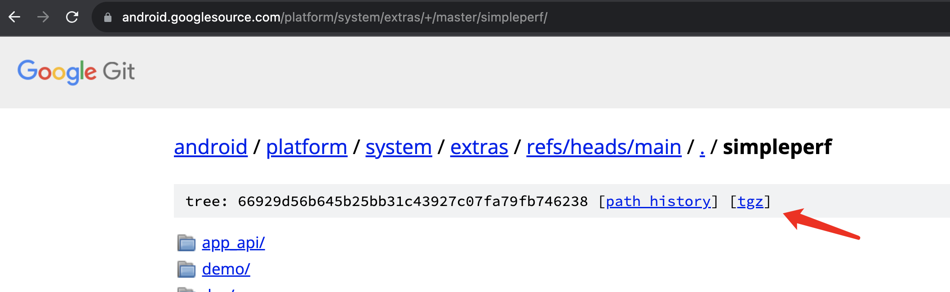

# addr2line

```
addr2line64 -i -C -f -e xxx.so <address>
```

# SimplePerf

>   官方文档：https://android.googlesource.com/platform/system/extras/+/master/simpleperf/doc/README.md
>
>   源码：https://android.googlesource.com/platform/system/extras/+/master/simpleperf/
>   

## dump堆栈5s

```
python /Users/mezzsy/Projects/Android/SimplePerf/scripts/app_profiler.py -p "com.mezzsy.myapplication" -r "-e task-clock:u -f 1000 -g --duration 5"
```

## 导出

```
adb pull /data/local/tmp/perf.data ~/Downloads/
```

## 生成火焰图

--symfs表示so的位置，比如此时so放在了~/Downloads

```
python /Users/mezzsy/Projects/Android/SimplePerf/scripts/inferno/inferno.py -sc --record_file ~/Downloads/perf.data --symfs ~/Downloads
```

