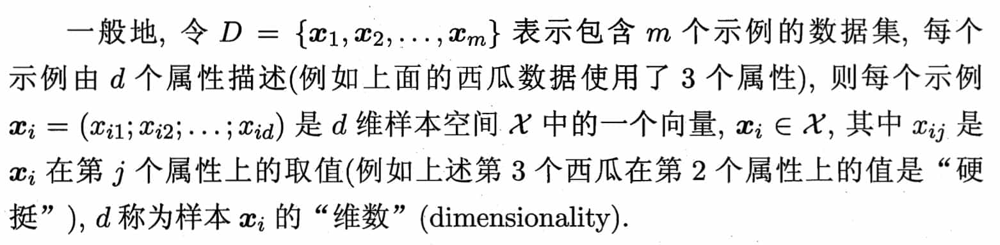
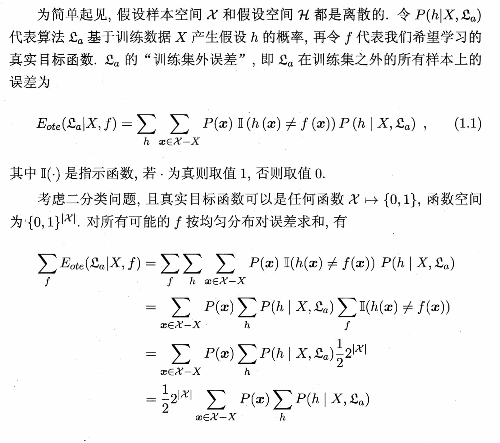
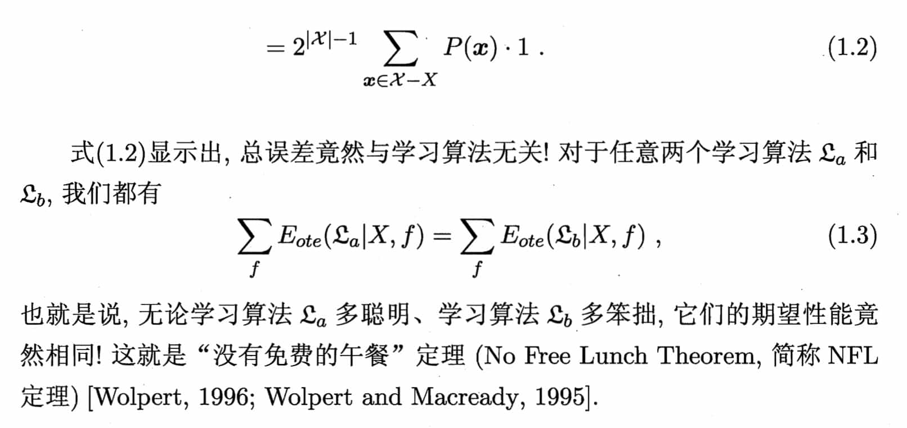

# 1.1 基本术语

收集了一批关于西瓜的数据，例如（色泽=青绿；根蒂=蜷缩；敲声=浊响），（色泽=乌黑；根蒂=稍蜷；敲声=沉闷），（色泽==浅白；根蒂==硬挺；敲声=清脆）。。。。

这组记录的集合称为一个“数据集”（data set），其中每条记录是关于一个事件或对象（这里是一个西瓜）的描述，称为一个“示例”（instance）或“样本”（sample）。

反映事件或对象在某方面的表现或性质的事项，例如“色泽”“根蒂”“敲声”，称为“属性”（attribute）或“特征”（feature）；属性上的取值，例如“青绿”“乌黑”，称为“属性值”（attribute value）。

属性张成的空间称为“属性空间”（attribute space）、“样本空间”（sample space）或“输入空间”。

例如我们把“色泽”"根蒂”“敲声”作为三个坐标轴，则它们张成一个用于描述西瓜的三维空间，每个西瓜都可在这个空间中找到自己的坐标位置。由于空间中的每个点对应一个坐标向量，因此我们也把一个示例称为一个“特征向量”（feature vector）。

这里关于示例结果的信息，例如“好瓜”，称为“标记”（label）；拥有了标记信息的示例，则称为“样例”（example）。一般地：

若我们欲预测的是离散值，例如“好瓜”“坏瓜”，此类学习任务称为“**分类**”（classification）；若欲预测的是连续值，例如西瓜成熟度0。95、0。37，此类学习任务称为“**回归**”（regression）。

对只涉及两个类别的“二分类”（binary classification）任务，通常称其中一个类为“正类（positive class），另一个类为“反类"（negative class）；涉及多个类别时，则称为“多分类”（multi-class classification）任务。

# 1.4 归纳偏好

归纳偏好对应了学习算法本身所做出的关于“什么样的模型更好”的假设。

既然所有学习算法的期望性能都跟随机胡猜差不多，那还有什么好学的？

NFL定理有一个重要前提：所有“问题”出现的机会相同、或所有问题同等重要。但实际情形并不是这样。很多时候，我们只关注自己正在试图解决的问题（例如某个具体应用任务），希望为它找到一个解决方案，至于这个解决方案在别的问题、甚至在相似的问题上是否为好方案，我们并不关心。例如，为了快速从A地到达B地，如果我们正在考虑的A地是南京鼓楼、B地是南京新街口，那么“骑自行车”是很好的解决方案；这个方案对A地是南京鼓楼、B地是北京新街口的情形显然很糟糕，但我们对此并不关心。