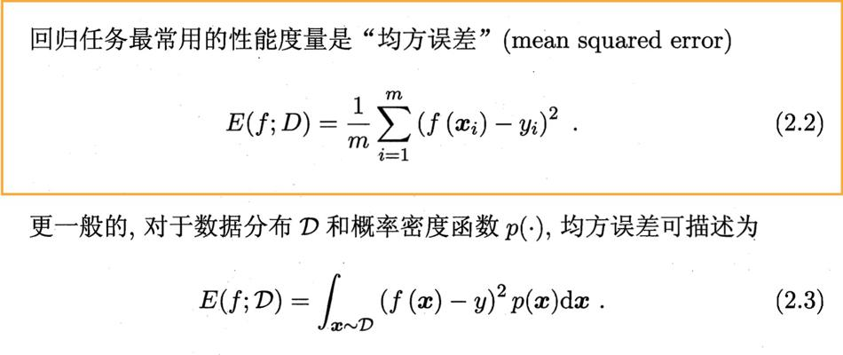

# 2.1 经验误差与过拟合

通常我们把分类错误的样本数占样本总数的比例称为“错误率”（error rate），即如果在m个样本中有a个样本分类错误，则错误率E=a/m；相应的，1-a/m称为“精度”（accuracy），即“精度=1-错误率”。更一般地，我们把学习器的实际预测输出与样本的真实输出之间的差异称为“误差”（error），学习器在训练集。上的误差称为“训练误差”（training error）或“经验误差”（empirical error），在新样本上的误差称为“泛化误差”（generalization error）。显然，我们希望得到泛化误差小的学习器。

当学习器把训练样本学得“太好”了的时候，很可能已经把训练样本自身的一些特点当作了所有潜在样本都
会具有的一般性质，这样就会导致泛化性能下降。这种现象在机器学习中称为“过拟合”（overfitting）。

与“过拟合”相对的是“欠拟合”（underftting），这是指对训练样本的一般性质尚未学好。

# 2.3 性能度量

