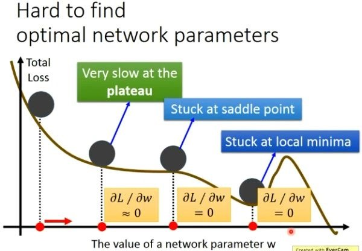
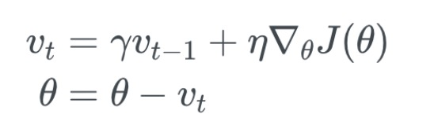
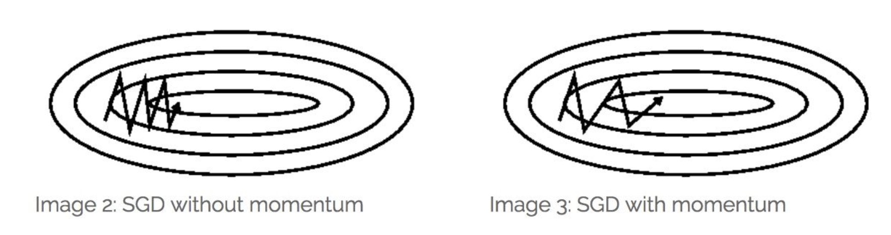
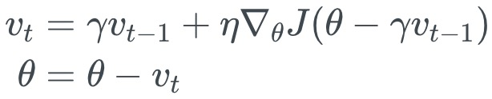

# 笔记

[理解梯度下降法](https://zhuanlan.zhihu.com/p/36902908)

最优化问题在机器学习中有非常重要的地位，很多机器学习算法最后都归结为求解最优化问题。

在机器学习之类的实际应用中，我们一般将最优化问题统一表述为求解函数的极小值问题。

可导函数在某一点处取得极值的必要条件是梯度为0，梯度为0的点称为函数的驻点，这是疑似极值点。需要注意的是，梯度为0只是函数取极值的必要条件而不是充分条件，即梯度为0的点可能不是极值点。

有些方程非常难以求解，对于有指数函数，对数函数，三角函数的方程，我们称为超越方程，求解的难度并不比求极值本身小。精确的求解不太可能，因此只能求近似解，这称为数值计算。

[动量梯度下降法Momentum](https://terrifyzhao.github.io/2018/02/16/%E5%8A%A8%E9%87%8F%E6%A2%AF%E5%BA%A6%E4%B8%8B%E9%99%8D%E6%B3%95Momentum.html)

[梯度下降的可视化解释(Momentum，AdaGrad，RMSProp，Adam)](https://zhuanlan.zhihu.com/p/147275344)

使用梯度下降算法来搜索使得损失函数最小的参数值。但是由于损失函数有时候会非常复杂，所以在很多时候我们求解到的并不是全局最小值。

在上图的三个位置它们并不是全局最小值，但是它们的梯度值为0，梯度值为0在应用梯度下降法的时候其中的参数得不到更新操作，也就是会陷在这些不是全局最优解的地方，这显然不是我们想要的结果。

三个地方代表的三种伪最优解分别是：

1.  plateau(稳定的水平)；
2.  saddle point(鞍点)；
3.  local minima(局部最小点)；但是不用太担心local minimal的问题，其实在复杂的神经网络上没有太多的local minimal，因为你要有一个local minimal都要是一个山谷的形状，我们假设出现谷底的概率是p，那因为我们的neural有非常非常多的参数，所以假设有1000参数，假设你每一个参数都是山谷的谷底，那么就是 ![[公式]](https://www.zhihu.com/equation?tex=p%5E%7B1000%7D) 。由下面的指数函数图像可以看出，你的neural越大，你的参数就越大，出现local minimal的概率就越低。所以local minimal在一个很大的neural里面并没有那么多local minimal。那走走你觉的是local minimal卡住的时候，他八成是global minimal或者很接近global minimal的。

# 总结

## Momentum optimization

冲量梯度下降算法基于这样一个物理事实：将一个小球从山顶滚下，其初始速率很慢，但在加速度作用下速率很快增加，并最终由于阻力的存在达到一个稳定速率。

对于冲量梯度下降算法，其更新方程如下：

可以看到，参数更新时不仅考虑当前梯度值，而且加上了一个积累项（冲量），γ一般取接近1的值如0.9。相比原始梯度下降算法，冲量梯度下降算法有助于加速收敛。当梯度与冲量方向一致时，冲量项会增加，而相反时，冲量项减少，因此冲量梯度下降算法可以减少训练的震荡过程。

## Nesterov Accelerated Gradient (NAG)

NAG方法是momentum方法的改进。momentum方法计算的是当前位置的梯度，NAG方法计算的是经过更新之后的位置的梯度，其参数更新公式为

经过变换之后的等效形式中，NAG算法相对于Momentum多了一个本次梯度相对上次梯度的变化量，这个变化量本质上是对目标函数二阶导的近似。由于利用了二阶导的信息，NAG算法才会比Momentum具有更快的收敛速度。