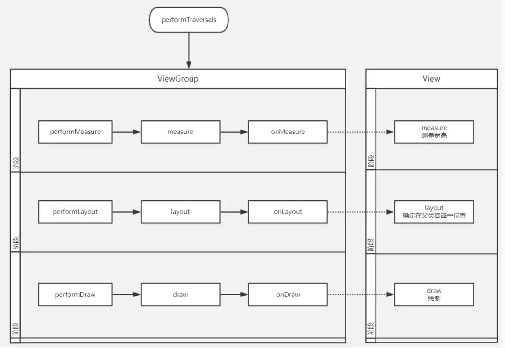
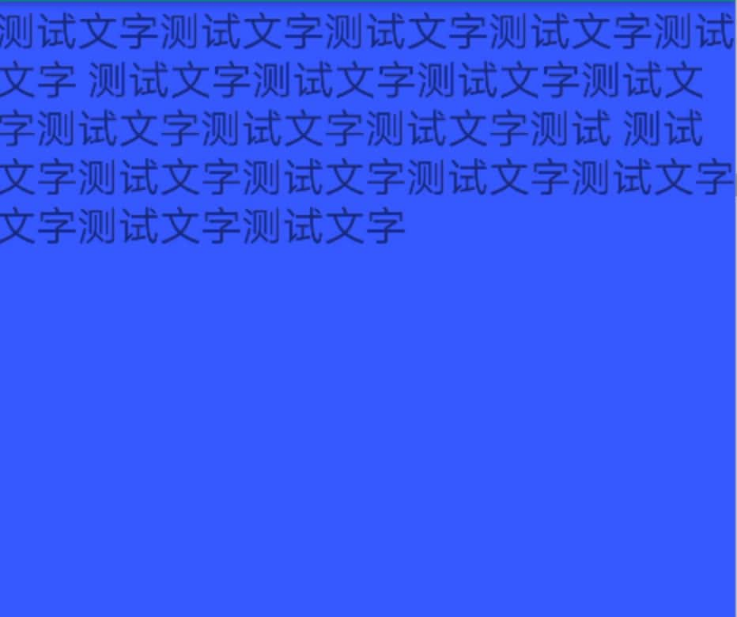
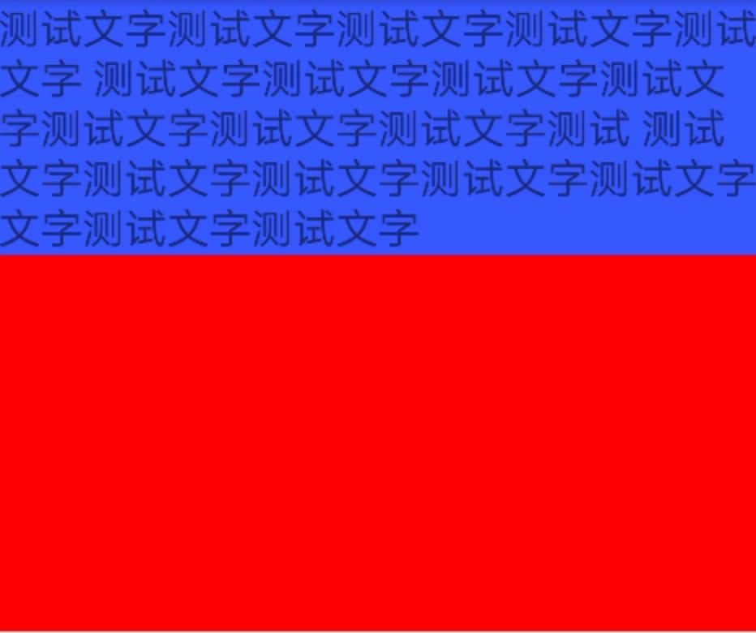
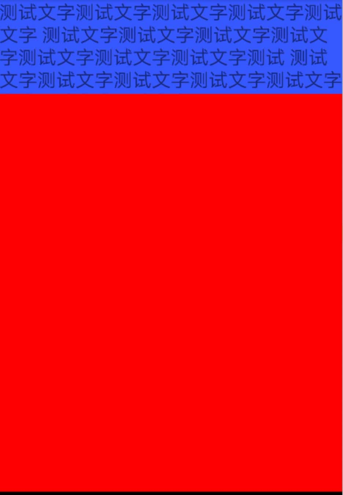
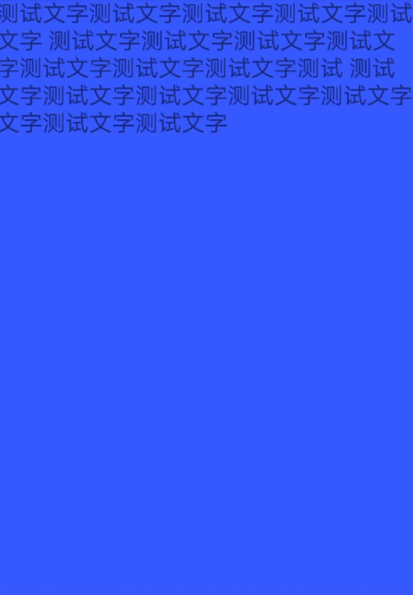
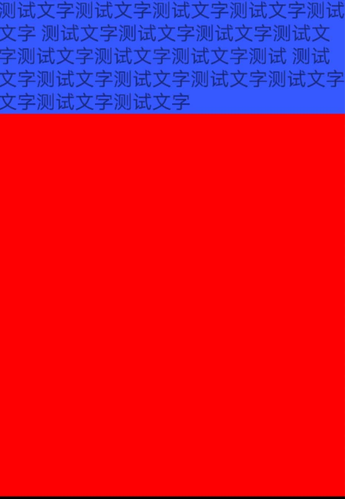
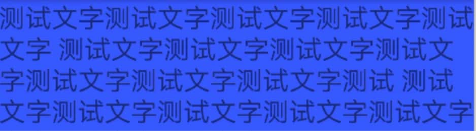
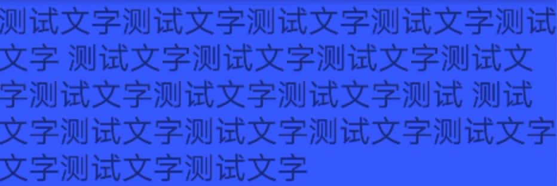

# Window

## Window、WM和WMS之间的关系

1.  Window是一个抽象类，具体的实现类为PhoneWindow，它对View进行管理。
2.  WindowManager是个接口类，继承自接口ViewManager，是用来管理Window的，实现类为WindowManagerlmpl。如果要对Window(View)进行添加、更新和删除操作就可以使用WindowManager。
3.  WindowManager会将具体的工作交由WMS来处理，WindowManager和WMS通过Binder来进行跨进程通信。

## Window的创建

Window是一个抽象类 ，它的具体实现类为PhoneWindow。在Activity启动过程中会调用ActivityThread的performLaunchActivity方法，performLaunchActivity方法中又会调用Activity的attach方法，PhoneWindow就是在Activity的attach方法中创建的。

```java
final void attach(Context context, ActivityThread aThread, Instrumentation instr, IBinder token, int ident, Application application, Intent intent, ActivityInfo info, CharSequence title, Activity parent, String id, NonConfigurationInstances lastNonConfigurationInstances, Configuration config, String referrer, IVoiceInteractor voiceInteractor, Window window, ActivityConfigCallback activityConfigCallback) {
    //...
    // 创建Window，mWindow是Activity的成员变量，说明一个Activity对应一个Window
    mWindow = new PhoneWindow(this, window, activityConfigCallback);
    //...
    // Window关联WindowManager
    mWindow.setWindowManager((WindowManager)context.getSystemService(Context.WINDOW_SERVICE), mToken, mComponent.flattenToString(), (info.flags & ActivityInfo.FLAG_HARDWARE_ACCELERATED) != 0);
    //...
}
```

1.   这里创建了一个PhoneWindow ，mWindow是Activity的成员变量，说明一个Activity对应一个Window。
2.   setWindowManager内部会创建一个WindowManager，具体实现是WindowManagerImpl，说明WindowManagerImpl是和Activity对应的。
3.   虽然WindowManagerImpl有多个，但是WindowManagerImpl的具体实现是交给WindowManagerGlobal来完成，而WindowManagerGlobal是单例，只有一个。

# DecorView

Window是以View的形式存在的，所以Activity里的Window也需要一个View，这个View就是DecorView，它分为title部分和content部分。

## DecorView的初始化

content部分一般是在onCreate里通过setContentView来设置的，里面会调用getDecorView方法：

```java
//PhoneWindow.java
@Override
public final View getDecorView() {
    // 当不存在DecorView就会创建一个。
    if (mDecor == null || mForceDecorInstall) {
        installDecor();
    }
    return mDecor;
}
```

即使没有在onCreate调用setContentView方法，最终也会创建DecorView。performLaunchActivity执行完，界面要与用户进行交互时，会调用ActivityThread的handleResumeActivity方法：

```java
final void handleResumeActivity(IBinder token, boolean clearHide, boolean isForward, boolean reallyResume, int seq, String reason) {
    //...
    r = performResumeActivity(token, clearHide, reason);//performResumeActivity方法最终会调用Activity的onResume方法
		//...
        if (r.window == null && !a.mFinished && willBeVisible) {
            r.window = r.activity.getWindow();
            // getDecorView，如果没有decorView就创建一个
            View decor = r.window.getDecorView();
            decor.setVisibility(View.INVISIBLE);
            ViewManager wm = a.getWindowManager();//得到ViewManager类型的wm对象
            // ...
            wm.addView(decor, l);
			//...
        }
}
```

在handleResumeActivity方法中会获取DecorView（如果没有就创建），并通过WM的addView展现出来。

这样Activity的Window是以DecorView的形式展现的。

## 获取contentView

DecorView实际上是一个FrameLayout，内部包含一个竖直方向的LinearLayout，这个LinearLayout有两个部分，上面是标题栏，下面是内容栏。获取content:

```java
ViewGroup content = findViewById(android.R.id.content);
```

获取设置的View

```java
View view = content.getChildAt(0);
```

# ViewRootImpl

## ViewRootImpl的创建

performLaunchActivity执行完，界面要与用户进行交互时，会调用ActivityThread的handleResumeActivity方法：

```java
final void handleResumeActivity(IBinder token, boolean clearHide, boolean isForward, boolean reallyResume, int seq, String reason) {
    //...
    r = performResumeActivity(token, clearHide, reason);//performResumeActivity方法最终会调用Activity的onResume方法
		//...
        if (r.window == null && !a.mFinished && willBeVisible) {
            r.window = r.activity.getWindow();
            // getDecorView，如果没有decorView就创建一个
            View decor = r.window.getDecorView();
            decor.setVisibility(View.INVISIBLE);
            ViewManager wm = a.getWindowManager();
            // ...
            wm.addView(decor, l);
			//...
        }
}
```

在handleResumeActivity方法中会调用了WindowManager的addView接口，addView方法中会调用WindowManagerGlobal的addView方法：

```java
public void addView(View view, ViewGroup.LayoutParams params,
        Display display, Window parentWindow) {
    //...
    ViewRootImpl root;
    View panelParentView = null;
    synchronized (mLock) {
        //...
        root = new ViewRootImpl(view.getContext(), display);//创建了ViewRootlmp并赋值给root

        view.setLayoutParams(wparams);

        mViews.add(view);//将添加的View保存到View列表中。
        mRoots.add(root);//将root存入到ViewRootImpl列表中。
        mParams.add(wparams);//将窗口的参数保存到布局参数列表中

        try {
            root.setView(view, wparams, panelParentView);//将窗口和窗口的参数通过setView方法设置到ViewRootImpl中
        }
        // 。。。
    }
}
```

WindowManagerGlobal中维护了和Window操作相关的3个列表，在窗口的添加、更新和删除过程中都会涉及这3个列表，它们分别是View列表 `ArrayList<View> mViews`、 布局参数列表 `ArrayList<WindowManager.LayouParamns> mParms`和ViewRootImpl列表 `ArrayList<VievRootlmpl> mRoots`。

ViewRootImpl主要做这些事：

- View树的根并管理View树。
- 触发View的测量、布局和绘制。
- 输入事件的中转站。
- 管理Surface。
- 负责与WMS进行进程间通信。

ViewRootImpl的setView方法：

```java
public void setView(View view, WindowManager.LayoutParams attrs, View panelParentView) {
    synchronized (this) {
        //...
            try {
                //。。。
                res = mWindowSession.addToDisplay(mWindow, mSeq, mWindowAttributes, getHostVisibility(), mDisplay.getDisplayId(), mAttachInfo.mContentInsets, mAttachInfo.mStableInsets, mAttachInfo.mOutsets, mInputChannel);
            } 
      	//....
}
```

在setView方法主要就是调用了mWindowSession的addToDisplay方法，mWindowSession是IWindowSession类型的，它是一个Binder对象，用于进行进程间通信，IWindowSession是Client端的代理，它的Server端的实现为Session，此前的代码逻辑都是运行在本地进程的，而Session的addToDisplay方法则运行在WMS所在的进程(SystemServer进程)中。

看一下Session的addToDisplay方法：

```java
public int addToDisplay(IWindow window, int seq, WindowManager.LayoutParams attrs, int viewVisibility, int displayId, Rect outContentInsets, Rect outStableInsets, Rect outOutsets, InputChannel outInputChannel) {
    return mService.addWindow(this, window, seq, attrs, viewVisibility, displayId, outContentInsets, outStableInsets, outOutsets, outInputChannel);
}
```

在addToDisplay方法中调用了WMS的addWindow方法，并将自身也就是Session作为参数传了进去，每个应用程序进程都会对应一个 Session，WMS会用ArrayList来保存这此Session。

剩下的工作就交给WMS来处理，在WMS中会为这个添加的窗口分配Surface，并确定窗口显示次序，可见负责显示界面的是画布Surface，而不是窗口本身。WMS会将它所管理的Surface交由SurfaceFlinger处理，SurfaceFlinger会将这些Surface混合并绘制到屏幕上。

# View绘制流程



## 绘制流程

绘制流程从ViewRootImpl的performTraversals方法开始，performTraversals方法会依次调用performMeasure、performLayout、performDraw方法来绘制顶级View（DecorView）。

> performMeasure、performLayout、performDraw是ViewRootImp的方法。View和ViewGroup都没有这些方法

在performMeasure方法中，会调用View的measure方法（final）进行测量（实际操作是在onMeasure中，来自measure方法的注释），然后在onMeasure（protected）中对子元素进行measure，子元素重复此过程。

performLayout也是如此，在performLayout方法中，会调用View的layout方法（不是final，但注释说不应该重写此方法，应该重写onLayout）进行布局，然后在onLayout（在View中是一个空方法，在ViewGroup中是一个抽象方法）中对子元素进行layout，子元素重复此过程。

performDraw有点区别。performDraw调用View的draw（draw不建议重写，如果一定要重写，需要调用super）绘制，draw调用drawBackground绘制背景，调用onDraw（onDraw是一个空方法）绘制内容，dispatchDraw绘制子View，onDrawScrollBars绘制装饰。

## 绘制方法介绍

Measure完成后，可以同getMeasureWidth和getMeasureHeight获得测量后的宽高，在几乎所有的情况下等于最终的宽高（因为View需要多次measure才能确定自己的测量宽高）。

Layout后可以通过getTop、getBottom、getLeft、getRight来拿到View的四个顶点的位置，并可以通过getWidth和getHeight来获得最终的宽高

Draw过程决定了View的显示，只有draw方法后，view的内容才会显示在屏幕上。

## MeasureSpec

**MeasureSpec的作用在于：**在Measure流程中，系统会将View的LayoutParams根据父容器所施加的规则转换成对应的MeasureSpec，然后在onMeasure方法中根据这个MeasureSpec来确定View的测量宽高。

MeasureSpec是一个32位int值，高两位是SpecMode（测量模式），低30位是SpecSize（规格大小）

### SpecMode

- **UNSPECIFIED**：一般用于系统内部，表示一种测量的状态。
    官方介绍原文：The parent has not imposed any constraint on the child. It can be whatever size it wants.大意是父View对子View不施加任何约束。
- **EXACTLY**：View所需要的精确大小，最终大小就是SpecSize指定的值，对应match_patent和具体的数值
- **AT_MOST**：父容器指定了一个可用大小即SpecSize，View的大小不能大于这个值，对应wrap_content

### MeasureSpec和LayoutParams的对应关系

对于DecorView是由窗口的尺寸和其LayoutParams来共同决定的

- **match_patent**：大小就是窗口的大小
- **wrap_content**：大小不定，但是不能超过窗口的大小
- **固定大小**：指定大小

对于普通View是由父容器的MeasureSpec和其LayoutParams来共同决定的

- 当View采用固定宽高的时候，不管父容器的MeasureSpec是什么，View的MeasureSpec都是精确模式并且大小遵循LayoutParams中的大小。
- 当View采用match_parent的时候，如果父容器是精确模式，那么View也是精确模式并且大小是父容器的剩余空间。如果父容器是最大模式，那么View也是最大模式，并且不会超过父容器的剩余空间。
- 当View采用wrap_content的时候，View总是最大模式，并且不会超过父容器的剩余空间。


### 实验

这里的xml文件如下：

```xml
<LinearLayout xmlns:android="http://schemas.android.com/apk/res/android"
    xmlns:tools="http://schemas.android.com/tools"
    android:layout_width="match_parent"
    android:layout_height="match_parent"
    android:background="#ddd">

    <FrameLayout
        android:layout_width="match_parent"
        android:layout_height="match_parent"
        android:background="#FF0000">

        <TextView
            android:layout_width="match_parent"
            android:layout_height="match_parent"
            android:background="#3858FF"
            android:text="@string/test"
            android:textSize="20sp" />
    </FrameLayout>

</LinearLayout>
```

只需要关注FrameLayout和内部的TextView。Parent为红色，Child为蓝色

这里只调整高度height。

#### Parent为px/dp

##### Child为px/dp


##### Child为match_parent



##### Child为wrap_content



#### Parent为match_parent

##### Child为px/dp



##### Child为match_parent



##### Child为wrap_content



#### Parent为wrap_content

##### Child为px/dp



##### Child为match_parent



##### Child为wrap_content


## measure

- 直接继承View的自定义控件需要重写onMeasure方法并设置wrap_content时自身的大小，否则在布局中使用wrap_content就相当于使用match_parent。
- 在某些情况下，系统可能会多次measure才会确定最终的测量宽高，在这种情况下，在onMeasure方法中拿到的宽高可能不准。一个比较好的习惯是在onLayout方法中获取宽高。

### 获取宽高的方法

在onCreate、onStart、onResume无法获取正确宽高，因为View的measure和Activity的生命周期不是同步的。**四个获取宽高的方法**：

1. **Activity/View#onWindowFocusChanged**
    这个方法的含义是View已经初始化完毕了，宽高已经准备好了。当Activity获得焦点和失去焦点的时候会调用一次，具体的说，是当onResume和onPause的时候会被调用。

2. **view.post(runnable)**
    通过post将一个runnable投到消息队列的尾部，等待Looper调用此runnable的时候，View已经初始化好了。

    ```java
    @Override
    protected void onStart() {
        super.onStart();
        ViewGroup viewGroup = findViewById(android.R.id.content);
        final View view = viewGroup.getChildAt(0);
        view.post(new Runnable() {
    
            @Override
            public void run() {
                int width = view.getMeasuredWidth();
                int height = view.getMeasuredHeight();
            }
        });
    }
    ```

3. **ViewTreeObserver**
    使用ViewTreeObserver的回调可以完成这个功能

    ```java
    @Override
    protected void onStart() {
        super.onStart();
        ViewGroup viewGroup = findViewById(android.R.id.content);
        final View view = viewGroup.getChildAt(0);
        ViewTreeObserver observer = view.getViewTreeObserver();
        observer.addOnGlobalLayoutListener(new ViewTreeObserver.OnGlobalLayoutListener() {
            @Override
            public void onGlobalLayout() {
                view.getViewTreeObserver().removeGlobalOnLayoutListener(this);
                int width = view.getMeasuredWidth();
                int height = view.getMeasuredHeight();
            }
        });
    }
    ```

4. **view.measure(int widthMeasureSpec，int heightMeasureSpec)**
    具体见下"手动measure"。

> View的measure方法是final方法，不能继承，建议在onMeasure写逻辑。

### DecorView的测量

MeasureSpec是LayoutParams和父容器的模式所共同影响的，那么，对于DecorView来说，它已经是顶层view了，没有父容器，那么它的MeasureSpec怎么来的呢？

在ViewRootImpl#PerformTraveals的方法中，有：

```java
WindowManager.LayoutParams lp = mWindowAttributes;
// ...
int childWidthMeasureSpec = getRootMeasureSpec(mWidth, lp.width);
int childHeightMeasureSpec = getRootMeasureSpec(mHeight, lp.height);
// ...
performMeasure(childWidthMeasureSpec, childHeightMeasureSpec);
```

```java
private static int getRootMeasureSpec(int windowSize, int rootDimension) {
    int measureSpec;
    switch (rootDimension) {

    case ViewGroup.LayoutParams.MATCH_PARENT:
        // Window can't resize. Force root view to be windowSize.
        measureSpec = MeasureSpec.makeMeasureSpec(windowSize, MeasureSpec.EXACTLY);
        break;
    case ViewGroup.LayoutParams.WRAP_CONTENT:
        // Window can resize. Set max size for root view.
        measureSpec = MeasureSpec.makeMeasureSpec(windowSize, MeasureSpec.AT_MOST);
        break;
    default:
        // Window wants to be an exact size. Force root view to be that size.
        measureSpec = MeasureSpec.makeMeasureSpec(rootDimension, MeasureSpec.EXACTLY);
        break;
    }
    return measureSpec;
}
```

思路也很清晰，根据不同的模式来设置MeasureSpec，如果是LayoutParams.MATCH_PARENT模式，则是窗口的大小，WRAP_CONTENT模式则是大小不确定，但是不能超过窗口的大小等等。

**个人总结**

DecorView虽然是顶层View，但是Window是以View的形式存在，而Window具有LayoutParams，这个lp会影响DecorView。

### 手动measure

通过手动对View进行measure来得到View的宽/高。这种方法比较复杂，这里要分情况处理，根据View的LayoutParams来分：

1.   match_parent
     直接放弃，无法measure出具体的宽/高。原因很简单，根据View的measure过程，构造此种MeasureSpec需要知道parentSize，即父容器的剩余空间，而这个时候无法知道parentSize的大小，所以理论上不可能测量出View的大小。

2.   具体的数值（dp/px）
     比如宽/高都是100px，如下measure：

     ```java
     int widthMeasureSpec = MeasureSpec.makeMeasureSpec(100，MeasureSpec.EXACTLY);
     int heightMeasureSpec = MeasureSpec.makeMeasureSpec(100, MeasureSpec.EXACTLY);
     view.measure(widthMeasureSpec, heightMeasureSpec);
     ```

3.   wrap_content
     如下measure：

     ```java
     int widthMeasureSpec = MeasureSpec.makeMeasureSpec((1 << 30) - 1, MeasureSpec.AT_MOST);
     int heightMeasureSpec = MeasureSpec.makeMeasureSpec((1 << 30) - 1, MeasureSpec.AT_MOST) ; 
     view.measure(widthMeasureSpecr heightMeasureSpec) ;
     ```

     注意到`(1 << 30) - 1`，通过分析MeasureSpec的实现可以知道，View的尺寸使用30位二进制表示，也就是说最大是30个1（即2^30- 1），也就是（1<<30）- 1，在最大化模式下，用View理论上能支持的最大值去构造MeasureSpec是合理的。

>   《Android艺术开发探索》里介绍：
>
>   关于View的measure,网络上有两个错误的用法。为什么说是错误的，首先其违背了系统的内部实现规范（因为无法通过错误的MeasureSpec去得出合法的SpecMode，从而导致measure过程出错），其次不能保证一定能measure出正确的结果。
>   第一种错误用法：
>
>   ```java
>   int widthMeasureSpec = MeasureSpec.makeMeasureSpec(-1，MeasureSpec.UNSPECIFIED);
>   int heightMeasureSpec = MeasureSpec.makeMeasureSpec(-1, MeasureSpec.UNSPECIFIED);
>   view.measure(widthMeasureSpec, heightMeasureSpec);
>   ```
>
>   这种错误方法原因未知。可能是-1？因为size是非负数。
>
>   第二种错误用法：
>
>   ```java
>   view.measure(LayoutParams.WRAP_CONTENT, LayoutParams.WRAP_CONTENT);
>   ```
>
>   这种错误用法我猜是没有指定SpecMode，应该以这样的方式：`MeasureSpec.makeMeasureSpec((1 << 30) - 1, MeasureSpec.AT_MOST);`。

## layout

Layout的作用是ViewGroup用来确定子元素的位置，当ViewGroup的位置被确定后，它在onLayout中会遍历所有的子元素并调用其layout方法，在layout方法中onLayout方法又会被调用。layout方法确定View本身的位置，而onLayout方法则会确定所有子元素的位置。

layout方法的大致流程如下：首先会通过setFrame方法来设定View的四个顶点的位置，即初始化mLeft、mRight、 mTop和mBottom这四个值，View的四个顶点一旦确定，那么View在父容器中的位置也就确定了:接着会调用onLayout方法，这个方法的用途是父容器确定子元素的位置，和onMeasure方法类似，onLayout 的具体实现同样和具体的布局有关，所以View和ViewGroup均没有真正实现onLayout方法。

> onLayout在ViewGroup是抽象方法，layout是由父容器在onlayout中调用。

### View的测量宽高和最终宽高有什么区别？

这个问题可以具体为：View的getMeasuredWidth和getWidth这两个方法有什么区别？

getMeasuredWidth：

```java
public final int getMeasuredWidth() {
    return mMeasuredWidth & MEASURED_SIZE_MASK;
}
```

getWidth：

```java
public final int getWidth() {
    return mRight - mLeft;
}
```

在View的默认实现中，View的测量宽/高和最终宽/高是相等的，只不过测量宽/高形成于View的measure过程，而最终宽/高形成于View的layout过程，即两者的赋值时机不同，测量宽/高的赋值时机稍微早一些。因此，在日常开发中，可以认为View的测量宽/高就等于最终宽/高。

>   即，一般情况下，两者相等，只是赋值时机不同。

## draw

draw方法

```java
public void draw(Canvas canvas) {
    //...
    
    /*
     * Draw traversal performs several drawing steps which must be executed
     * in the appropriate order:
     *
     *      1. Draw the background
     *      2. If necessary， save the canvas' layers to prepare for fading
     *      3. Draw view's content
     *      4. Draw children
     *      5. If necessary， draw the fading edges and restore layers
     *      6. Draw decorations (scrollbars for instance)
     */

    // Step 1， draw the background， if needed
    //...
    drawBackground(canvas);

    // skip step 2 & 5 if possible (common case)
    //...
    // Step 3， draw the content
    onDraw(canvas);
    
    // Step 4， draw the children
    dispatchDraw(canvas);
    
    // Step 6， draw decorations (foreground， scrollbars)
    onDrawForeground(canvas);

    // Step 7， draw the default focus highlight
    drawDefaultFocusHighlight(canvas);
    return;
}
```

View的绘制过程（主要）：

1. 绘制背景drawBackground(canvas)
2. 绘制自己（onDraw）
3. 绘制children（dispatchDraw）
4. 绘制装饰（onDrawScrollBars）

源码在注释上步骤写得很详细，主要步骤是这上面四个。

View的绘制过程的传递主要是通过dispatchDraw来实现的。

View有个特殊的方法（**setWillNotDraw**），如果一个View不需要绘制任何内容，那么设置这个标记位为true后，系统会进行相应的优化。默认情况下，View不启用，ViewGroup启用。当明确知道一个ViewGroup需要启用时，需要显式的关闭这个标记位。

draw的时候要考虑padding，让自定义View支持padding：

```java
@Override
protected void onDraw(Canvas canvas) {
    super.onDraw(canvas);
    int paddingLeft=getPaddingLeft();
    int paddingRight=getPaddingRight();
    int paddingTop=getPaddingTop();
    int paddingBottom=getPaddingBottom();
    int width=getWidth()-paddingLeft-paddingRight;
    int height=getHeight()-paddingTop-paddingBottom;
    int radius=Math.min(width，height)/2;
    canvas.drawCircle(paddingLeft+width/2，paddingTop+height/2，radius，paint);
}
```

这是绘制圆形的情况，其他图案可以更改部分代码。

## **布局优化**

### 避免过度绘制

过度绘制会浪费很多的cpu，Gpu资源，例如系统默认会绘制Activity的背景，如果在给布局重新绘制了重叠的背景，那么默认的Activity的背景就属于无效的过度绘制。

过度绘制（Overdraw）也是很浪费CPU/GPU资源的，系统也提供了检测工具Debug GPU Overdraw来查看界面overdraw的情况。该工具会使用不同的颜色绘制屏幕，来指示overdraw发生在哪里以及程度如何，其中：
没有颜色： 意味着没有overdraw。像素只画了一次。
蓝色： 意味着overdraw 1倍。像素绘制了两次。大片的蓝色还是可以接受的（若整个窗口是蓝色的，可以摆脱一层）。
绿色： 意味着overdraw 2倍。像素绘制了三次。中等大小的绿色区域是可以接受的但你应该尝试优化、减少它们。
浅红： 意味着overdraw 3倍。像素绘制了四次，小范围可以接受。
暗红： 意味着overdraw 4倍。像素绘制了五次或者更多。这是错误的，要修复它们。

**不绘制Activity的背景**

去掉DecorView的背景。定义一个style theme。应用到需要的Activity或者Application。

```xml
<resources>
    <style name="Theme.NoBackground" parent="android:Theme">
        <item name="android:windowBackground">@null</item>
    </style>
</resources>
```

### 优化布局层次

在Android中，系统对View的进行测量、布局和绘制时，都是通过对View树的遍历来进行操作的。如果一个View的高度太高，就会影响测量、布局和绘制的速度，因此优化布局的第一个方法就是降低View树的高度，Google在器API文档中也建议View树的高度不超过10层。避免嵌套过多无用布局：

1. **使用\<include\>标签重用layout**
    主要用于布局重用。
    注：根容器id与include id必须相同
    如给include所加载的layout布局的根容器设置了id属性，也在include标签中设置了id属性，同时需要在代码中获取根容器的控件对象时，一定要将这两个id设置相同的名称！否则，将获取不到根容器对象，即为null。
    
2. **merge标签**
    merge标签可以自动消除当一个布局插入到另一个布局时产生的多余的View Group。用法就是直接使用merge标签作为复用布局的根节点，再使用include标签复用到其他布局中，这时，系统会自动忽略merge标签，直接把两个Button替换到include标签的位置。 
    也就是说，include和merge是配合使用的。
    **需要注意的地方：**
    
    - merge标签只能作为复用布局的root元素来使用。
    - 使用它来inflate一个布局时，必须指定一个ViewGroup实例作为其父元素并且设置attachToRoot属性为true（参考 inflate(int， android.view.ViewGroup， boolean) 方法的说明 ）。
    
3. **使用\<ViewStub\>实现view的延迟加载**
    **\<ViewStub\>**是一个非常轻量级的组件，它不仅不可见，而且大小为0。
    首先创建一个布局，这个布局在初始化加载时不需要显示，只在某些情况下才显示出来，例如查看用户信息的时，只有点击了某个按钮是，用户详细信息才显示出来。写一个简单的布局：
    
    ```xml
    <?xml version="1.0" encoding="utf-8"?>
    <LinearLayout  xmlns:android="http://schemas.android.com/apk/res/android"
        android:layout_width="match_parent"
        android:layout_height="match_parent"
        android:orientation="vertical">
        <TextView
            android:id="@+id/tv"
            android:layout_width="wrap_content"
            android:layout_height="wrap_content"
            android:text="not often use layout"
            android:textSize="30sp"/>
    </LinearLayout>
    ```
    
    接下来与使用\<include\>标签类似，在主布局中的\<ViewStub\>中的layout属性来引用上面的布局。
    
    ```xml
    <ViewStub
        android:id="@+id/not_often_use"
        android:layout_alignParentBottom="true"
        android:layout_width="match_parent"
        android:layout_height="wrap_content"
        android:layout="@layout/not_often_use"/>
    ```
    
    **如何重新加载显示的布局呢？**
    首先，通过普通的findViewById方法找到\<ViewStub>组件，这点与一般的组件基本相同：
    `mViewStub = (ViewStub)findViewById(R.id.not_often_use);`
    接下来，有两种方式重新显示这个View：
    (1) VISIBLE
    通过调用ViewStub的setVisibility()方法来显示这个View，代码如下所示：
    `mViewStub.setVisibility(View.VISIBLE);`
    (2) inflate
    通过调用ViewStub的inflate（）方法来显示这个View，代码如下：
    `View inflateView = mViewStub.inflate();`
    这两种方式都可以让ViewStub重新展开，显示引用的布局，而唯一的区别就是inflate方法可以返回引用的布局，从而可以在通过View.findViewById()方法来找到对应的控件，代码如下：
    
    ```java
    View inflateView = mViewStub.inflate();
    TextView textview  = (TextView) inflateView.findViewById(R.id.Tv);
    textView.setText(“Hello“);
    ```
    
    **ViewStub和View.GONE有啥区别？**
    它们的共同点是初始时都不会显示，但是前者只会在显示时才去渲染整个布局，而后者在初始化布局树的时候就已经添加到布局树上了，相比之下前者的布局具有更高的效率。

### LinearLayout、RelativeLayout、FrameLayout的特性及对比，并介绍使用场景。

RelativeLayout会对子View做两次measure。 
首先RelativeLayout中子View的排列方式是基于彼此的依赖关系，而这个依赖关系可能和布局中View的顺序并不相同，在确定每个子View的位置的时候，就需要先给所有的子View排序一下。 

如果不使用weight属性，LinearLayout会在当前方向上进行一次measure的过程，如果使用weight属性，LinearLayout会避开设置过weight属性的view做第一次measure，完了再对设置过weight属性的view做第二次measure。由此可见，weight属性对性能是有影响的。

总结：

1.   RelativeLayout会让子View调用2次onMeasure，LinearLayout在有weight时，也会调用子View2次onMeasure
2.   RelativeLayout的子View如果高度和RelativeLayout不同，则会引发效率问题，当子View很复杂时，这个问题会更加严重。如果可以，尽量使用padding代替margin。
3.   在不影响层级深度的情况下，使用LinearLayout和FrameLayout而不是RelativeLayout。
4.   能用两层LinearLayout，尽量用一个RelativeLayout，在时间上此时RelativeLayout耗时更小。另外LinearLayout慎用layout_weight，也将会增加一倍耗时操作。由于使用LinearLayout的layout_weight，大多数时间是不一样的，这会降低测量的速度。这只是一个如何合理使用Layout的案例，必要的时候，要小心考虑是否用layout_weight。总之减少层级结构，才是王道，让onMeasure做延迟加载，用viewStub，include等一些技巧。

**选择LinearLayout还是RelativeLayout？**

谷歌的官方说明

> A RelativeLayout is a very powerful utility for designing a user interface because it can eliminate nested view groups and keep your layout hierarchy flat， which improves performance. If you find yourself using several nested LinearLayout groups， you may be able to replace them with a single RelativeLayout

Google的意思是“性能至上”， RelativeLayout在性能上更好，因为在诸如ListView等控件中，使用 LinearLayout容易产生多层嵌套的布局结构，这在性能上是不好的。而 RelativeLayout 因其原理上的灵活性，通常层级结构都比较扁平，很多使用LinearLayout 的情况都可以用一个 RelativeLayout 来替代，以降低布局的嵌套层级，优化性能。所以从这一点来看，Google比较推荐开发者使用RelativeLayout，因此就将其作为Blank Activity的默认布局了。

## 自定义View

1. 让View支持wrap_content
    这是因为直接维承View或者ViewGroup的控件，如果不在onMeasure中对wrap_content做特殊处理，那么当外界在布局中使用wrap_content时就无法达到预期的效果。
2. 如果有必要，让View支持padding
    这是因为直接继承View的控件，如果不在draw方法中处理padding，那么padding居性是无法起作用的。另外，直接继承自ViewGroup的控件需要在onMeasure和onLayout中考虑padding和子元素的margin对其造成的影响，不然将导致padding和子元素的margin失效。
3. 尽量不要在View中使用Handler(没必要)
    这是因为View内部本身就提供了post系列的方法，完全可以替代Handler的作用，当然除非你很明确地要使用Handler来发送消息。
4. View中如果有线程或者动画，需要及时停止，参考View#onDetachedFromWindow。
    这一条也很好理解，如果有线程或者动画需要停止时，那么onDetachedFromWindow是一个很好的时机。当包含此View的Activity退出或者当前View被remove 时，View的onDetachedFromWindow方法会被调用，和此方法对应的是onAtachedToWindow， 当包含此View的Activity启动时，View的onAtachedToWindow方法会被调用。同时，当View变得不可见时也需要停止线程和动画，如果不及时处理这种问题，有可能会造成内存泄漏。
5. View带有滑动嵌套情形时，需要处理好滑动冲突
    如果有滑动冲突的话，那么要合适地处理滑动冲突，否则将会严重影响View的效果。

## invalidate()

该方法的调用会引起View树的重绘，常用于内部调用(比如setVisiblity())或者需要刷新界面的时候，需要在主线程(即UI线程)中调用该方法。

invalidate()会不断调用父View的invalidate()方法，一直调用ViewRootImpl的invalidate()方法，在ViewRootImpl的invalidate()方法中，最后会调用performTraversals()，但没有设置重新测量的标记，所以只会调用onDraw。

**postInvalidate()**
这个方法与invalidate方法的作用是一样的，都是使View树重绘，但两者的使用条件不同，postInvalidate是在非UI线程中调用，invalidate则是在UI线程中调用。 

## requestLayout()

当动态移动一个View的位置，或者View的大小、形状发生了变化的时候，可以在View中调用这个方法。

从源码注释看出，如果当前View在请求布局的时候，View树正在进行布局流程的话，该请求会延迟到布局流程完成后或者绘制流程完成且下一次布局出现的时候再执行。

在View的requestLayout方法中，首先会设置View的标记位，PFLAG_FORCE_LAYOUT表示当前View要进行重新布局，PFLAG_INVALIDATED表示要进行重新绘制。

requestLayout方法中会一层层向上调用父布局的requestLayout方法，设置PFLAG_FORCE_LAYOUT标记，最终调用的是ViewRootImpl中的requestLayout方法。

可以看到ViewRootImpl中的requestLayout方法中会调用scheduleTraversals方法，scheduleTraversals方法最后会调用performTraversals方法开始执行View的三大流程，会分别调用View的measure、layout、draw方法。

### 总结

requestLayout方法会标记PFLAG_FORCE_LAYOUT，然后一层层往上调用父布局的requestLayout方法并标记PFLAG_FORCE_LAYOUT，最后调用ViewRootImpl中的requestLayout方法开始View的三大流程，然后被标记的View就会进行测量、布局和绘制流程，调用的方法为onMeasure、onLayout和onDraw。

## post方法

Android是消息驱动的模式，View.post的Runnable任务会被加入任务队列，并且等待第一次TraversalRunnable执行结束后才执行，此时已经执行过一次measure，layout过程了，所以在后面执行post的Runnable时，已经有measure的结果，因此此时可以获取到View的宽高。

源码

```java
public boolean post(Runnable action) {
    final AttachInfo attachInfo = mAttachInfo;
    if (attachInfo != null) {
        return attachInfo.mHandler.post(action);
    }

    // Postpone the runnable until we know on which thread it needs to run.
    // Assume that the runnable will be successfully placed after attach.
    getRunQueue().post(action);
    return true;
}
```

如果 <strong>mAttachInfo</strong> 不为空，那就调用 <strong>mAttachInfo.mHanlder.post()</strong> 方法，如果为空，则调用 <strong>getRunQueue().post()</strong> 方法。
使用 <strong>View.post()</strong> 时，其实内部它自己分了两种情况处理，当 View 还没有 <strong>attachedToWindow</strong> 时，通过 <strong>View.post(Runnable)</strong> 传进来的 Runnable 操作都先被缓存在 HandlerActionQueue，然后等 View 的<strong>dispatchAttachedToWindow()</strong> 被调用时，就通过 <strong>mAttachInfo.mHandler</strong> 来执行这些被缓存起来的 Runnable 操作。从这以后到 View 被 <strong>detachedFromWindow</strong> 这段期间，如果再次调用 <strong>View.post(Runnable)</strong> 的话，那么这些 Runnable 不用再缓存了，而是直接交给 <strong>mAttachInfo.mHanlder</strong> 来执行。

<strong>dispatchAttachedToWindow() 是什么时候被调用的？</strong>

<strong>mAttachInfo 是在哪里初始化的？</strong>

在 Activity 首次进行 View 树的遍历绘制时，ViewRootImpl 会将自己的 <strong>mAttachInfo</strong> 通过根布局 DecorView 传递给所有的子 View 。

# View事件分发机制

点击事件即是MotionEvent，由三个方法构成：dispatchTouchEvent、onInterceptTouchEvent、onTouchEvent。

- dispatchTouchEvent：用来事件的分发。如果事件能传递给当前View，那么此方法一定会被调用。

- onInterceptTouchEvent：用来判断是否拦截某个事件。

- onTouchEvent：在dispatchTouchEvent中调用，用来处理点击事件。

上述方法的关系的伪代码:

```java
public boolean dispatchTouchEvent(MotionEvent ev){
	boolean consume = false;
	if  (onInterceptTouchEvent (ev)) {
		consume = onTouchEvent (ev) ;
	}else{
		consume = child.dispatchTouchEvent (ev) ;
	}
	return consume ;
}
```

ViewGroup的dispatchTouchEvent源码简单分析：
参考https://www.jianshu.com/p/e6413de93fff

```java
final boolean intercepted;
if (actionMasked == MotionEvent.ACTION_DOWN || mFirstTouchTarget != null) {
    final boolean disallowIntercept = (mGroupFlags & FLAG_DISALLOW_INTERCEPT) != 0;
    if (!disallowIntercept) {
        intercepted = onInterceptTouchEvent(ev);
        ev.setAction(action);
    } else {
        intercepted = false;
    }
} else {
    intercepted = true;
}
```

以上这段代码是用来判断是否拦截事件，可以看到只有当事件是ACTION_DOWN或
`mFirstTouchTarget != null`时才会去调用`onInterceptTouchEvent()`方法来判断是否拦截该事件。这里mFirstTouchTarget是什么呢？
mFirstTouchTarget是ViewGroup的一个内部类。`mFirstTouchTarget`对象指向的是接受触摸事件的View所组成的链表的起始节点。也就是说，当事件由ViewGroup传递给子元素成功处理时，`mFirstTouchTarget`对象就会被赋值，换种方式来说，也就是说当ViewGroup不拦截事件传递，`mFirstTouchTarget!=null`。如果拦截事件，`mFirstTouchTarget!=null`就不成立。此时如果事件序列中的ACTION_MOVE、ACTION_UP事件再传递过来时，由于`(actionMasked == MotionEvent.ACTION_DOWN || mFirstTouchTarget != null)`条件为false，就不会再调用`onInterceptTouchEvent()`方法，是否被拦截的标志变量也会设置为`intercepted = true`，并且后续同一事件序列的其他事件都会默认交给它处理。

这里还有一种特殊情况，那就是FLAG_DISALLOW_INTERCEPT标记位，这个标记位是通过`requestDisallowInterceptTouchEvent()`方法来设置的。FLAG_DISALLOW_INTERCEPT这个标记位一旦设置后，ViewGroup就无法拦截除ACTION_DOWN以外的其他点击事件。

## **总结**

当一个点击事件产生后，先传递给Activity，Activity 通过Window（实现类是PhoneWindow）来分发，最后PhoneWindow交给了DecorView。DecorView接收到事件后，就会按照View的事件分发机制去分发事件，点击事件的传递规则：

对于一个根ViewGroup来说，点击事件产生后，首先会传递给它，这时它的dispatchTouchEvent就会被调用。如果这个ViewGroup的onInterceptTouceEvent（默认为false）方法返回true就表示它要拦截当前事件，接着事件就会交给这个ViewGroup的onTouchEvent方法处理；如果onInterceptTouchEvent方法返回false就表示它不拦截当前事件，这时当前事件就会继续传递给它的子元素，接着子元素的dispatchTouchEvent方法就会被调用，如此反复直到事件被最终处理。（即上面的伪代码）

当一个View需要处理事件时，如果它设置了OnTouchListener，那么OnTouchListener
中的onTouch方法会被回调。这时事件如何处理还要看onTouch的返回值，如果返回false，则当前View的onTouchEvent方法会被调用；如果返回true，那么onTouchEvent方法将不会被调用。由此可见，给View设置的OnTouchListener，其优先级比onTouchEvent要高。
在onTouchEvent方法中，如果当前设置的有OnClickListener，那么它的onClick方法会被
调用。可以看出，平时用的OnClickListener，其优先级最低，即处于事件传递的尾端。

另外，如果一个View的onTouchEvent（ACTION_DOWN）返回false，那么它的父容器的onTouchEvent将会被调用，依此类推。如果所有的元素都不处理这个事件，那么这个事件将会最终传递给Activity处理。如果非ACTION_DOWN返回了false，那么父容器不会调用自己的onTouchEvent，最终是由Activity处理。

## **几个结论**

1. 同一个事件序列是指从手指接触屏幕的那一刻起，到手指离开屏幕的那一刻结束，在这个过程中所产生的一系列事件，这个事件序列以down事件开始，中间含有数量不定的move事件，最终以up事件结束。
2. 正常情况下，一个事件序列只能被一个View拦截且消耗。这条的原因可以参考 （3），因为一旦一个元素拦截了某此事件，那么同一个事件序列内的所有事件都会直接交给它处理，因此同一个事件序列中的事件不能分别由两个View同时处理，但是通过特殊手段可以做到，比如一个View将本该自己处理的事件通过onTouchEvent强行传递给其他View处理。
3. 某个View一旦决定拦截，那么这一个事件序列都只能由它来处理（如果事件序列能够传递给它的话），并且它的onInterceptTouchEvent不会再被调用。这条也很好理解，就是说当一个View决定拦截一个事件后， 那么系统会把同一个事件序列内的其他方法都直接交给它来处理，因此就不用再调用这个View的onInterceptTouchEvent去询问它是否要拦截了。
4. 某个View一旦开始处理事件， 如果它不消耗ACTION_DOWN事件（onTouchEvent返回了false）， 那么同一事件序列中的其他事件都不会再交给它来处理；并且事件将重新交由它的父元素去处理，即父元素的onTouchEvent会被调用。意思就是事件一旦交给一个View处理，那么它就必须消耗掉，否则同一事件序列中剩下的事件就不再交给它来处理了。
5. 如果View不消耗除ACTION_DOWN以外的其他事件，那么这个点击事件会消失，此时父元素的onTouchEvent 并不会被调用，并且当前View可以持续收到后续的事件，最终这些消失的点击事件会传递给Activity处理。（这么做的原因：个人猜测：此时这个View已经拦截了ACTION_DOWN事件，由3可知，这一系列的事件由此View处理，而非ACTION_DOWN事件不处理，其它View也不能处理，只能交给最顶级的Activity处理）
6. ViewGroup默认不拦截任何事件，Android源码中ViewGroup的onInterceptTouchEvent方法默认返回false。
7. View没有onInterceptTouchEvent方法，一旦有点击事件传递给它，那么它的onTouchEvent方法就会被调用。
8. View的onTouchEvent默认都会消耗事件（返回true）除非它是不可点击的（clickable和longClickable同时为false）。 View的longClickable属性默认都为false， clickable属性要分情况，比如Button的clickable属性默认为true，而TextView的clickable属性默认为false。
9. View的enable属性不影响onTouchEvent的默认返回值。哪怕个View是disable状态的，只要它的clickable或者longClickable有一个为true，那么它的onTouchEvent就返true。
10. onClick会发生的前提是当前View是可点击的，并且它收到了down和up的事件。
11. 事件传递过程是由外向内的，即事件总是先传递给父元素，然后再由父元素分发给子View，通过requestDisallowInterceptTouchEvent方法可以在子元素中干预父元素的事件分发过程，但是ACTION_DOWN事件除外。 


## 实验

实验对象：Activity、ViewGroup、View。

### 实验一

Activity、ViewGroup、View的onTouch和onTouchEvent返回false，其余方法返回super。

日志：

```
MyActivity: dispatchTouchEvent: 
MyActivity: dispatchTouchEvent: ACTION_DOWN
MyViewGroup: dispatchTouchEvent: 
MyViewGroup: dispatchTouchEvent: ACTION_DOWN
MyViewGroup: onInterceptTouchEvent: 
MyViewGroup: onInterceptTouchEvent: ACTION_DOWN
MyView: dispatchTouchEvent: 
MyView: dispatchTouchEvent: ACTION_DOWN
MyView: onTouch: 
MyView: onTouch: ACTION_DOWN
MyView: onTouchEvent: 
MyView: onTouchEvent: ACTION_DOWN
MyViewGroup: onTouch: 
MyViewGroup: onTouch: ACTION_DOWN
MyViewGroup: onTouchEvent: 
MyViewGroup: onTouchEvent: ACTION_DOWN
MyActivity: onTouchEvent: 
MyActivity: onTouchEvent: ACTION_DOWN
MyActivity: dispatchTouchEvent: 
MyActivity: dispatchTouchEvent: ACTION_UP
MyActivity: onTouchEvent: 
MyActivity: onTouchEvent: ACTION_UP
```

实验一表示对于一个点击事件，三个对象都不拦截。日志显示，最终Activity会处理事件。此实验结果证明了结论中的第4个结论。

在上面的基础上，更改Activity的ACTION_DOWN和ACTION_UP的返回值，情况与上一样。可以说明，Activity的onTouchEvent对事件分发没有影响。

### 实验二

在实验一的基础上，将View的onTouchEvent的ACTION_DOWN返回true。

```
D/zzsy@MyActivity: dispatchTouchEvent: 
D/zzsy@MyActivity: dispatchTouchEvent: ACTION_DOWN
D/zzsy@MyViewGroup: dispatchTouchEvent: 
D/zzsy@MyViewGroup: dispatchTouchEvent: ACTION_DOWN
D/zzsy@MyViewGroup: onInterceptTouchEvent: 
D/zzsy@MyViewGroup: onInterceptTouchEvent: ACTION_DOWN
D/zzsy@MyView: dispatchTouchEvent: 
D/zzsy@MyView: dispatchTouchEvent: ACTION_DOWN
D/zzsy@MyView: onTouch: 
D/zzsy@MyView: onTouch: ACTION_DOWN
D/zzsy@MyView: onTouchEvent: 
D/zzsy@MyView: onTouchEvent: ACTION_DOWN
D/zzsy@MyActivity: dispatchTouchEvent: 
D/zzsy@MyActivity: dispatchTouchEvent: ACTION_UP
D/zzsy@MyViewGroup: dispatchTouchEvent: 
D/zzsy@MyViewGroup: dispatchTouchEvent: ACTION_UP
D/zzsy@MyViewGroup: onInterceptTouchEvent: 
D/zzsy@MyViewGroup: onInterceptTouchEvent: ACTION_UP
D/zzsy@MyView: dispatchTouchEvent: 
D/zzsy@MyView: dispatchTouchEvent: ACTION_UP
D/zzsy@MyView: onTouch: 
D/zzsy@MyView: onTouch: ACTION_UP
D/zzsy@MyView: onTouchEvent: 
D/zzsy@MyView: onTouchEvent: ACTION_UP
D/zzsy@MyActivity: onTouchEvent: 
D/zzsy@MyActivity: onTouchEvent: ACTION_UP
```

实验二的结果显示，View的onTouchEvent拦截了ACTION_DOWN，其余不拦截，那么，不会调用ViewGroup的onTouchEvent，而是直接调用Activity的onTouchEvent方法。此实验证明了结论5。

### 实验三

实验三将ouTouch的返回变为true，结果显示onTouchEvent不再调用。

### 实验四

之前的实验一直没有出现onClick的日志，查看源码发现onClick是在onTouchEvent中调用，如果不调用super方法，onClick会失效。如果给一个View设置了onClickListener，那么就会表示View是clickable的了，所以默认的onTouchEvent会返回true。

当View的onTouchEvent返回false，那么ViewGroup的onClick会被调用。

## 滑动冲突

内外两层同时可以滑动，这个时候就会产生滑动冲突。

### 常见的滑动冲突场景

1. 外部滑动方向和内部滑动方向不一致
2. 外部滑动方向和内部滑动方向一致
3. 上面两种情况的嵌套

### 滑动冲突的处理规则

对于场景1：**当用户左右滑动的时候，需要让外部的View拦截点击事件，当用户上下滑动时，需要让内部View拦截事件**。

### 滑动冲突的解决方式

两种方式：**外部拦截法**、**内部拦截法**。

#### **外部拦截法**

所谓外部拦截法是指点击事情都先经过父容器的拦截处理，如果父容器需要此事件就拦截，如果不需要此事件就不拦截，这样就可以解决滑动冲突的问题，这种方法比较符合点击事件的分发机制。

伪代码：

```java
@Override
public boolean onInterceptTouchEvent(MotionEvent event) {
    boolean intercepted = false;
    int x = (int) event.getX();
    int y = (int) event.getY();

    switch (event.getAction()) {
    case MotionEvent.ACTION_DOWN: {
        intercepted = false;
        break;
    }
    case MotionEvent.ACTION_MOVE: {
        if (父容器需要的事件) {
            intercepted = true;
        } else {
            intercepted = false;
        }
        break;
    }
    case MotionEvent.ACTION_UP: {
        intercepted = false;
        break;
    }
    default:
        break;
    }

    mLastXIntercept = x;
    mLastYIntercept = y;

    return intercepted;
}
```

#### **内部拦截法**

是指父容器默认拦截除ACTION_DOWN以外所有事件，所有的事件都传递给子元素，如果子元素需要此事件就直接消耗掉，否则就交由父容器进行处理，这种方法和Android分发机制不一致，需要配合requestDisallowinterceptTouchEvent方法才能正常工作，使用比较复杂。

伪代码：

```java
//父容器所做的修改
public boolean onInterceptTouchEvent(MotionEvent event) {
    int action = event.getAction();
    if (action == MotionEvent.ACTION_DOWN) {
        return false;//如果返回true，那么之后的事件就不会传入到子View中
    } else {
        return true;
    }
}
```

```java
//子元素的dispatchTouchEvent
@Override
public boolean dispatchTouchEvent(MotionEvent event) {
    int x = (int) event.getX();
    int y = (int) event.getY();

    switch (event.getAction()) {
    case MotionEvent.ACTION_DOWN: {
        parent.requestDisallowInterceptTouchEvent(true);
        break;
    }
    case MotionEvent.ACTION_MOVE: {
        int deltaX = x - mLastX;
        int deltaY = y - mLastY;
        if (父容器需要的事件) {
        	//当子元素调用此方法时，父元素才能拦截所需事件
            parent.requestDisallowInterceptTouchEvent(false);
        }
        break;
    }
    case MotionEvent.ACTION_UP: {
        break;
    }
    default:
        break;
    }

    mLastX = x;
    mLastY = y;
    return super.dispatchTouchEvent(event);
}
```

### 两者区别

个人认为，两者没什么区别。一定要有的话在冲突不同的情况下，比如ViewPager+ListView，这里用外部拦截法，

# 