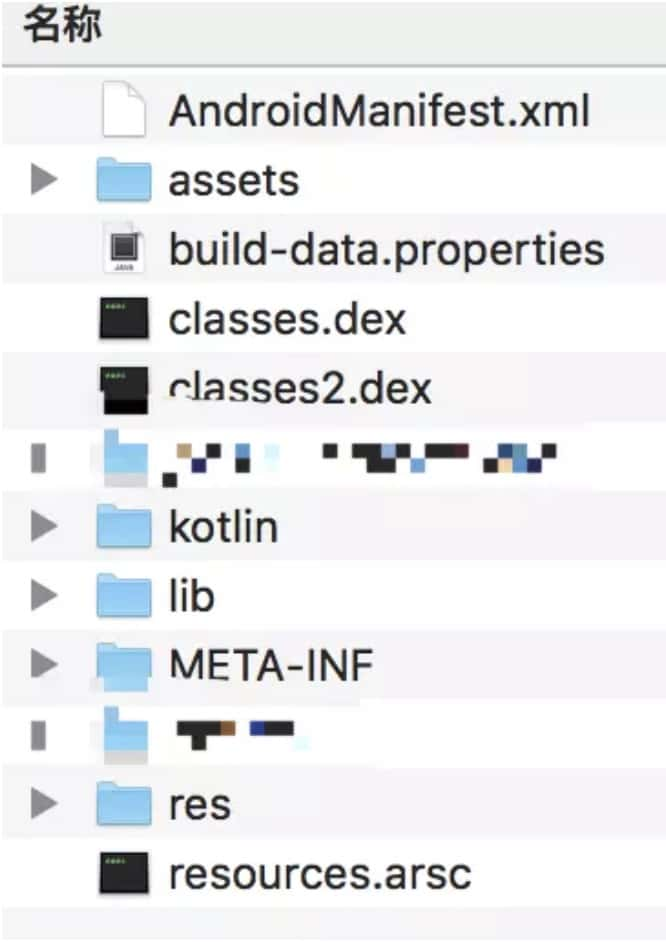

# Bitmap优化

## 加载图片

BitmapFactory类提供了四类方法：decodeFile、decodeResource、 decodeSteam和decodeByteAray分别用于支持从文件系统、资源、输入流以及字节数组中加载出一个Bitmap对象，其中decodeFile和decodeResource又间接调用了decodeStream方法，这四类方法最终是在Android的底层实现的，对应着BitmapFactory类的几个native方法。

## 高效加载Bitmap

采用BitmapFactory.Options来加载所需尺寸的图片。

通过BitmapFactory.Options来缩放图片，主要是用到了它的inSampleSize参数，即**采样率**。
当inSampleSize为1时，采样后的图片大小为图片的原始大小；
当inSampleSize大于1时，比如为2，那么采样后的图片其宽/高均为原图大小的1/2，而像素数为原图的1/4。可以发现采样率inSampleSize必须是大于1的整数图片才会有缩小的效果，并且采样率同时作用于宽/高。
当inSampleSize小于1时，其作用相当于1，即无缩放效果。

考虑实际的情况，比如ImageView的大小是100x100像素，而图片的原始大小为200x200，那么只需将采样率inSampleSize设为2即可。但是如果图片大小为200x300呢？这个时候采样率还应该选择2，这样缩放后的图片大小为100x150 像素，仍然是适合imageView的，如果采样率为3，那么缩放后的图片大小就会小于ImageView所期望的大小这样图片就会被拉伸从而导致模糊。

**获取采样率**

获取采样率也很简单，遵循如下流程：

1. 将BitmapFactory.Options的inJustDecodeBounds参数设为tnue并加载图片。
2. 从BitmapFactory.Options中取出图片的原始宽高信息，它们对应于outWidth和outHeight参数。
3. 根据采样率的规则并结合目标View的所需大小计算出采样率inSampleSize。
4. 将BitmapFactory.Options的inJustDecodeBounds参数设为false，然后重新加载图片。

经过上面4个步骤，加载出的图片就是最终缩放后的图片，当然也有可能不需要缩放。
这里说明一下inJustDecodeBounds参数，当此参数设为true时，BitmapFactory只会解析图片的原始宽高信息，并不会去真正地加载图片，所以这个操作是轻量级的。

## 优化策略

使用适当分辨率和大小的图片；

及时回收内存：从Android 3.0开始，Bitmap被放置到了堆中，其内存由GC管理，所以不用手动调用bitmap.recycle()方法进行释放了；

1. 对图片质量进行压缩

    ```java
    public static Bitmap compressImage(Bitmap bitmap){  
    		ByteArrayOutputStream baos = new ByteArrayOutputStream();  
    		//质量压缩方法，这里100表示不压缩，把压缩后的数据存放到baos中              				bitmap.compress(Bitmap.CompressFormat.JPEG， 100， baos);  
    		int options = 100;  
    		//循环判断如果压缩后图片是否大于50kb，大于继续压缩  
    		while ( baos.toByteArray().length / 1024>50) {                 
    			//清空baos  
    			baos.reset();  
    			bitmap.compress(Bitmap.CompressFormat.JPEG， options， baos);  
    			options -= 10;//每次都减少10  
    		}  
    		//把压缩后的数据baos存放到ByteArrayInputStream中  
    		ByteArrayInputStream isBm = new ByteArrayInputStream(baos.toByteArray());  
    		//把ByteArrayInputStream数据生成图片  
    		Bitmap newBitmap = BitmapFactory.decodeStream(isBm， null， null);  
    		return newBitmap;  
    } 
    ```

2. 对图片尺寸进行压缩

    ```java
    public static Bitmap compressImageFromBitmap(Bitmap bitmap， int pixelW， int pixelH) {
            ByteArrayOutputStream os = new ByteArrayOutputStream();
            bitmap.compress(Bitmap.CompressFormat.JPEG， 100， os);
            if( os.toByteArray().length / 1024>512) {//判断如果图片大于0.5M，进行压缩避免在生成图片（BitmapFactory.decodeStream）时溢出
                os.reset();
                bitmap.compress(Bitmap.CompressFormat.JPEG， 50， os);//这里压缩50%，把压缩后的数据存放到baos中
            }
            ByteArrayInputStream is = new ByteArrayInputStream(os.toByteArray());
            BitmapFactory.Options options = new BitmapFactory.Options();
            options.inJustDecodeBounds = true;
            options.inPreferredConfig = Bitmap.Config.RGB_565;
            BitmapFactory.decodeStream(is， null， options);
            options.inJustDecodeBounds = false;
            options.inSampleSize = 计算尺寸;
            is = new ByteArrayInputStream(os.toByteArray());
            Bitmap newBitmap = BitmapFactory.decodeStream(is， null， options);
            return newBitmap;
    }
    ```

3. 使用图片缓存
    设计内存缓存和磁盘缓存可以更好地利用Bitmap。

# 布局优化

- 删除无用控件和减少层级
- 选择性能较低的ViewGroup
- 利用merag和include进行布局重用
- 利用ViewStub进行延迟加载

具体见View绘制流程的布局优化

# 绘制优化

- 不要在onDraw里创建对象
- 不要在onDraw里做耗时操作

## 过度绘制优化

可以利用开发者选项的显示过度绘制区域来显示过度绘制区域，也可以利用Layout Inspector来查看View树。

具体见View绘制流程的过度绘制优化

可以从这几个方面进行优化：

1. 去除无用背景
    当布局中有多重背景时会导致视图的过度绘制，通过删除删除布局中不需要的背景来减少视图的过度绘制。
    在布局中，如果存在多个线性布局重叠时，可以考虑只针对最上层的布局设置背景色，而不需要每一个布局（例如LinearLayout）都设置背景色，过多的相同的背景色会导致过度绘制。
2. 在自定义view的onDraw中过度绘制问题
    在自定义view的onDraw中，如果涉及到重叠的绘制view时，可以考虑利用局部绘制避免过度绘制。
    考虑到效率和性能问题，界面是有一定刷新频率的，每一次刷新都会调用View的onDraw方法，而View提前绘制就是在onDraw中进行，避免在onDraw创建对象，避免在onDraw进行绘制，应在构造函数中画好，交给onDraw。

# 内存优化

## 内存泄漏优化

### 静态变量导致的内存泄漏

单例对象也是如此。

### 属性动画

无限循环的属性动画没有及时关闭。

### 注册解注册

对于一些需要注册的对象，需要及时解注册。

### Handler

#### 具体原理分析

通过Handler发送延时Message的时候，Message没有被及时处理，Message是持有Handler的引用，而Handler是通过匿名内部类的形式创建的，会默认持有外部类Activity的引用。这样在GC垃圾回收机制进行回收时发现这个Activity居然还有其他引用存在，因而就不会去回收这个Activity。 

#### 解决方案

**1.在Activity结束时将Handler里面的Message清空**

由于在Activity结束后，Handler里面的消息还没有被处理导致，消息不处理完Handler的引用就一直存在。因而我们可以在onDestroy中将Handler里面的消息给清空了，这样就不会有消息引用Handler了，也就不会因为Handler引用Activity导致Activity无法释放了。

```java
@Override
protected void onDestroy() {
    super.onDestroy();
    //将Handler里面消息清空了。
    mHandler.removeCallbacksAndMessages(null);
}
```

**2.静态内部类+弱引用**

为了避免非静态内部类&匿名内部类持有外部类引用可以采用静态内部类或者直接在外部编写该Handler的继承类。如果该类需要使用Activity相关变量，可以采用弱引用的方式将Activity的变量传过去。在获取Activity的时候还可以加上判断当前Activity是不是isFinishing的代码，避免因为当前Activity已经进入了finish状态，还去引用这个Activity。

```java
public class MainActivity extends Activity {
private CustomHandler mHandler;
 
@Override
protected void onCreate(Bundle savedInstanceState) {
super.onCreate(savedInstanceState);
        mHandler = new CustomHandler(this);
    }
 
static class CustomHandler extends Handler {
// 内部声明一个弱引用，引用外部类
private WeakReference<MainActivity > activityWeakReference;
public MyHandler(MyActivity activity) {
            activityWeakReference= new WeakReference<MainActivity >(activity);
        }
// ... ...   
    }
}
```

## 缓存对象

避免重复创建对象。

### 缓存策略

目前常用的一种缓存算法是LRU (Least Recently Used)，LRU是近期最少使用算法，它的**核心思想是当缓存满时，会优先淘汰那些近期最少使用的缓存对象。**采用LRU算法的缓存有两种：LruCache和DiskLruCache，LruCache用于实现内存缓存，而DiskLruCache则充当了存储设备缓存。

**LruCache**

[LruCache源码分析](/Applications/Projects/Blog/源码分析/LruCache源码分析.md)

LruCache是一个泛型类，它内部采用一个LinkedHashMap以强引用的方式存储外界的缓存对象，其提供了get和put方法来完成缓存的获取和添加操作，当缓存满时，LruCache会移除较早使用的缓存对象，然后再添加新的缓存对象。

LruCache是线程安全的，用synchronized来同步。

基本使用

```java
int maxMemory = (int)(Runtime.getRuntime().maxMemory()/1024);
int cacheSize = maxMemory / 8;
mMemoryCache = new LruCache<String， Bitmap> (cacheSize) {
      @Override
      protected int sizeOf(String key， Bitmap bitmap) {
          return bitmap.getRowBytes() * bitmap .getHeight() / 1024;
      }
};
```

在上面的代码中，只需要提供缓存的总容量大小并重写sizeOf方法即可。
sizeOf方法的作用是计算缓存对象的大小，这里大小的单位需要和总容量的单位一致。对于上面的示例代码来说，总容量的大小为当前进程的可用内存的1/8，单位为KB，而sizeOf方法则完成了Bitmap对象的大小计算。很明显，之所以除以1024也是为了将其单位转换为KB。

一些特殊情况下，还需要重写LruCache的entryRemoved方法，LruCache移除旧缓存时会调用entryRemoved方法，因此可以在entryRemoved中完成些资源回收工作 (如果需要的话)。

除了LruCache的创建以外，还有缓存的获取和添加，这也很简单，从LruCache中获取一个缓存对象，如下所示。

`mMemoryCache.get(key)`

向LruCache中添加一个缓存对象，如下所示。

`mMemoryCache.put(key， bitmap)`

LruCache还支持删除操作，通过remove方法即可删除个指定的缓存对象。

**DiskLruCache**

DiskLruCache用于实现存储设备缓存，即磁盘缓存，它通过将缓存对象写入文件系统从而实现缓存的效果。DiskLruCache得到了Android官方文档的推荐，但它不属于AndroidSDK的一部分。

**三级缓存策略**

先从内存缓存获取，如果没有，再从硬盘缓存获取，如果没有，最后从网络获取。

### Glide的缓存方式

[Glide源码分析](/Applications/Projects/Blog/源码分析/Glide源码分析.md)

## OOM问题如何处理

OOM主要原因有两个：

1. 内存泄露，资源造成得不到释放。
2. 保存了多个内存过大的对象（如Bitmap），造成内存超出限制。

针对图片过大的OOM的解决方法：

1. 高效加载大图片，利用图片压缩。
    见Bitmap优化

2. 利用图片缓存技术
    见缓存对象

减少内存占用的方法：

1. 使用更加轻量的数据结构

2. 避免在Android里面使用Enum

3. 减小Bitmap对象的内存占用

4. Bitmap对象的复用
    除了缓存还有一种方式
    **inBitMap高级特性**：利用inBitmap的高级特性提高Android系统在Bitmap分配与释放执行效率。使用inBitmap属性可以告知Bitmap解码器去尝试使用已经存在的内存区域，新解码的Bitmap会尝试去使用之前那张Bitmap在Heap中所占据的pixel data内存区域，而不是去问内存重新申请一块区域来存放Bitmap。利用这种特性，即使是上千张的图片，也只会仅仅只需要占用屏幕所能够显示的图片数量的内存大小
5. 使用更小的图片
6. 避免在onDraw方法里面执行对象的创建
7. 避免对象的内存泄露

## 其他内存优化

- 使用一些Android特有的数据结构，比如SparseArray和Pair等，它们都具有更好的性能
- 适当使用软引用和弱引用

# 启动优化

app启动分为冷启动（Cold start）、热启动（Hot start）和温启动（Warm start）三种。

## 冷启动（Cold start）

冷启动是指APP在手机启动后第一次运行，或者APP进程被kill掉后在再次启动。
可见冷启动的必要条件是该APP进程不存在，这就意味着系统需要创建进程，APP需要初始化。

在这三种启动方式中，冷启动耗时最长，对于冷启动的优化也是最具挑战的。

在冷启动开始时，系统有三个任务。这些任务是： 

1. 加载并启动应用程序
2. 启动后立即显示应用程序的空白启动窗口
3. 创建应用程序进程

当系统创建了应用进程之后，开始创建应用程序对象。

1、启动主线程 2、创建主Activity 3、加载布局 4、屏幕布局 5、执行初始绘制

应用程序进程完成第一次绘制后，系统进程会交换当前显示的背景窗口，将其替换为主活动。此时，用户可以开始使用该应用程序。至此启动完成。

### Application创建

当Application启动时，空白的启动窗口将保留在屏幕上，直到系统首次完成绘制应用程序。此时，系统进程会交换应用程序的启动窗口，允许用户开始与应用程序进行交互。这就是为什么程序启动时会先出现一段时间的黑屏(白屏)。

如果有Application，系统会`onCreate()`在Application对象上调用该方法。之后，应用程序会生成主线程（也称为UI线程），并通过创建主要活动来执行任务。

从这一点开始，App就按照他的应用程序生命周期阶段进行。

### Activity创建

应用程序进程创建活动后，活动将执行以下操作：

1. 初始化值。
2. 调用构造函数。
3. 调用回调方法，例如 Activity.onCreate()，对应Activity的当前生命周期状态。

通常，该onCreate()方法对加载时间的影响最大，因为它以最高的开销执行工作：加载和膨胀视图，以及初始化活动运行所需的对象。

## 热启动（Hot start）

App进程存在，并且Activity对象仍然存在内存中没有被回收。可以重复避免对象初始化，布局解析绘制。
场景就类似你打开微信聊了一会天这时候出去看了下日历 在打开微信 微信这时候启动就属于热启动。

热启动显示与冷启动方案相同的屏幕行为：系统进程显示空白屏幕，直到应用程序完成呈现活动。

## 温启动（Warm start）

App进程存在，当时Activity可能因为内存不足被回收。这时候启动App不需要重新创建进程，但是Activity的onCreate还是需要重新执行的。场景类似打开淘宝逛了一圈然后切到微信去聊天去了，过了半小时再次回到淘宝。这时候淘宝的进程存在，但是Activity可能被回收，这时候只需要重新加载Activity即可。

场景：

- 用户退出您的应用，但随后重新启动它。该过程可能已继续运行，但应用程序必须通过调用从头开始重新创建Activity 的onCreate()。
- 系统将您的应用程序从内存中逐出，然后用户重新启动它。需要重新启动进程和活动，但是在调用onCreate()的时候可以从Bundle（savedInstanceState）获取数据。

因此在创建应用程序和创建Activity期间都可能会出现性能问题。

这里是慢的定义：

- 冷启动需要5秒或更长时间。
- 温启动需要2秒或更长时间。
- 热启动需要1.5秒或更长时间。

无论何种启动，优化点都是： **Application、Activity创建以及回调等过程**

谷歌官方给的建议是：

1. 利用提前展示出来的Window，快速展示出来一个界面，给用户快速反馈的体验
2. 避免在启动时做密集沉重的初始化（Heavy app initialization）
3. 避免I/O操作、反序列化、网络操作、布局嵌套等

## 具体做法

#### 利用提前展示出来的Window，快速展示出来一个界面

在style中自定义一个样式Lancher，在其中放一张背景图片，或是广告图片之类的

```xml
<style name="AppTheme.Launcher">
    <item name="android:windowBackground">@drawable/ic_launcher_background</item>
</style>
```

把这个样式设置给启动的Activity

```xml
<activity android:name=".MainActivity"
    android:theme="@style/AppTheme.Launcher">
```

然后在Activity的onCreate方法，把Activity设置回原来的主题

```java
@Override
protected void onCreate(Bundle savedInstanceState) {
    setTheme(R.style.AppTheme);
    super.onCreate(savedInstanceState);
    setContentView(R.layout.activity_main);
    //...
}
```

这样在启动时就通过给用户看一张图片或是广告来防止黑白屏的尴尬。

### 避免在启动时做密集沉重的初始化

假设MyApplication的初始化操作有友盟，百度，bugly，数据库，IM，神策，图片加载库，网络请求库，广告sdk，地图，推送等。这些会导致Application加载缓慢，需要异步执行：

1. 比如像友盟，bugly这样的业务非必要的可以的异步加载。 
2. 比如地图，推送等，非第一时间需要的可以在主线程做延时启动。当程序已经启动起来之后，在进行初始化。 
3. 对于图片，网络请求框架必须在主线程里初始化了。

同时因为一般会有闪屏页面，也可以把延时启动的地图，推动的启动在这个时间段里，这样合理安排时间片的使用，极大的提高了启动速度。

## 总结

1. 利用提前展示出来的Window，快速展示出来一个界面，给用户快速反馈的体验；
2. 避免在启动时做密集沉重的初始化（Heavy app initialization）；
3. 避免I/O操作、反序列化、网络操作、布局嵌套等。 

# 包体优化



- **assets文件夹** 存放一些配置文件、资源文件，assets不会自动生成对应的 ID，而是通过AssetManager类的接口获取。
- **res目录** res 是 resource 的缩写，这个目录存放资源文件，会自动生成对应的 ID 并映射到 .R 文件中，访问直接使用资源 ID。
- **META-INF** 保存应用的签名信息，签名信息可以验证 APK 文件的完整性。
- **AndroidManifest.xml** 这个文件用来描述 Android 应用的配置信息，一些组件的注册信息、可使用权限等。
- **classes.dex** Dalvik 字节码程序，让 Dalvik 虚拟机可执行，一般情况下，Android 应用在打包时通过 Android SDK 中的 dx 工具将 Java 字节码转换为 Dalvik 字节码。
- **resources.arsc** 记录着资源文件和资源 ID 之间的映射关系，用来根据资源 ID 寻找资源。

需要从代码和资源两个方面去减少响应的大小。

1.   首先可以使用 lint 工具，如果有没有使用过的资源就会打印如下的信息：

     ```
     res/layout/preferences.xml: Warning: The resource R.layout.preferences appears to be unused [UnusedResources]
     ```

2.   同时可以开启资源压缩，自动删除无用的资源

     ```
     android {
         ...
         buildTypes {
             release {
                 shrinkResources true
                 minifyEnabled true
                 proguardFiles getDefaultProguardFile('proguard-android.txt'), 'proguard-rules.pro'
             }
         }
     ```

     可以使用可绘制对象，某些图像不需要静态图像资源；框架可以在运行时动态绘制图像。Drawable对象（`<shape>`以XML格式）可以占用APK中的少量空间。此外，XML Drawable对象产生符合“材料设计”准则的单色图像。
     简单说来就是尽量用XML写Drawable。

3.   重用资源，比如一个三角按钮，点击前三角朝上代表收起的意思，点击后三角朝下，代表展开，一般情况下会用两张图来切换，完全可以用旋转的形式去改变。

     ```xml
     <?xml version="1.0" encoding="utf-8"?>
     <rotate xmlns:android="http://schemas.android.com/apk/res/android"
         android:drawable="@drawable/ic_thumb_up"
         android:pivotX="50%"
         android:pivotY="50%"
         android:fromDegrees="180" />
     ```

     比如同一图像的着色不同，可以用android:tint和tintMode属性，低版本（5.0以下）可以使用ColorFilter。

4.   压缩PNG和JPEG文件可以减少PNG文件的大小，而不会丢失使用工具如图像质量 pngcrush，pngquant，或zopflipng。所有这些工具都可以减少PNG文件的大小，同时保持感知的图像质量。

5.   使用WebP文件格式可以使用图像的WebP文件格式，而不是使用PNG或JPEG文件。WebP格式提供有损压缩（如JPEG）以及透明度（如PNG），但可以提供比JPEG或PNG更好的压缩。
     可以使用Android Studio将现有的BMP，JPG，PNG或静态GIF图像转换为WebP格式。

6.   使用矢量图形可以使用矢量图形来创建与分辨率无关的图标和其他可伸缩Image。使用这些图形可以大大减少APK大小。一个100字节的文件可以生成与屏幕大小相关的清晰图像。
     但是，系统渲染每个VectorDrawable对象需要花费大量时间 ，而较大的图像需要更长的时间才能显示在屏幕上。因此，请考虑仅在显示小图像时使用这些矢量图形。
     不要把AnimationDrawable用于创建逐帧动画，因为这样做需要为动画的每个帧包含一个单独的位图文件，这会大大增加APK的大小。

7.   代码混淆 
     使用proGuard代码混淆器工具，它包括压缩、优化、混淆等功能。

     ```groovy
     android {
         buildTypes {
             release {
                 minifyEnabled true
                 proguardFiles getDefaultProguardFile(‘proguard-android.txt'),
                         'proguard-rules.pro'
             }
         }
     ```

# ANR

Activity：5秒
Broadcast：10秒
Service：20秒
会报ANR，都是在主线程中运行的

三种常见类型：

1. KeyDispatchTimeout(5 seconds) 

    按键或触摸事件在特定时间内无响应

2. BroadcastTimeout(10 seconds)

    BroadcastReceiver在特定时间内无法处理完成

3. ServiceTimeout(20 seconds) 

    Service在特定的时间内无法处理完成

如果在开发过程中遇到了ANR，那么怎么定位问题呢？

当一个进程发生ANR了以后，系统会在/data/anr目录下创建一个文件traces.txt，通过分析这个文件就能定位出ANR的原因。

# Fragment懒加载

在Fragment中有一个setUserVisibleHint方法，而且这个方法比onCreate()先执行，它会通过isVisibleToUser来判断当前Fragment是否可见，可以在可见的时候再进行网络加载。

```java
public void setUserVisibleHint(boolean isVisibleToUser)
```

只有可见时，isVisibleToUser为true，否则为false。所可以重写`setUserVisibleHint`方法，然后在可见时进行网络加载数据：

```java
@Override
public void setUserVisibleHint(boolean isVisibleToUser) {
    Log.d("TAG"， mTagName + " setUserVisibleHint() --> isVisibleToUser = " + isVisibleToUser);

    if (isVisibleToUser) {
        pullData();
    }
    super.setUserVisibleHint(isVisibleToUser);
}
```

# 