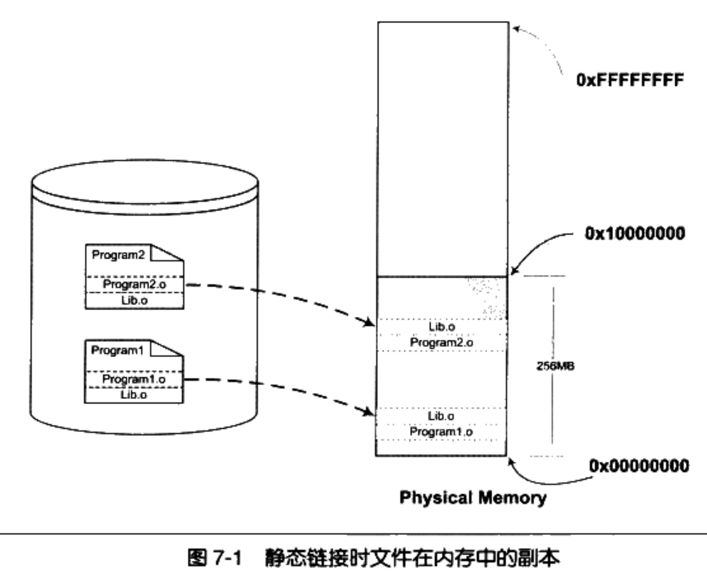
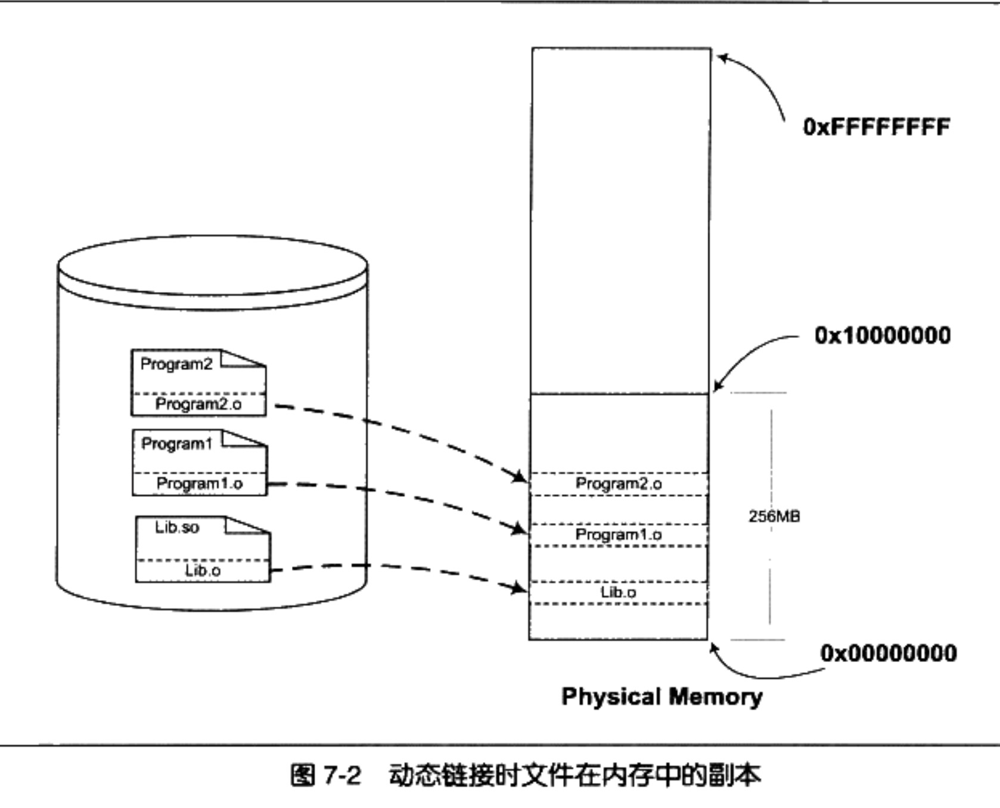
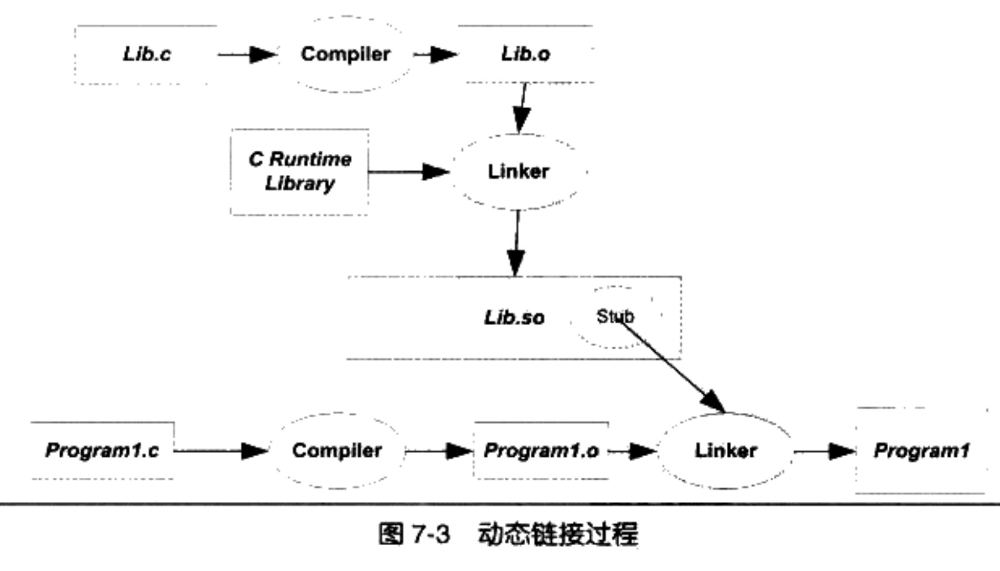

# 并发和并行

并行是指两个或者多个事件在同一时刻发生；而并发是指两个或多个事件在同一时间间隔发生。

从处理器的角度来看：

并行(parallel)：指在同一时刻，有多条指令在多个处理器上同时执行。所以无论从微观还是从宏观来看，二者都是一起执行的。

并发(concurrency)：指在同一时刻只能有一条指令执行，但多个进程指令被快速的轮换执行，使得在宏观上具有多个进程同时执行的效果，但在微观上并不是同时执行的，只是把时间分成若干段，使多个进程快速交替的执行。

# 进程和线程的区别

**进程**：当前执行程序的抽象。

**线程**：进程内的一个执行实体。

1.   一个进程有独立的内存空间，不同进程互不干扰。
2.   一个进程可以有多个线程。这些线程共享同一个内存空间。
3.   进程之间可以并发执行，同一个进程的多个线程之间也可并发执行。
4.   进程创建和销毁的开销要大于线程。

# 虚拟内存与物理内存

物理内存：真实的硬件设备（内存条）

虚拟内存：利用磁盘空间虚拟出的一块逻辑内存，用作虚拟内存的磁盘空间被称为交换空间。（为了满足物理内存的不足而提出的策略）

## 直接使用物理内存的问题

-   地址空间不隔离
    所有程序都直接访问物理地址，程序所使用的内存空间不是相互隔离的。其它程序很容易影响当前程序。
-   内存使用效率低
    由于没有有效的内存管理机制，通常需要一个程序执行时，监控程序就将整个程序装入内存中然后开始执行。如果我们忽然需要运行程序C，那么这时内存空间其实已经不够了，这时候我们可以用的一个办法是将其他程序的数据暂时写到磁盘里面，等到需要用到的时候再读回来。由于程序所需要的空间是连续的，那么这个例子里面，如果我们将程序A换出到磁盘所释放的内存空间是不够的，所以只能将B换出到磁盘，然后将C读入到内存开始运行。可以看到整个过程中有大量的数据在换入换出，导致效率十分低下。
-   程序运行的地址
    不确定因为程序每次需要装入运行时，我们都需要给它从内存中分配一块足够大的空闲区域，这个空闲区域的位置是不确定的。这给程序的编写造成了一定的麻烦，因为程序在编写时，它访问数据和指令跳转时的目标地址很多都是固定的，这涉及**程序的重定位**问题。

解决这几个问题的思路就是使用一种间接的地址访问方法。整个想法是这样的：
我们把程序给出的地址看作是一种虚拟地址(Virtual Address)，然后通过某些映射的方法，将这个虚拟地址转换成实际的物理地址。这样，只要我们能够妥善地控制这个虚拟地址到物理地址的映射过程，就可以保证任意一个程序所能够访问的物理内存区域跟另外一个程序相互不重叠，以达到地址空间隔离的效果。

## 页式存储管理

分页的基本方法是把地址空间人为地等分成固定大小的页，每一页的大小由硬件决定，或硬件支持多种大小的页，由操作系统选择决定页的大小。

那么，当我们把进程的虚拟地址空间按页分割，把常用的数据和代码页装载到内存中，把不常用的代码和数据保存在磁盘里，当需要用到的时候再把它从磁盘里取出来即可。

虚拟存储的实现需要依靠硬件的支持，对于不同的CPU来说是不同的。但是几乎所有的硬件都采用一个叫MMU（Memory Management Unit）的部件来进行页映射，在页映射模式下，CPU发出的是Virtual Address，即我们的程序看到的是虚拟地址。经过MMU转换以后就变成了Physical Address。一般MMU都集成在CPU内部了，不会以独立的部件存在。

## **分页式虚拟内存管理基本原理**

1.   首先，划分物理内存空间。同时，用户程序也进行分页。

2.   在用户程序开始执行前，不将该程序的所有页都一次性装入内存，而是先放在外存。当程序被调度投入运行时，系统根据需要将页装入内存。
3.   发现所要访问的数据或指令不在内存中，就会产生缺页中断，到外存寻找包含所需数据或指令的页，并将其装入到内存的空闲块中。
4.   在装入页的过程中，若发现内存不足，则需要通过页面置换功能从已在内存的页中挑选一个将其淘汰，释放所占用的物理块后将新的页面装人该块，进程继续运行。
5.   被淘汰的页面如果刚才被修改过，则还需要将其回写到外存，以保留其最新内容。

# 编译链接

## 静态链接

静态链接器（static linker）以一组可重定位目标文件和命令行参数作为输入，生成一个完全链接的、可以加载和运行的可执行目标文件作为输出。

为了构造可执行文件，链接器必须完成两个主要任务：

-   符号解析（symbolresolution）。
    目标文件定义和引用符号，每个符号对应于一个函数、一个全局变量或一个静态变量（即C语言中任何以static属性声明的变量）。 符号解析的目的是将每个符号引用正好和一个符号定义关联起来。 
-   重定位（relocation）。
    编译器和汇编器生成从地址0开始的代码和数据节。链接器通过把每个符号定义与一个内存位置关联起来，从而重定位这些节，然后修改所有对这些符号的引用，使得它们指向这个内存位置。链接器使用汇编器产生的重定位条目（relocationentry）的详细指令，不加甄别地执行这样的重定位。 

## 静态库

静态库是一些目标文件（.o）的压缩包（.a）。

Q：为什么静态运行库里面一个目标文件只包含一个函数？比如libc.a里面printf.o只有printf()函数、strlen.o只有strlen()函数。
A：链接器在链接静态库的时候是以目标文件为单位的。比如我们引用了静态库中的printf()函数，那么链接器就会把库中包含printf()函数的那个目标文件链接进来，如果很多函数都放在一个目标文件中，很可能很多没用的函数都被一起链接进了输出结果中。由于运行库有成百上千个函数，数量非常庞大，每个函数独立地放在一个目标文件中可以尽量减少空间的浪费，那些没有被用到的目标文件(函数)就不要链接到最终的输出文件中。

## 静态链接的问题

1.   内存和磁盘空间
     静态链接的方式对于计算机内存和磁盘的空间浪费非常严重。在现在的Linux系统中，一个普通程序会使用到的C语言静态库至少在1MB以上，那么，如果我们的机器中运行着100个这样的程序，就要浪费近100MB的内存；如果磁盘中有2000个这样的程序，就要浪费近2GB的磁盘空间。

     

2. 程序开发和发布
     静态链接对程序的更新、部署和发布也会带来很多麻烦。比如程序Program1所使用的Lib.o是由一个第三方厂商提供的，当该厂商更新了Lib.o的时候，那么Program1的厂商就需要拿到最新版的Lib.o，然后将其与Program1链接后，将新的Program1整个发布给用户。
     这样做的缺点很明显，即一旦程序中有任何模块更新，整个程序就要重新链接、发布给用户。

## 动态链接

要解决空间浪费和更新困难这两个问题最简单的办法就是把程序的模块相互分割开来，形成独立的文件，而不再将它们静态地链接在一起。简单地讲，就是不对那些组成程序的目标文件进行链接，等到程序要运行时才进行链接。这就是动态链接（Dynamic Linking）的基本思想。

以 Program1和 Program2 为例，假设我们保留 Program1.o、Program2.o 和 Lib.o 三个目标文件。当我们要运行Program1这个程序时，系统首先加载Program1.o，当系统发现Program1.o中用到了 Lib.o，那么系统接着加载 Lib.o，如果Program1.o或Lib.o还依赖于其他目标文件，系统会按照这种方法将它们全部加载至内存。

所有需要的目标文件加载完毕之后，如果依赖关系满足，即所有依赖的目标文件都存在于磁盘，系统开始进行链接工作。这个链接工作的原理与静态链接非常相似，包括符号解析、地址重定位等。

很明显，上面的这种做法解决了共享的目标文件多个副本浪费磁盘和内存空间的问题。

## 简单的动态链接例子

两个程序的主要模块 Program1.c 和 Program2.c 分别调用了 Lib.c 里面的foobar()函数。

使用 GCC将Lib.c编译成一个共享对象文件:
gcc -fPIC -shared -o Lib.so Lib.c
GCC 命令中的参数“-shared”表示产生共享对象

然后分别编译链接 Program1.c 和 Program2.c：
gcc -o Program1 Program1.c ./Lib.so
gcc -o Program2 Program2.c ./Lib.so

图中有一个步骤与静态链接不一样，那就是Program1.o被链接成可执行文件的这一步。在静态链接中，这一步链接过程会把Program1.o和Lib.o链接到一起，并且产生输出可执行文件Program1。但是在这里，Lib.o没有被链接进来，链接的输入目标文件只有Program1.o。但是从前面的命令行中我们看到，Lib.so也参与了链接过程。这是怎么回事呢?

当程序模块Program1.c被编译成为Program1.o时，编译器还不不知道foobar函数的地址。当链接器
将Program1.o链接成可执行文件时，这时候链接器必须确定Program1.o中所引用的foobar函数的性质。如果foobar是一个定义与其他静态目标模块中的函数，那么链接器将会按照静态链接的规则，将Program1.o中的foobar地址引用重定位；如果foobar是一个定义在某个动态共享对象中的函数，那么链接器就会将这个符号的引用标记为一个动态链接的符号，不对它进行地址重定位，把这个过程留到装载时再进行。

那么这里就有个问题，链接器如何知道foobar的引用是一个静态符号还是一个动态符号？这实际上就是我们要用到Lib.so的原因。Lib.so中保存了完整的符号信息（因为运行时进行动态链接还须使用符号信息），把Lib.so也作为链接的输入文件之一，链接器在解析符号时就可以知道：foobar是一个定义在Lib.so的动态符号。这样链接器就可以对foobar的引用做特殊的处理，使它成为一个对动态符号的引用。

# 同步和互斥

## 什么是互斥

若干进程因相互竞争独占性资源而产生的竞争制约关系称为互斥

## 什么是同步

同步是指在若干任务访问共享资源时，采取某种手段来保证共享资源在同一个时刻只被一个任务使用。互斥是同步的一种方法。

# 死锁是怎么导致的？如何定位死锁

某个任务在等待另一个任务，而后者又等待别的任务，这样一直下去，直到这个链条上的任务又在等待第一个任务释放锁。这得到了一个任务之间互相等待的连续循环，没有哪个线程能继续。这被称之为死锁。当以下四个条件同时满足时，就会产生死锁：

1. 互斥条件。任务所使用的资源中至少有一个是不能共享的。

2. 任务必须持有一个资源，同时等待获取另一个被别的任务占有的资源。

3. 资源不能被强占。

4. 必须有循环等待。一个任务正在等待另一个任务所持有的资源，后者又在等待别的任务所持有的资源，这样一直下去，直到有一个任务在等待第一个任务所持有的资源，使得大家都被锁住。

要解决死锁问题，必须打破上面四个条件的其中之一。在程序中，最容易打破的往往是第四个条件。