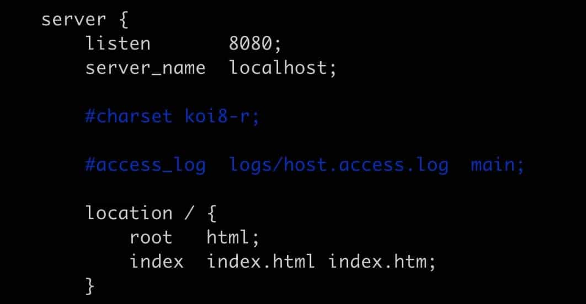

# 创建文件夹

```
mkdir nginx
cd nginx
```

# 下载并解压

```
wget http://nginx.org/download/nginx-1.19.2.tar.gz
tar -zxvf nginx-1.19.2.tar.gz
```

# 安装nginx依赖包

```
yum -y install gcc zlib zlib-devel pcre-devel openssl openssl-devel
```

# 安装nginx 

```
进入nginx目录：
cd  /root/nginx/nginx-1.19.2

执行命令：
./configure

执行编译命令：
make

执行安装命令：
make   install
```

安装完，nginx在/usr/local/nginx下

# 配置nginx

```
vim /usr/local/nginx/conf/nginx.conf
```



端口改为8080，最好不要占用默认的80端口。

# 配置环境变量

```
ln -s /usr/local/nginx/sbin/nginx /usr/local/bin/
```

/usr/local/bin/就是环境变量目录

# 启动nginx

```
启动：
nginx

查看 nginx 进程：
ps -ef | grep  nginx
```

# 遇到的问题

## 8080端口不生效

如果端口不生效，可能是云服务器拦截了，设置安全组：


