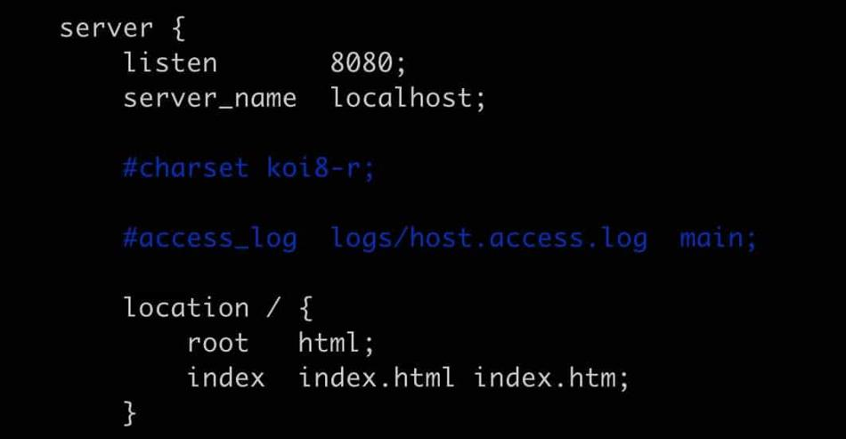
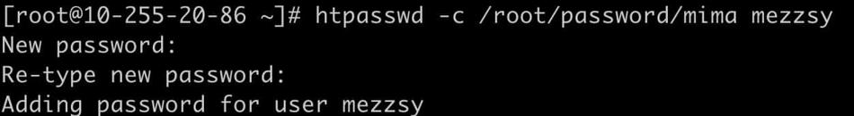
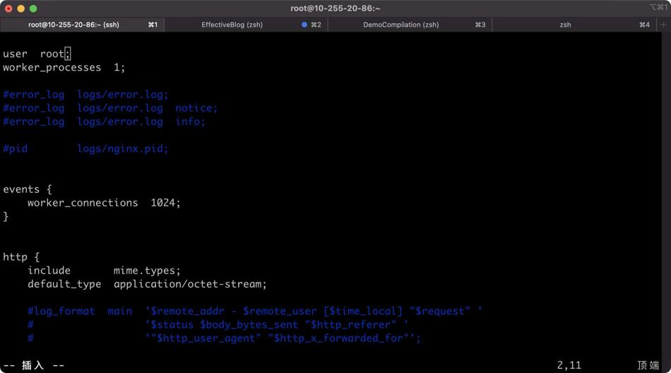

# CentOS配置

## git安装

```
# 安装
yum install -y git

# 查看版本
git version
```

## 密钥生成

```shell
 ssh-keygen -t rsa -b 4096 -C "your_email@example.com"
```

# gitbook安装

需要先安装node.js

```
npm install gitbook-cli -g
```

首次安装会出现语法错误：

修改文件`/root/node-v16.16.0/lib/node_modules/gitbook-cli/node_modules/npm/node_modules/graceful-fs/polifills.js`

找到这个文件打开，找到

```
fs.stat = statFix(fs.stat)
fs.fstat = statFix(fs.fstat)
fs.lstat = statFix(fs.lstat)
```

注释掉这三个调用

## gitbook和nginx关联

修改配置文件：

```
vim /usr/local/nginx/conf/nginx.conf
```

```
server {
        listen       4000;                		#nginx监听的端口
        server_name  117.51.142.225;         	#拦截的用户访问路径
        # 访问本地绝对路径下的静态html    
        location / {
            root   /root/EffectiveBlog/_book;	#gitbook build 生成的文件
            index  index.html index.htm;
		}
}
```

# 搭建nginx

## 创建文件夹

```
mkdir nginx
cd nginx
```

## 下载并解压

```
wget http://nginx.org/download/nginx-1.19.2.tar.gz
tar -zxvf nginx-1.19.2.tar.gz
```

## 安装nginx依赖包

```
yum -y install gcc zlib zlib-devel pcre-devel openssl openssl-devel
```

## 安装nginx 

```
进入nginx目录：
cd  /root/nginx/nginx-1.19.2

执行命令：
./configure

执行编译命令：
make

执行安装命令：
make   install
```

安装完，nginx在/usr/local/nginx下

## 配置nginx

```
vim /usr/local/nginx/conf/nginx.conf
```



端口改为8080，最好不要占用默认的80端口。

## 配置环境变量

```
ln -s /usr/local/nginx/sbin/nginx /usr/local/bin/
```

/usr/local/bin/就是环境变量目录

## 启动nginx

```
启动：
nginx

查看 nginx 进程：
ps -ef | grep  nginx
```

## 登录权限认证

### 安装htpassed工具

通过yum安装

```
yum -y install httpd-tools
```

设置用户名和密码，并把用户名、密码保存到指定文件中：

```
htpasswd -c [passwfile] [username]
```

 

### 修改nginx配置文件

```
vim /usr/local/nginx/conf/nginx.conf
```

```
server {
        listen       4000;                		#nginx监听的端口
        server_name  117.51.142.225;         	#拦截的用户访问路径
        # 访问本地绝对路径下的静态html    
        location / {
            root   /root/EffectiveBlog/_book;	#gitbook build 生成的文件
            index  index.html index.htm;
		}
		#新增下面两行
   		auth_basic "请输入密码"; #这里是验证时的提示信息 
   		auth_basic_user_file /root/password/mima;
}
```

## 遇到的问题

### 8080端口不生效

如果端口不生效，可能是云服务器拦截了，设置安全组：


### 没有读取文件的权限

将nginx.config的user改为和启动用户一致：



### 启动Nginx时候报错

https://blog.csdn.net/weixin_45525272/article/details/107980445

# node.js安装

```
// 压缩包
wget https://nodejs.org/dist/v16.16.0/node-v16.16.0-linux-x64.tar.xz
```

# screen安装

```
yum install screen
```

