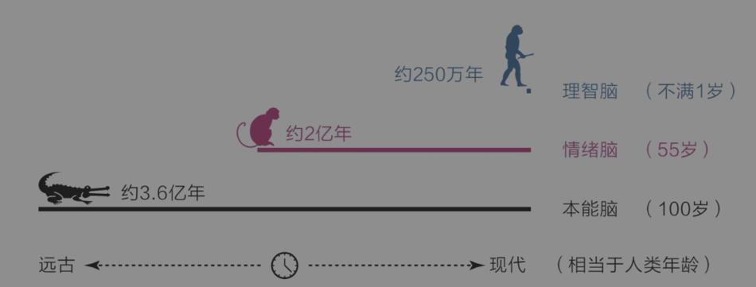
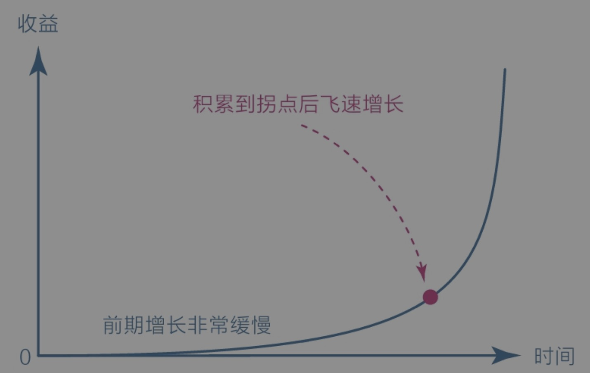
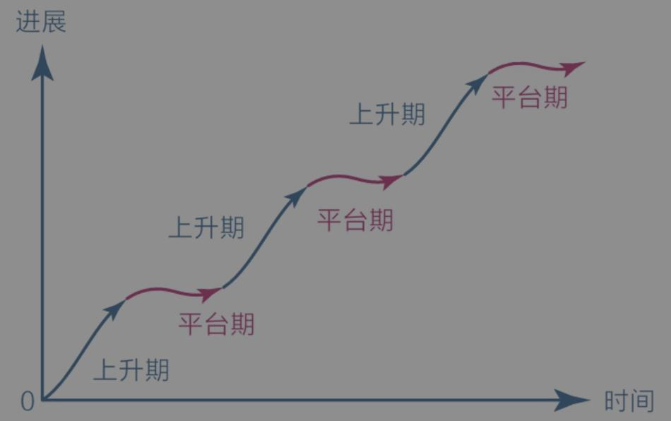

# 第一章：大脑

## 大脑

大脑分为三种类型：

1.   本能脑
2.   情绪脑
3.   理智脑

理智脑虽然高级，但比起本能脑和情绪脑，它的力量实在是太弱小了。

本能脑和情绪脑虽然看起来很低级，但它们掌管着潜意识和生理系统，其运行速度极快，至少可达11 000000次/秒；而理智脑的最快运行速度仅为40次/秒，并且理智脑运行时非常耗能。

## 焦虑

焦虑真正的根源：急于求成，想同时做很多事；避难趋易，想不怎么努力就立即看到效果。

-   克制欲望，不要让自己同时做很多事；
-   面对现实，看清自己真实的能力水平；
-   要事优先，想办法只做最重要的事情；
-   接受环境，在局限中做力所能及的事；
-   直面核心，狠狠逼自己一把去突破它。

如何做到上面这几点：提升能力和保持耐心。

## 耐心

肤浅的认知：用意志力去对抗，如果做不到，只能说明自己意志力不强。

复利曲线

复利效应显示了价值积累的普遍规律：前期增长非常缓慢，但到达一个拐点后会飞速增长。

对于任何没有特殊资源的个体或群体来说，坚信并践行这个价值积累规律，早晚能有所成就。当然，前提是选择正确的方向，并在积累的过程中遵循刻意练习的原则，在舒适区边缘一点一点地扩展自己的能力范围。

舒适区边缘另一个重要的规律是它揭示了能力成长的普遍法则：无论个体还是群体，其能力都以“舒适区—拉伸区—困难区”的形式分布，要想让自己高效成长，必须让自己始终处于舒适区的边缘，贸然跨到困难区会让自己受挫，而始终停留在舒适区会让自己停滞。

有了上述宏观规律作支撑，我们就可以观察微观规律了。
对于学习成长而言，成长权重对比是每个人都应该首先认识的，它揭示了“学习、思考、行动和改变”在成长过程中的关系：即对于学习而言，学习之后的思考、思考之后的行动、行动之后的改变更重要，如果不盯住内层的改变量，那么在表层投入再多的学习量也会事倍功半；因此，从权重上看，改变量﹥行动量﹥思考量﹥学习量。

另一个值得关注的微观规律是学习的平台期。这个规律表明，学习进展和时间的关系并不是我们想象中的那种线性关系（学多少是多少），而是呈现一种波浪式上升曲线。

几乎任何学习都是这样，刚开始的时候进步很快，然后会变慢，进入一个平台期。在平台期，我们可能付出了大量的努力，但看起来毫无进步，甚至可能退步，不过这仅仅是一个假象，因为大脑中的神经元细胞依旧在发生连接并被不停地巩固，到了某一节点后，就会进入下一个快速上升阶段。

### 怎样拥有耐心

1.   首先，面对天性，放下心理包袱，坦然接纳自己。
2.   其次，面对诱惑，学会延迟满足，变对抗为沟通。
3.   最后，面对困难，主动改变视角，赋予行动意义。

最高级的方法是请本能脑和情绪脑出动来解决困难。科学家废寝忘食地沉迷于研究，是因为他们真的乐在其中；跑步者风雨无阻地迈腿奔跑，是因为他们自己不愿意停下，他们正舒服着呢！