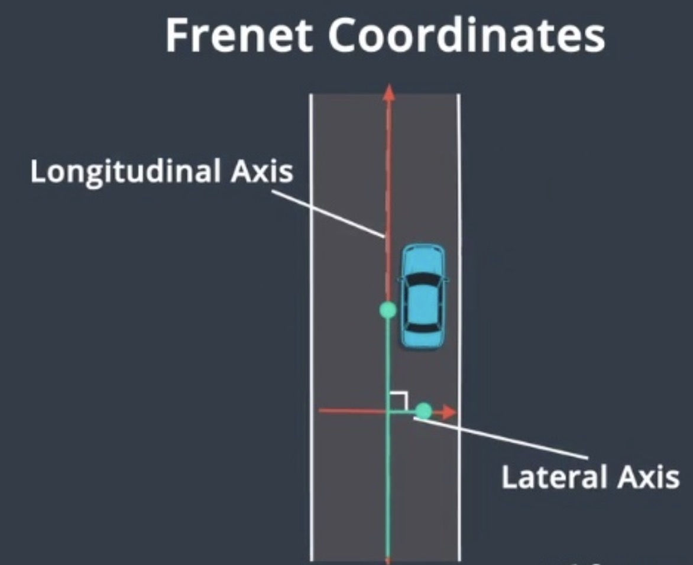
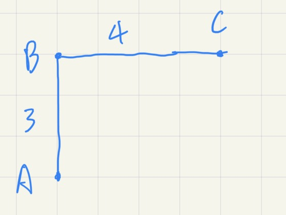
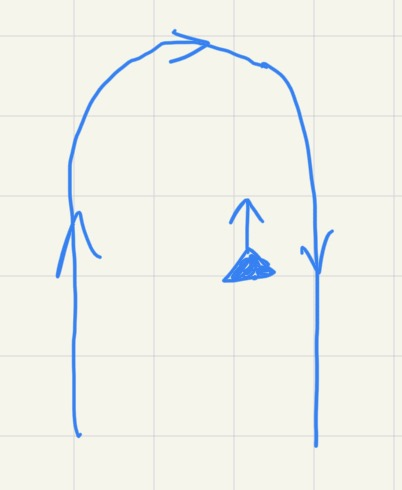
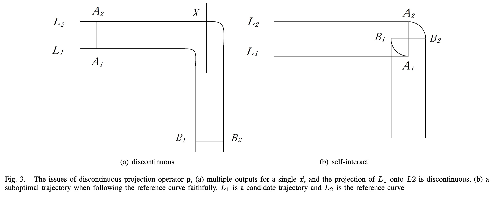
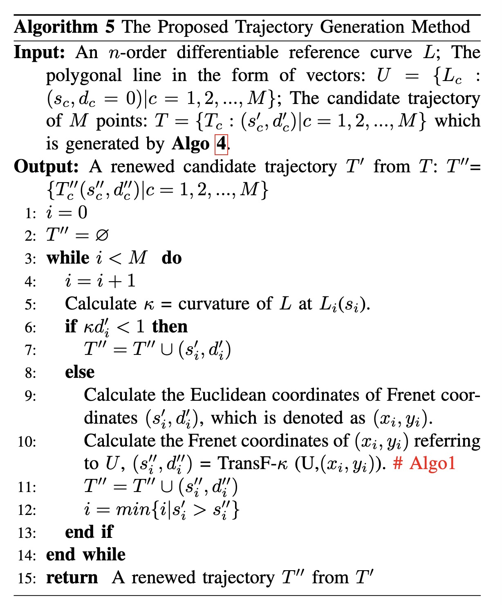
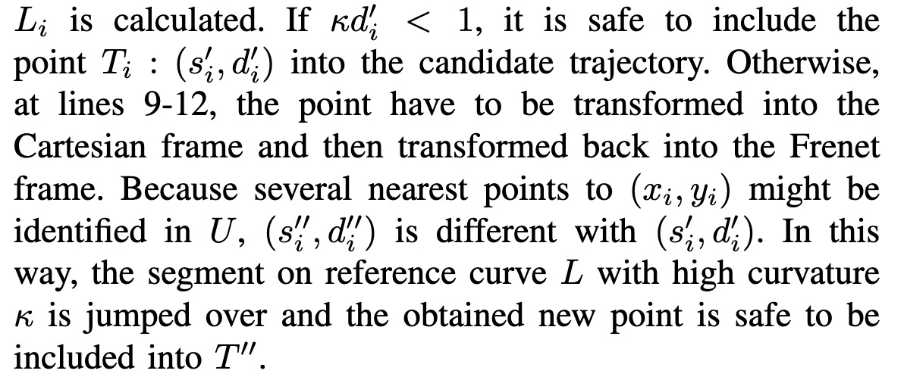

# 笛卡尔坐标系

通常使用笛卡尔坐标系描述物体的位置，但在车道级导航中主要使用frenet坐标系，因为车辆位置 (x, y)难以确定它是否偏离车道中心，也很难计算车辆行驶了多远。

# Frenet 坐标系

Frenet 坐标系描述了汽车相对于道路的位置，在 Frenet 坐标系中，s 代表沿道路的距离称为纵坐标，d表示与纵向线的位移称为横坐标。

这样保证了在道路的每个点上，横轴和纵轴都是垂直的，纵坐标表示在道路中的行驶距离，横坐标表示汽车偏离中心线的距离。

在Frenet坐标系中，使用道路的中心线作为参考线，使用参考线的切线向量 t 和法线向量 n 建立一个坐标系。以车辆自身为原点，坐标轴相互垂直，分为s 方向（即沿着参考线的方向，通常被称为纵向，Longitudinal）和 d 方向（即参考线当前的法向，被称为横向，Lateral）。

# 坐标系转换

## S的计算

参考线上的s值是某个点到参考线起点的路程。

比如A-B-C是参考线，点C的s值是7，而不是5。

## 笛卡尔坐标转为Frenet坐标

车辆点A投影到参考线的投影点B作为原点，s就是投影点B的s值，d值就是A到B的距离（法向距离）。

### 寻找投影点

在程序中，路线（参考线）是通过polyline表示的，也就是一条条线段。在寻找投影点时，遍历每一条线段，寻找最近的一条线段，

### 寻找投影点优化

在寻找投影点时，会遍历每一条线段，复杂度是On。apollo的优化方式是采用KdTree，可以将平均复杂度降到Ologn。

### 寻找投影点过滤

参考线和小车的位置关系如图，此时小车更靠近右边，但是根据小车的方向，小车的投影点应该在左边，所以寻找投影点时还需要加上方向约束。

## Frenet坐标转为笛卡尔坐标

已知参考线和Frenet坐标(s, d)。首先根据s坐标计算出在参考线上的笛卡尔坐标，这个坐标就是投影点，然后根据d值计算出实际位置。

### 自相交(self-intersection)问题

>   这篇论文介绍了如何解决自相交问题：
>
>   《An Efficient Generation Method based on Dynamic Curvature of the
>   Reference Curve for Robust Trajectory Planning》

L2作为参考线，以上面的定义计算车辆的笛卡尔坐标，那么最终的曲线如b，会出现自相交的情况。

解决方法，见论文的算法5：

首先计算参考线s处的曲率k，如果kd < 1，那么这个转换没有问题。为什么要kd < 1，因为曲率k是曲率半径的倒数，出现自相交的边界条件就是kd = 1。

如果kd >= 1，那么将其转为笛卡尔坐标，再转为Frenet坐标，并调整index值。

# 参考

[【自动驾驶】运动规划丨轨迹规划丨Frenet坐标转换](https://zhuanlan.zhihu.com/p/109193953)