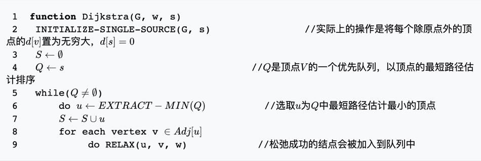
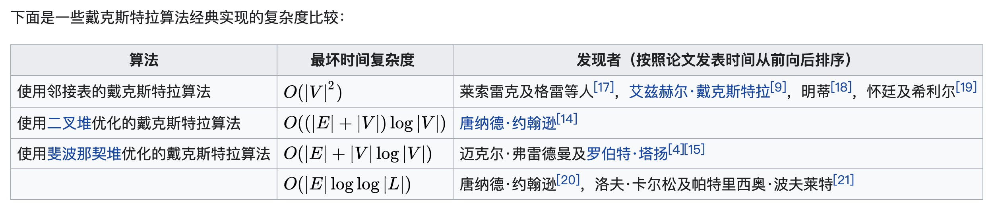
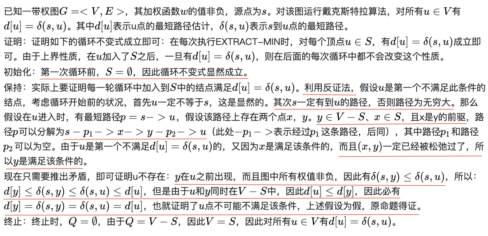
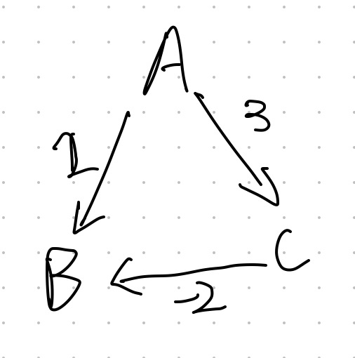

# 广度优先搜索

略

# Dijkstra（迪杰斯特拉算法）

[维基百科-Dijkstra](https://zh.wikipedia.org/wiki/%E6%88%B4%E5%85%8B%E6%96%AF%E7%89%B9%E6%8B%89%E7%AE%97%E6%B3%95)

Dijkstra算法使用类似广度优先搜索的方法解决赋权图的单源最短路径问题。

## 算法描述

算法维护两个顶点集合S和Q。集合S保留所有已知实际最短路径值的顶点，而集合Q则保留其他所有顶点。

集合S初始状态为空，而后每一步都有一个顶点从Q移动到S。这个被选择的顶点是Q中拥有最小的`d[u]`值的顶点。当一个顶点u从Q中转移到了S中，算法对u的每条外接边`w(u, v)`进行松弛。

伪代码：

## 时间复杂度

## 算法正确性证明

## 不能出现负权重的原因

从正确性证明看，Dijkstra算法不能出现负权重的边。

从一个case也能看出。规划一条从A到B的最短路径：

按照Dijkstra算法，先把A加入到S中，然后松弛。下一步，把B加入到S中，此时B已经找到，会规划出`A->B`的路径，但这并不是最短路径。

## 性质

Dijkstra无关有向无向。无关有环无环。

# 最佳优先搜索

在一些情况下，如果可以预先计算出每个节点到终点的距离，那么可以利用这个信息更快的到达终点。

其原理也很简单。与Dijkstra算法类似，使用一个优先队列，但此时以每个节点到达终点的距离作为优先级，每次始终选取到终点移动代价最小（离终点最近）的节点作为下一个遍历的节点。这种算法称之为最佳优先（Best First）算法。

# A*算法

