把绘制代码写在 `onDraw()` 里面，就是自定义绘制最基本的实现。记得别漏 `super.onDraw()`。

# Canvas.drawXXX() 

## Canvas.drawColor(@ColorInt int color) 颜色填充

在整个绘制区域统一涂上指定的颜色。

```java
drawColor(Color.BLACK);  // 纯黑  
```

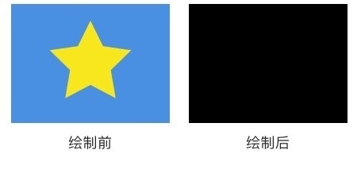

```java
drawColor(Color.parse("#88880000"); // 半透明红色  
```

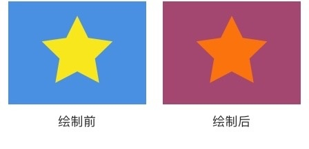

类似的方法还有 `drawRGB(int r, int g, int b)` 和 `drawARGB(int a, int r, int g, int b)` ，它们和 `drawColor(color)` 。

**这类颜色填充方法一般用于在绘制之前设置底色，或者在绘制之后为界面设置半透明蒙版。**

## drawCircle(float centerX, float centerY, float radius, Paint paint) 画圆

前两个参数 `centerX` `centerY` 是圆心的坐标，第三个参数 `radius` 是圆的半径，单位都是像素，它们共同构成了这个圆的基本信息（即用这几个信息可以构建出一个确定的圆）；第四个参数 `paint` 提供基本信息之外的所有风格信息，例如颜色、线条粗细、阴影等。

```java
canvas.drawCircle(300, 300, 200, paint);  
```

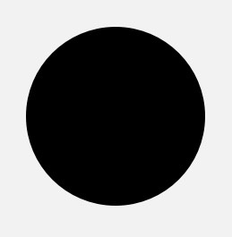

## drawRect(float left, float top, float right, float bottom, Paint paint) 画矩形

`left`, `top`, `right`, `bottom` 是矩形四条边的坐标。

```java
paint.setStyle(Style.FILL);  
canvas.drawRect(100, 100, 500, 500, paint);

paint.setStyle(Style.STROKE);  
canvas.drawRect(700, 100, 1100, 500, paint);  
```

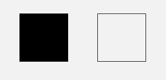

另外，它还有两个重载方法 `drawRect(RectF rect, Paint paint)` 和 `drawRect(Rect rect, Paint paint)` ，让你可以直接填写 `RectF` 或 `Rect` 对象来绘制矩形。

## drawPoint(float x, float y, Paint paint) 画点

`x` 和 `y` 是点的坐标。

点的大小可以通过 `paint.setStrokeWidth(width)` 来设置。

点的形状可以通过 `paint.setStrokeCap(cap)` 来设置：

1. `ROUND` 画出来是圆形的点
2. `SQUARE` 或 `BUTT` 画出来是方形的点。

> 注：`Paint.setStrokeCap(cap)` 可以设置点的形状，但这个方法并不是专门用来设置点的形状的，而是一个设置线条端点形状的方法。端点有圆头 (`ROUND`)、平头 (`BUTT`) 和方头 (`SQUARE`) 三种。

```java
paint.setStrokeWidth(20);  
paint.setStrokeCap(Paint.Cap.ROUND);  
canvas.drawPoint(50, 50, paint);  
```

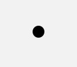

```java
paint.setStrokeWidth(20);  
paint.setStrokeCap(Paint.Cap.SQUARE);  
canvas.drawPoint(50, 50, paint);  
```

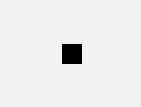

## drawPoints(float[] pts, int offset, int count, Paint paint) / drawPoints(float[] pts, Paint paint) 画点（批量）

同样是画点，它和 `drawPoint()` 的区别是可以画多个点。`pts` 这个数组是点的坐标，每两个成一对；`offset` 表示跳过数组的前几个数再开始记坐标；`count` 表示一共要绘制几个点。

```java
float[] points = {0, 0, 50, 50, 50, 100, 100, 50, 100, 100, 150, 50, 150, 100};  
// 绘制四个点：(50, 50) (50, 100) (100, 50) (100, 100)
canvas.drawPoints(points, 2 /* 跳过两个数，即前两个 0 */,  
          8 /* 一共绘制 8 个数（4 个点）*/, paint);
```

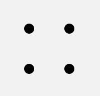

## drawOval(float left, float top, float right, float bottom, Paint paint) 画椭圆

只能绘制横着的或者竖着的椭圆，不能绘制斜的（斜的需要配合几何变换）。`left`, `top`, `right`, `bottom` 是这个椭圆的左、上、右、下四个边界点的坐标。

```java
paint.setStyle(Style.FILL);  
canvas.drawOval(50, 50, 350, 200, paint);

paint.setStyle(Style.STROKE);  
canvas.drawOval(400, 50, 700, 200, paint);  
```

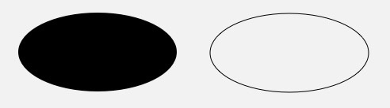

另外，它还有一个重载方法 `drawOval(RectF rect, Paint paint)`，让你可以直接填写 `RectF` 来绘制椭圆。

## drawLine(float startX, float startY, float stopX, float stopY, Paint paint) 画线

`startX`, `startY`, `stopX`, `stopY` 分别是线的起点和终点坐标。

```java
canvas.drawLine(200, 200, 800, 500, paint);  
```

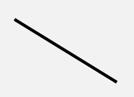

> 由于直线不是封闭图形，所以 `setStyle(style)` 对直线没有影响。

## drawLines(float[] pts, int offset, int count, Paint paint) / drawLines(float[] pts, Paint paint) 画线（批量）

`drawLines()` 是 `drawLine()` 的复数版。

```java
float[] points = {20, 20, 120, 20, 70, 20, 70, 120, 20, 120, 120, 120, 150, 20, 250, 20, 150, 20, 150, 120, 250, 20, 250, 120, 150, 120, 250, 120};  
canvas.drawLines(points, paint);  
```


## drawRoundRect(float left, float top, float right, float bottom, float rx, float ry, Paint paint) 画圆角矩形

`left`, `top`, `right`, `bottom` 是四条边的坐标，`rx` 和 `ry` 是圆角的横向半径和纵向半径。

```java
canvas.drawRoundRect(100, 100, 500, 300, 50, 50, paint);  
```

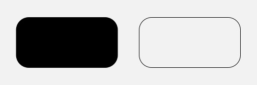

另外，它还有一个重载方法 `drawRoundRect(RectF rect, float rx, float ry, Paint paint)`，让你可以直接填写 `RectF` 来绘制圆角矩形。

## drawArc(float left, float top, float right, float bottom, float startAngle, float sweepAngle, boolean useCenter, Paint paint) 绘制弧形或扇形

`drawArc()` 是使用一个椭圆来描述弧形的。`left`, `top`, `right`, `bottom` 描述的是这个弧形所在的椭圆；`startAngle` 是弧形的起始角度（x 轴的正向，即正右的方向，是 0 度的位置；顺时针为正角度，逆时针为负角度），`sweepAngle` 是弧形划过的角度；`useCenter` 表示是否连接到圆心，如果不连接到圆心，就是弧形，如果连接到圆心，就是扇形。

```java
float[] points = {20, 20, 120, 20, 70, 20, 70, 120, 20, 120, 120, 120, 150, 20, 250, 20, 150, 20, 150, 120, 250, 20, 250, 120, 150, 120, 250, 120};  
canvas.drawLines(points, paint);  
```

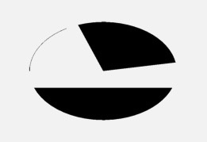

## drawPath(Path path, Paint paint) 画自定义图形

前面的这些方法，都是绘制某个给定的图形，而 `drawPath()` 可以绘制自定义图形。


`drawPath(path)` 这个方法是通过描述路径的方式来绘制图形的，它的 `path` 参数就是用来描述图形路径的对象。`path` 的类型是 `Path` ，使用方法大概像下面这样：

```java
public class PathView extends View {

    Paint paint = new Paint();
    Path path = new Path(); // 初始化 Path 对象

    ......

    {
      // 使用 path 对图形进行描述
      path.addArc(200, 200, 400, 400, -225, 225);
      path.arcTo(400, 200, 600, 400, -180, 225, false);
      path.lineTo(400, 542);
    }

    @Override
    protected void onDraw(Canvas canvas) {
      super.onDraw(canvas);

      canvas.drawPath(path, paint); // 绘制出 path 描述的图形（心形），大功告成
    }
}
```

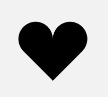

`Path` 可以描述直线、二次曲线、三次曲线、圆、椭圆、弧形、矩形、圆角矩形。把这些图形结合起来，就可以描述出很多复杂的图形。

`Path` 有两类方法，一类是直接描述路径的，另一类是辅助的设置或计算。

### 直接描述路径

这一类方法还可以细分为两组：添加子图形和画线（直线或曲线）

####  `addXxx()` ——添加子图形

##### addCircle(float x, float y, float radius, Direction dir) 添加圆

`x`, `y`, `radius` 这三个参数是圆的基本信息，最后一个参数 `dir` 是画圆的路径的方向。

> 路径方向有两种：顺时针 (`CW` clockwise) 和逆时针 (`CCW` counter-clockwise) 。对于普通情况，这个参数填 `CW` 还是填 `CCW` 没有影响。它只是在**需要填充图形** (`Paint.Style` 为 `FILL` 或 `FILL_AND_STROKE`) ，并且**图形出现自相交**时，用于判断填充范围的。比如下面这个图形：
>
> 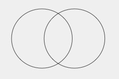
>
> 是应该填充成这样呢：
>
> 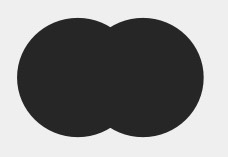
>
> 还是应该填充成这样呢：
>
> 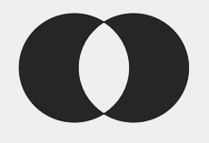

在用 `addCircle()` 为 `Path` 中新增一个圆之后，调用 `canvas.drawPath(path, paint)` ，就能画一个圆出来。就像这样：

```java
float[] points = {20, 20, 120, 20, 70, 20, 70, 120, 20, 120, 120, 120, 150, 20, 250, 20, 150, 20, 150, 120, 250, 20, 250, 120, 150, 120, 250, 120};  
canvas.drawLines(points, paint);  
```

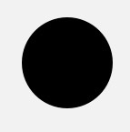

可以看出，`path.AddCircle(x, y, radius, dir)` + `canvas.drawPath(path, paint)` 这种写法，和直接使用 `canvas.drawCircle(x, y, radius, paint)` 的效果是一样的，区别只是它的写法更复杂。所以如果只画一个圆，没必要用 `Path`，直接用 `drawCircle()` 就行了。`drawPath()` 一般是在绘制组合图形时才会用到的。

其他的 `Path.add-()` 方法和这类似，例如：

##### addOval(float left, float top, float right, float bottom, Direction dir) / addOval(RectF oval, Direction dir) 添加椭圆

##### addRect(float left, float top, float right, float bottom, Direction dir) / addRect(RectF rect, Direction dir) 添加矩形

##### addRoundRect(RectF rect, float rx, float ry, Direction dir) / addRoundRect(float left, float top, float right, float bottom, float rx, float ry, Direction dir) / addRoundRect(RectF rect, float[] radii, Direction dir) / addRoundRect(float left, float top, float right, float bottom, float[] radii, Direction dir) 添加圆角矩形

##### addPath(Path path) 添加另一个 Path

上面这几个方法和 `addCircle()` 的使用都差不多。

#### `xxxTo()` ——画线（直线或曲线）

这一组添加的是一条线。

##### lineTo(float x, float y) / rLineTo(float x, float y) 画直线

从**当前位置**向目标位置画一条直线， `x` 和 `y` 是目标位置的坐标。这两个方法的区别是，`lineTo(x, y)`的参数是**绝对坐标**，而 `rLineTo(x, y)` 的参数是相对当前位置的**相对坐标** （前缀 `r` 指的就是 `relatively` 「相对地」)。

> **当前位置**：所谓当前位置，即最后一次调用画 `Path` 的方法的终点位置。初始值为原点 (0, 0)。

```java
paint.setStyle(Style.STROKE);  
path.lineTo(100, 100); // 由当前位置 (0, 0) 向 (100, 100) 画一条直线  
path.rLineTo(100, 0); // 由当前位置 (100, 100) 向正右方 100 像素的位置画一条直线  
```

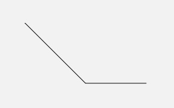

##### quadTo(float x1, float y1, float x2, float y2) / rQuadTo(float dx1, float dy1, float dx2, float dy2) 画二次贝塞尔曲线

这条二次贝塞尔曲线的起点就是当前位置，而参数中的 `x1`, `y1` 和 `x2`, `y2` 则分别是控制点和终点的坐标。和 `rLineTo(x, y)` 同理，`rQuadTo(dx1, dy1, dx2, dy2)` 的参数也是相对坐标

具体知识见下。

##### moveTo(float x, float y) / rMoveTo(float x, float y) 移动到目标位置

不论是直线还是贝塞尔曲线，都是以当前位置作为起点，而不能指定起点。但你可以通过 `moveTo(x, y)`或 `rMoveTo()` 来改变当前位置，从而间接地设置这些方法的起点。

```java
paint.setStyle(Style.STROKE);  
path.lineTo(100, 100); // 画斜线  
path.moveTo(200, 100); // 我移~~  
path.lineTo(200, 0); // 画竖线  
```

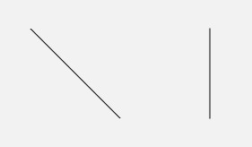

`moveTo(x, y)` 虽然不添加图形，但它会设置图形的起点，所以它是非常重要的一个辅助方法。

另外，还有两个特殊的方法： `arcTo()` 和 `addArc()`。它们也是用来画线的，但并不使用当前位置作为弧线的起点。

##### arcTo(RectF oval, float startAngle, float sweepAngle, boolean forceMoveTo) / arcTo(float left, float top, float right, float bottom, float startAngle, float sweepAngle, boolean forceMoveTo) / arcTo(RectF oval, float startAngle, float sweepAngle) 画弧形

这个方法和 `Canvas.drawArc()` 比起来，少了一个参数 `useCenter`，而多了一个参数 `forceMoveTo` 。

少了 `useCenter` ，是因为 `arcTo()` 只用来画弧形而不画扇形，所以不再需要 `useCenter` 参数；而多出来的这个 `forceMoveTo` 参数的意思是，绘制是要「抬一下笔移动过去」，还是「直接拖着笔过去」，区别在于是否留下移动的痕迹。

```java
paint.setStyle(Style.STROKE);  
path.lineTo(100, 100);  
path.arcTo(100, 100, 300, 300, -90, 90, true); // 强制移动到弧形起点（无痕迹）  
```


```java
paint.setStyle(Style.STROKE);  
path.lineTo(100, 100);  
path.arcTo(100, 100, 300, 300, -90, 90, false); // 直接连线连到弧形起点（有痕迹）  
```

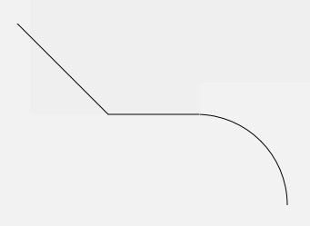

##### addArc(float left, float top, float right, float bottom, float startAngle, float sweepAngle) / addArc(RectF oval, float startAngle, float sweepAngle)

又是一个弧形的方法。一个叫 `arcTo` ，一个叫 `addArc()`，都是弧形，区别在哪里？其实很简单： `addArc()` 只是一个直接使用了 `forceMoveTo = true` 的简化版 `arcTo()` 。

```java
paint.setStyle(Style.STROKE);  
path.lineTo(100, 100);  
path.addArc(100, 100, 300, 300, -90, 90);  
```

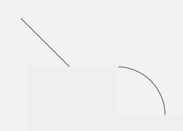

##### close() 封闭当前子图形

它的作用是把当前的子图形封闭，即由当前位置向当前子图形的起点绘制一条直线。

```java
paint.setStyle(Style.STROKE);  
path.moveTo(100, 100);  
path.lineTo(200, 100);  
path.lineTo(150, 150);  
// 子图形未封闭
```

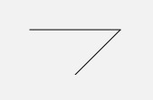

```java
paint.setStyle(Style.STROKE);  
path.moveTo(100, 100);  
path.lineTo(200, 100);  
path.lineTo(150, 150);  
path.close(); // 使用 close() 封闭子图形。等价于 path.lineTo(100, 100)  
```

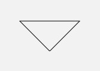

`close()` 和 `lineTo(起点坐标)` 是完全等价的。

> 「子图形」：官方文档里叫做 `contour` 。但由于在这个场景下我找不到这个词合适的中文翻译（直译的话叫做「轮廓」），所以我换了个便于中国人理解的词：「子图形」。前面说到，第一组方法是「添加子图形」，所谓「子图形」，指的就是一次不间断的连线。一个 `Path` 可以包含多个子图形。当使用第一组方法，即 `addCircle()` `addRect()` 等方法的时候，每一次方法调用都是新增了一个独立的子图形；而如果使用第二组方法，即 `lineTo()` `arcTo()` 等方法的时候，则是每一次断线（即每一次「抬笔」），都标志着一个子图形的结束，以及一个新的子图形的开始。
>
> 另外，不是所有的子图形都需要使用 `close()` 来封闭。当**需要填充图形时（即 Paint.Style 为 FILL 或 FILL_AND_STROKE）**，`Path` 会自动封闭子图形。
>
> ```
> java   paint.setStyle(Style.FILL);   path.moveTo(100, 100);   path.lineTo(200, 100);   path.lineTo(150, 150);   // 这里只绘制了两条边，但由于 Style 是 FILL ，所以绘制时会自动封口   
> ```
>
> 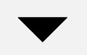

### 辅助的设置或计算

使用场景较少。

#### Path.setFillType(Path.FillType ft) 设置填充方式

前面在说 `dir` 参数的时候提到， `Path.setFillType(fillType)` 是用来设置图形自相交时的填充算法的：

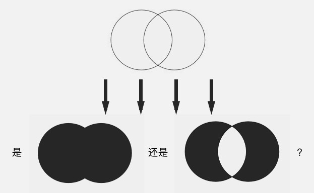

方法中填入不同的 `FillType` 值，就会有不同的填充效果。`FillType` 的取值有四个：

- `EVEN_ODD`
- `WINDING` （默认值）
- `INVERSE_EVEN_ODD`
- `INVERSE_WINDING`

其中后面的两个带有 `INVERSE_` 前缀的，只是前两个的反色版本，所以只要把前两个，即 `EVEN_ODD` 和 `WINDING`，搞明白就可以了。

 `WINDING` 是「全填充」，而 `EVEN_ODD` 是「交叉填充」：

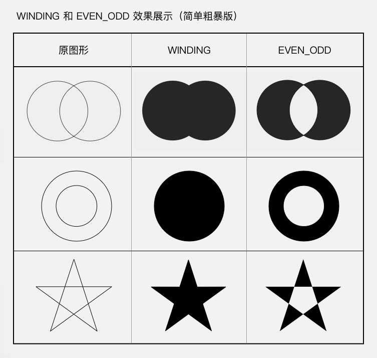

##### EVEN_ODD 和 WINDING 的原理

**EVEN_ODD**

即 even-odd rule （奇偶原则）：对于平面中的任意一点，向任意方向射出一条射线，这条射线和图形相交的次数（相交才算，相切不算哦）如果是奇数，则这个点被认为在图形内部，是要被涂色的区域；如果是偶数，则这个点被认为在图形外部，是不被涂色的区域。还以左右相交的双圆为例：


> 射线的方向无所谓，同一个点射向任何方向的射线，结果都是一样的。

从上图可以看出，射线每穿过图形中的一条线，内外状态就发生一次切换，这就是为什么 `EVEN_ODD` 是一个「交叉填充」的模式。

**WINDING**

即 non-zero winding rule （非零环绕数原则）：首先，它需要你图形中的所有线条都是有绘制方向的：

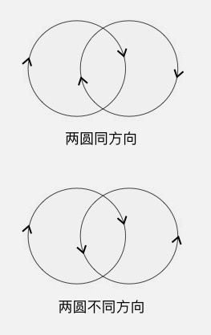

然后，同样是从平面中的点向任意方向射出一条射线，但计算规则不一样：以 0 为初始值，对于射线和图形的所有交点，遇到每个顺时针的交点（图形从射线的左边向右穿过）把结果加 1，遇到每个逆时针的交点（图形从射线的右边向左穿过）把结果减 1，最终把所有的交点都算上，得到的结果如果不是 0，则认为这个点在图形内部，是要被涂色的区域；如果是 0，则认为这个点在图形外部，是不被涂色的区域。


> 和 `EVEN_ODD` 相同，射线的方向并不影响结果。

所以，我前面的那个「简单粗暴」的总结，对于 `WINDING` 来说并不完全正确：如果你所有的图形都用相同的方向来绘制，那么 `WINDING` 确实是一个「全填充」的规则；但如果使用不同的方向来绘制图形，结果就不一样了。

> 图形的方向：对于添加子图形类方法（如 `Path.addCircle()` `Path.addRect()`）的方向，由方法的 `dir` 参数来控制，这个在前面已经讲过了；而对于画线类的方法（如 `Path.lineTo()``Path.arcTo()`）就更简单了，线的方向就是图形的方向。

所以，完整版的 `EVEN_ODD` 和 `WINDING` 的效果应该是这样的：

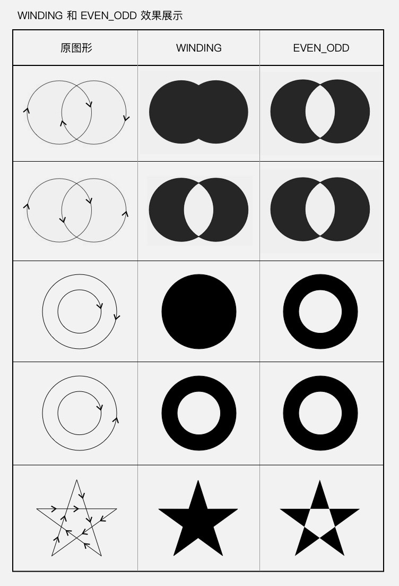

而 `INVERSE_EVEN_ODD` 和 `INVERSE_WINDING` ，只是把这两种效果进行反转而已，你懂了 `EVEN_ODD` 和 `WINDING` ，自然也就懂 `INVERSE_EVEN_ODD` 和 `INVERSE_WINDING` 了，我就不讲了。

## drawBitmap(Bitmap bitmap, float left, float top, Paint paint) 画 Bitmap

绘制 `Bitmap` 对象，也就是把这个 `Bitmap` 中的像素内容贴过来。其中 `left` 和 `top` 是要把 `bitmap` 绘制到的位置坐标。它的使用非常简单。

```java
drawBitmap(bitmap, 200, 100, paint);  
```

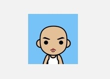

它的重载方法：

```
drawBitmap(Bitmap bitmap, Rect src, RectF dst, Paint paint)` /`drawBitmap(Bitmap bitmap, Rect src, Rect dst, Paint paint)` /`drawBitmap(Bitmap bitmap, Matrix matrix, Paint paint)
```

# Canvas 绘制文字

## drawText(String text, float x, float y, Paint paint)

给出文字的内容和位置，按要求去绘制文字。

```java
String text = "Hello HenCoder";
canvas.drawText(text, 200, 100, paint);  
```

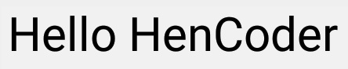

`text` 是文字内容，`x` 和 `y` 是文字的坐标。但需要注意：这个坐标并不是文字的左上角，而是一个与左下角比较接近的位置。大概在这里：


`drawText()` 参数中的 `y` ，指的是文字的**基线（ baseline ）** 的位置。

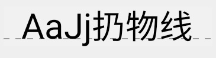

不同的语言和文字，每个字符的高度和上下位置都是不一样的。要让不同的文字并排显示的时候整体看起来稳当，需要让它们上下对齐。但这个对齐的方式，不能是简单的「底部对齐」或「顶部对齐」或「中间对齐」，而应该是一种类似于「重心对齐」的方式。

而这个用来让所有文字互相对齐的基准线，就是**基线( baseline )**。 `drawText()` 方法参数中的 `y` 值，就是指定的基线的位置。

说完 `y` 值，再说说 `x` 值。从前面图中的标记可以看出来，「Hello HenCoder」绘制出来之后的 `x` 点并不是字母 "H" 左边的位置，而是比它的左边再往左一点点。那么这个「往左的一点点」是什么呢？

它是字母 "H" 的左边的空隙。绝大多数的字符，它们的宽度都是要略微大于实际显示的宽度的。字符的左右两边会留出一部分空隙，用于文字之间的间隔，以及文字和边框的间隔。就像这样：

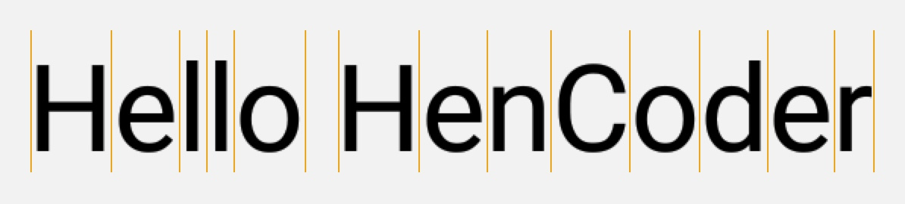

## drawTextRun()

> 这个方法对中文没有作用

## drawTextOnPath()

沿着一条 `Path` 来绘制文字。这是一个耍杂技的方法。

```java
private void init() {
        mPaint = new Paint();
        mPaint.setColor(Color.BLACK);
        mPaint.setStyle(Paint.Style.STROKE);
        mPaint.setStrokeWidth(5);
        mPaint.setTextSize(200);

        mPath = new Path();
        mPath.moveTo(100, 300);
        mPath.lineTo(150, 200);
        mPath.lineTo(300, 400);
        mPath.lineTo(450, 200);
        mPath.lineTo(600, 400);
        mPath.lineTo(750, 200);
        mPath.lineTo(900, 400);
    }

    @Override
    protected void onDraw(Canvas canvas) {
        super.onDraw(canvas);

        canvas.drawPath(mPath, mPaint);
        mPaint.setStyle(Paint.Style.FILL);
        canvas.drawTextOnPath("Hello zzsy!!!", mPath, 0, 0, mPaint);
    }
```

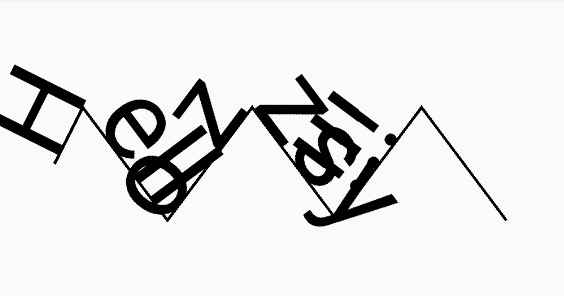

参数里，需要解释的只有两个： `hOffset` 和 `vOffset`。它们是文字相对于 `Path` 的水平偏移量和竖直偏移量，利用它们可以调整文字的位置。例如你设置 `hOffset` 为 5， `vOffset` 为 10，文字就会右移 5 像素和下移 10 像素。

## StaticLayout

`Canvas.drawText()` 只能绘制单行的文字，而不能换行。

```java
private void init() {
		mPaint = new Paint();
		mPaint.setColor(Color.BLACK);
		mPaint.setStrokeWidth(5);
		mPaint.setTextSize(200);
}

@Override
protected void onDraw(Canvas canvas) {
		super.onDraw(canvas);
		canvas.drawText("Hello zzsy!!!", 0, 200, mPaint);
} 
```

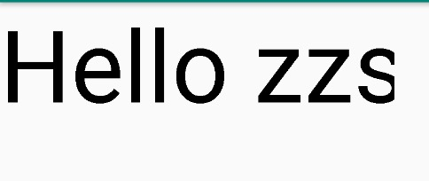

不能在换行符 `\n` 处换行

```java
  String text = "a\nbc\ndefghi\njklm\nnopqrst\nuvwx\nyz";

  ...

  canvas.drawText(text, 50, 100, paint);
```

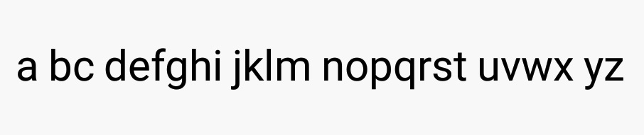

在换行符 `\n` 的位置并没有换行，而只是加了个空格

如果需要绘制多行的文字，你必须自行把文字切断后分多次使用 `drawText()` 来绘制，或者使用 `StaticLayout` 。

`StaticLayout` 并不是一个 `View` 或者 `ViewGroup` ，而是 `android.text.Layout` 的子类，它是纯粹用来绘制文字的。 `StaticLayout` 支持换行，它既可以为文字设置宽度上限来让文字自动换行，也会在 `\n`处主动换行。

```java
@Override
    protected void onSizeChanged(int w, int h, int oldw, int oldh) {
        super.onSizeChanged(w, h, oldw, oldh);
        TextPaint textPaint = new TextPaint(Paint.ANTI_ALIAS_FLAG);
        textPaint.setColor(Color.RED);
        textPaint.setStyle(Paint.Style.FILL);
        textPaint.setTextSize(80);

        staticLayout1 = StaticLayout.Builder
                .obtain(s1, 0, s1.length(), textPaint, w)//在onSizeChanged创建方便获取宽度
                .build();

        staticLayout2 = StaticLayout.Builder
                .obtain(s2, 0, s2.length(), textPaint, w)
                .build();
    }

    @Override
    protected void onDraw(Canvas canvas) {
        super.onDraw(canvas);
        
        staticLayout1.draw(canvas);
        canvas.translate(0,staticLayout1.getHeight());//移动canvas，防止绘制重叠
        staticLayout2.draw(canvas);
    }
```

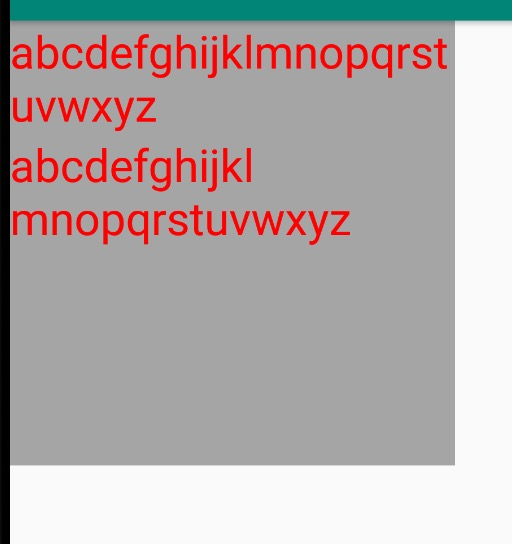

> 灰色是view的背景

StaticLayout的构造方法已经废弃，建议使用Builder，在build()之前一定要先调用obtain方法：

```java
/**
	* @param source 文字
	* @param start 文字的开始索引，一般为0
	* @param end 位子的结束索引，一般为文字的长度
	* @param paint 画笔，这里的画笔为TextPaint
	* @param width 宽度
	*/
public static Builder obtain(CharSequence source, int start, int end, TextPaint paint, int width){...
```

# Canvas.clipXXX()

范围裁切有两个方法： `clipRect()` 和 `clipPath()`。裁切方法之后的绘制代码，都会被限制在裁切范围内。

## clipRect()

使用很简单，直接应用：

```java
canvas.clipRect(left, top, right, bottom);  
canvas.drawBitmap(bitmap, x, y, paint);  
```

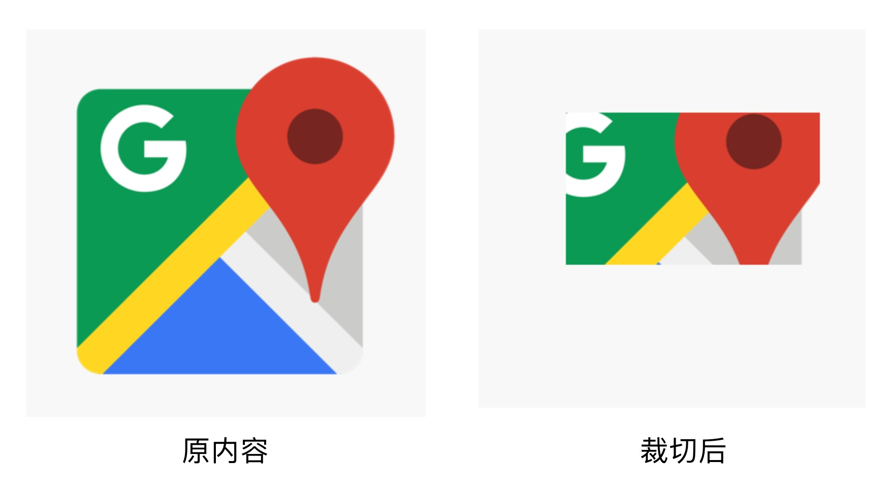

记得要加上 `Canvas.save()` 和 `Canvas.restore()` 来及时恢复绘制范围，所以完整代码是这样的：

```java
canvas.save();  
canvas.clipRect(left, top, right, bottom);  
canvas.drawBitmap(bitmap, x, y, paint);  
canvas.restore();  
```

## clipPath()

其实和 clipRect() 用法完全一样，只是把参数换成了 `Path` ，所以能裁切的形状更多一些：

```java
canvas.save();  
canvas.clipPath(path1);  
canvas.drawBitmap(bitmap, point1.x, point1.y, paint);  
canvas.restore();

canvas.save();  
canvas.clipPath(path2);  
canvas.drawBitmap(bitmap, point2.x, point2.y, paint);  
canvas.restore();  
```


## demo

### 裁剪1

**效果**

原图


裁剪


代码

```java
private void init(Context context) {
    mPaint = new Paint();
    mPath = new Path();
    mBitmap = BitmapFactory.decodeResource(context.getResources(), R.drawable.img4);

    mPath.addCircle(mBitmap.getWidth() / 2f, mBitmap.getHeight() / 2f, 200f, Path.Direction.CCW);
}

@Override
protected void onSizeChanged(int w, int h, int oldw, int oldh) {
    super.onSizeChanged(w, h, oldw, oldh);
    mCenterX = w / 2;
    mCenterY = h / 2;
}

@Override
protected void onDraw(Canvas canvas) {
    super.onDraw(canvas);

    canvas.save();
    canvas.clipPath(mPath);
    canvas.drawBitmap(mBitmap, 0, 0, mPaint);
    canvas.restore();
}
```

### 裁剪2

原图


效果

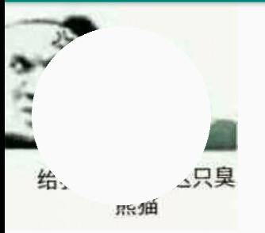

代码

只是和上面多了一行setFillType。

```java
mPath.addCircle(mBitmap.getWidth() / 2f, mBitmap.getHeight() / 2f, 200f
        , Path.Direction.CCW);
mPath.setFillType(Path.FillType.INVERSE_WINDING);
```

### 翻页

效果

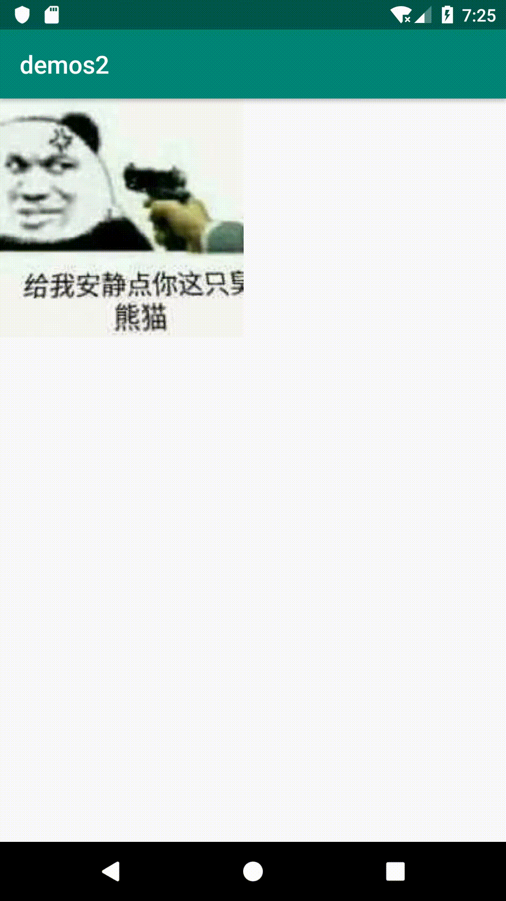

代码

```java
public class MyPageTurning extends View {
    private Paint mPaint;
    private Bitmap mBitmap;
    private ObjectAnimator mAnimator;
    private int mDegree = 0;
    private Camera mCamera;

    public MyPageTurning(Context context) {
        super(context);
        init(context);
    }

    public MyPageTurning(Context context, AttributeSet attrs) {
        super(context, attrs);
        init(context);
    }

    private void init(Context context) {
        mPaint = new Paint(Paint.ANTI_ALIAS_FLAG);
        mBitmap = BitmapFactory.decodeResource(context.getResources(), R.drawable.img4);

        mAnimator = ObjectAnimator.ofInt(this, "degree", 0, 180);
        mAnimator.setDuration(2000);
        mAnimator.setRepeatCount(ValueAnimator.INFINITE);
        mAnimator.setRepeatMode(ValueAnimator.REVERSE);
        mAnimator.setInterpolator(new LinearInterpolator());

        mCamera = new Camera();
    }

    @Override
    protected void onDraw(Canvas canvas) {
        super.onDraw(canvas);
        int bitmapWidth = mBitmap.getWidth();
        int bitmapHeight = mBitmap.getHeight();
        int centerX = mBitmap.getWidth() / 2;
        int centerY = mBitmap.getHeight() / 2;

        //绘制上半部分不动的区域
        canvas.save();
        canvas.clipRect(0, 0, bitmapWidth, centerY);
        canvas.drawBitmap(mBitmap, 0, 0, mPaint);
        canvas.restore();

        //绘制下半部分动画的区域
        canvas.save();

        if (mDegree > 90) {
            canvas.clipRect(0, 0, bitmapWidth, centerY);
        } else {
            canvas.clipRect(0, centerY, bitmapWidth, bitmapHeight);
        }
        mCamera.save();
        mCamera.rotateX(mDegree);
        canvas.translate(centerX, centerY);
        mCamera.applyToCanvas(canvas);
        canvas.translate(-centerX, -centerY);
        mCamera.restore();

        canvas.drawBitmap(mBitmap, 0, 0, mPaint);
        canvas.restore();
    }

    @Override
    protected void onAttachedToWindow() {
        super.onAttachedToWindow();
        mAnimator.start();
    }

    @Override
    protected void onDetachedFromWindow() {
        super.onDetachedFromWindow();
        mAnimator.end();
    }

    @SuppressLint("ObjectAnimatorBinding")
    public void setDegree(int degree) {
        mDegree = degree;
        invalidate();
    }
}
```

# 几何变换

## 用 Canvas 来做二维变换

### Canvas.translate(float dx, float dy) 平移

参数里的 `dx` 和 `dy` 表示横向和纵向的位移。

```java
canvas.save();  
canvas.translate(200, 0);  
canvas.drawBitmap(bitmap, x, y, paint);  
canvas.restore();  
```


### Canvas.rotate(float degrees, float px, float py) 旋转

参数里的 `degrees` 是旋转角度，单位是度（也就是一周有 360° 的那个单位），方向是顺时针为正向； `px` 和 `py` 是轴心的位置。

```java
canvas.save();  
canvas.rotate(45, centerX, centerY);  
canvas.drawBitmap(bitmap, x, y, paint);  
canvas.restore();  
```


### Canvas.scale(float sx, float sy, float px, float py) 放缩

参数里的 `sx` `sy` 是横向和纵向的放缩倍数； `px` `py` 是放缩的轴心。

```java
canvas.save();  
canvas.scale(1.3f, 1.3f, x + bitmapWidth / 2, y + bitmapHeight / 2);  
canvas.drawBitmap(bitmap, x, y, paint);  
canvas.restore();  
```

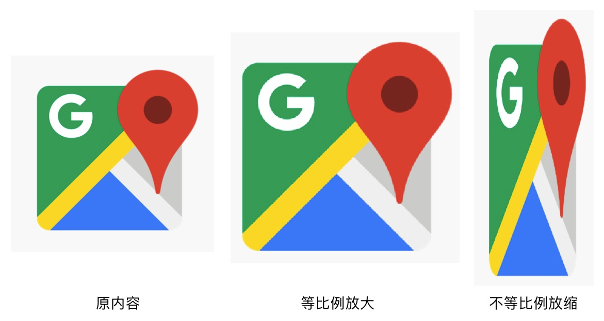

### skew(float sx, float sy) 错切

参数里的 `sx` 和 `sy` 是 x 方向和 y 方向的错切系数。

```java
canvas.save();  
canvas.skew(0, 0.5f);  
canvas.drawBitmap(bitmap, x, y, paint);  
canvas.restore();  
```


## 用 Matrix 来做变换

### 常见变换

`Matrix` 做常见变换的方式：

1. 创建 `Matrix` 对象；
2. 调用 `Matrix` 的 `pre/postTranslate/Rotate/Scale/Skew()` 方法来设置几何变换；
3. 使用 `Canvas.setMatrix(matrix)` 或 `Canvas.concat(matrix)` 来把几何变换应用到 `Canvas`。

```java
Matrix matrix = new Matrix();

...

matrix.reset();  
matrix.postTranslate();  
matrix.postRotate();

canvas.save();  
canvas.concat(matrix);  
canvas.drawBitmap(bitmap, x, y, paint);  
canvas.restore();  
```

把 `Matrix` 应用到 `Canvas` 有两个方法： `Canvas.setMatrix(matrix)` 和 `Canvas.concat(matrix)`。

1. `Canvas.setMatrix(matrix)`：用 `Matrix` 直接替换 `Canvas` 当前的变换矩阵，即抛弃 `Canvas` 当前的变换，改用 `Matrix` 的变换（注：不同的系统中 `setMatrix(matrix)` 的行为可能不一致，所以还是尽量用 `concat(matrix)` ）；
2. `Canvas.concat(matrix)`：用 `Canvas` 当前的变换矩阵和 `Matrix` 相乘，即基于 `Canvas` 当前的变换，叠加上 `Matrix` 中的变换。

### 自定义变换

#### 用点对点映射的方式设置变换

**Matrix.setPolyToPoly(float[] src, int srcIndex, float[] dst, int dstIndex, int pointCount)** 

`poly` 就是「多」的意思。`setPolyToPoly()` 的作用是通过多点的映射的方式来直接设置变换。「多点映射」的意思就是把指定的点移动到给出的位置，从而发生形变。例如：(0, 0) -> (100, 100) 表示把 (0, 0) 位置的像素移动到 (100, 100) 的位置，这个是单点的映射，单点映射可以实现平移。而多点的映射，就可以让绘制内容任意地扭曲。

```java
Matrix matrix = new Matrix();  
float pointsSrc = {left, top, right, top, left, bottom, right, bottom};  
float pointsDst = {left - 10, top + 50, right + 120, top - 90, left + 20, bottom + 30, right + 20, bottom + 60};

...

matrix.reset();  
matrix.setPolyToPoly(pointsSrc, 0, pointsDst, 0, 4);

canvas.save();  
canvas.concat(matrix);  
canvas.drawBitmap(bitmap, x, y, paint);  
canvas.restore();  
```


参数里，`src` 和 `dst` 是源点集合目标点集；`srcIndex` 和 `dstIndex` 是第一个点的偏移；`pointCount`是采集的点的个数（个数不能大于 4，因为大于 4 个点就无法计算变换了）。

## 用 Camera 来做三维变换

`Camera` 的三维变换有三类：旋转、平移、移动相机。

### 三维旋转

`Camera.rotate*()` 一共有四个方法： `rotateX(deg)`， `rotateY(deg)` ，`rotateZ(deg)`，`rotate(x, y, z)`。这四个方法的区别不用我说了吧？

```java
canvas.save();

camera.rotateX(30); // 旋转 Camera 的三维空间  
camera.applyToCanvas(canvas); // 把旋转投影到 Canvas

canvas.drawBitmap(bitmap, point1.x, point1.y, paint);  
canvas.restore();  
```


另外，`Camera` 和 `Canvas` 一样也需要保存和恢复状态才能正常绘制，不然在界面刷新之后绘制就会出现问题。所以上面这张图完整的代码应该是这样的：

```java
canvas.save();

camera.save(); // 保存 Camera 的状态  
camera.rotateX(30); // 旋转 Camera 的三维空间  
camera.applyToCanvas(canvas); // 把旋转投影到 Canvas  
camera.restore(); // 恢复 Camera 的状态

canvas.drawBitmap(bitmap, point1.x, point1.y, paint);  
canvas.restore();  
```

如果你需要图形左右对称，需要配合上 `Canvas.translate()`，在三维旋转之前把绘制内容的中心点移动到原点，即旋转的轴心，然后在三维旋转后再把投影移动回来：

```java
canvas.save();

camera.save(); // 保存 Camera 的状态  
camera.rotateX(30); // 旋转 Camera 的三维空间  
canvas.translate(centerX, centerY); // 旋转之后把投影移动回来  
camera.applyToCanvas(canvas); // 把旋转投影到 Canvas  
canvas.translate(-centerX, -centerY); // 旋转之前把绘制内容移动到轴心（原点）  
camera.restore(); // 恢复 Camera 的状态

canvas.drawBitmap(bitmap, point1.x, point1.y, paint);  
canvas.restore();  
```

Canvas 的几何变换顺序是反的，所以要把移动到中心的代码写在下面，把从中心移动回来的代码写在上面。


### 移动

**Camera.translate(float x, float y, float z)** 

它的使用方式和 `Camera.rotate*()` 相同。

### 设置虚拟相机的位置

**Camera.setLocation(x, y, z)** 

注意，它的参数的单位不是像素，而是 inch，英寸。

这种设计源自 Android 底层的图像引擎 Skia。在 Skia 中，Camera 的位置单位是英寸，英寸和像素的换算单位在 Skia 中被写死为了 72 像素，而 Android 中把这个换算单位照搬了过来。

在 `Camera` 中，相机的默认位置是 (0, 0, -8)（英寸）。8 x 72 = 576，所以它的默认位置是 (0, 0, -576)（像素）。

如果绘制的内容过大，当它翻转起来的时候，就有可能出现图像投影过大的「糊脸」效果。而且由于换算单位被写死成了 72 像素，而不是和设备 dpi 相关的，所以在像素越大的手机上，这种「糊脸」效果会越明显。


而使用 `setLocation()` 方法来把相机往后移动，就可以修复这种问题。

```
camera.setLocation(0, 0, newZ);  
```


`Camera.setLocation(x, y, z)` 的 `x` 和 `y` 参数一般不会改变，直接填 0 。

# Paint

## 颜色

`Paint` 设置颜色的方法有两种：一种是直接用 `Paint.setColor/ARGB()` 来设置颜色，另一种是使用 `Shader` 来指定着色方案。

### setColor(int color)

```java
paint.setColor(Color.parseColor("#009688"));  
canvas.drawRect(30, 30, 230, 180, paint);

paint.setColor(Color.parseColor("#FF9800"));  
canvas.drawLine(300, 30, 450, 180, paint);

paint.setColor(Color.parseColor("#E91E63"));  
canvas.drawText("HenCoder", 500, 130, paint);  
```

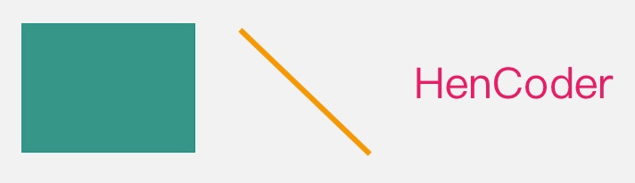

setColor() 对应的 get 方法是 getColor()

### setARGB(int a, int r, int g, int b)

参数用的是更直接的三原色与透明度的值。

```java
paint.setARGB(100, 255, 0, 0);  
canvas.drawRect(0, 0, 200, 200, paint);  
paint.setARGB(100, 0, 0, 0);  
canvas.drawLine(0, 0, 200, 200, paint);  
```

### setShader(Shader shader) 设置 Shader

着色器。

当设置了 `Shader` 之后，`Paint` 在绘制图形和文字时就不使用 `setColor/ARGB()` 设置的颜色了，而是使用 `Shader` 的方案中的颜色。

在 Android 的绘制里使用 `Shader` ，并不直接用 `Shader` 这个类，而是用它的几个子类。具体来讲有 `LinearGradient` `RadialGradient` `SweepGradient` `BitmapShader` `ComposeShader` 这么几个

#### LinearGradient 线性渐变

设置两个点和两种颜色，以这两个点作为端点，使用两种颜色的渐变来绘制颜色。就像这样：

```java
Shader shader = new LinearGradient(100, 100, 500, 500, Color.parseColor("#E91E63"),  
        Color.parseColor("#2196F3"), Shader.TileMode.CLAMP);
paint.setShader(shader);

...

canvas.drawCircle(300, 300, 200, paint);  
```

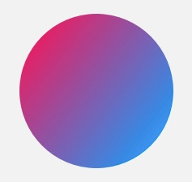

构造方法： 
`LinearGradient(float x0, float y0, float x1, float y1, int color0, int color1, Shader.TileMode tile)`。

参数： 
`x0` `y0` `x1` `y1`：渐变的两个端点的位置 
`color0` `color1` 是端点的颜色 
`tile`：端点范围之外的着色规则，类型是 `TileMode`。`TileMode` 一共有 3 个值可选： `CLAMP`, `MIRROR`和 `REPEAT`。

`CLAMP` 会在端点之外延续端点处的颜色；`MIRROR`是镜像模式；`REPEAT` 是重复模式。

`CLAMP`:


`MIRROR`:

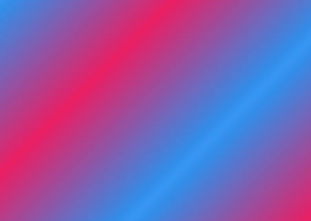

`REPEAT`:


#### RadialGradient 辐射渐变

辐射渐变很好理解，就是从中心向周围辐射状的渐变。大概像这样：

```java
Shader shader = new RadialGradient(300, 300, 200, Color.parseColor("#E91E63"),  
        Color.parseColor("#2196F3"), Shader.TileMode.CLAMP);
paint.setShader(shader);

...

canvas.drawCircle(300, 300, 200, paint);  
```


构造方法： 
`RadialGradient(float centerX, float centerY, float radius, int centerColor, int edgeColor, TileMode tileMode)`。

参数： 
`centerX` `centerY`：辐射中心的坐标 
`radius`：辐射半径 
`centerColor`：辐射中心的颜色 
`edgeColor`：辐射边缘的颜色 
`tileMode`：辐射范围之外的着色模式。

`CLAMP`:

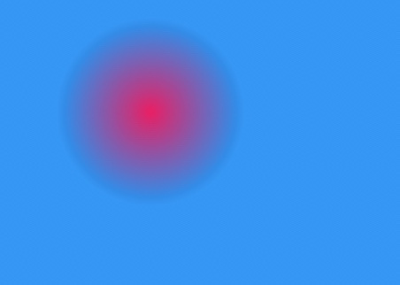

`MIRROR`:

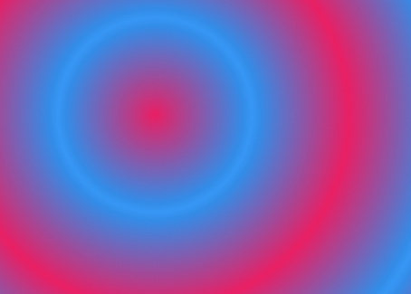

`REPEAT`:

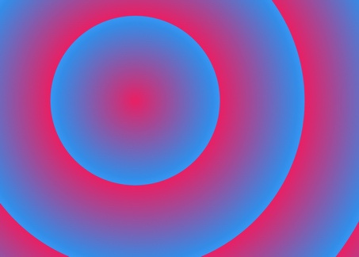

#### SweepGradient 扫描渐变

```java
Shader shader = new SweepGradient(300, 300, Color.parseColor("#E91E63"),  
        Color.parseColor("#2196F3"));
paint.setShader(shader);

...

canvas.drawCircle(300, 300, 200, paint);  
```

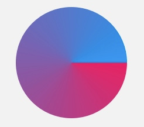

构造方法： 
`SweepGradient(float cx, float cy, int color0, int color1)`

参数： 
`cx` `cy` ：扫描的中心 
`color0`：扫描的起始颜色 
`color1`：扫描的终止颜色

#### BitmapShader

用 `Bitmap` 来着色（终于不是渐变了）。其实也就是用 `Bitmap` 的像素来作为图形或文字的填充。大概像这样：

```java
Bitmap bitmap = BitmapFactory.decodeResource(getResources(), R.drawable.batman);  
Shader shader = new BitmapShader(bitmap, Shader.TileMode.CLAMP, Shader.TileMode.CLAMP);  
paint.setShader(shader);

...

canvas.drawCircle(300, 300, 200, paint);  
```


> 如果你想绘制圆形的 `Bitmap`，就别用 `drawBitmap()` 了，改用 `drawCircle()` + `BitmapShader` 就可以了（其他形状同理）。

构造方法： 
`BitmapShader(Bitmap bitmap, Shader.TileMode tileX, Shader.TileMode tileY)`

参数： 
`bitmap`：用来做模板的 `Bitmap` 对象 
`tileX`：横向的 `TileMode` 
`tileY`：纵向的 `TileMode`。

`CLAMP`:

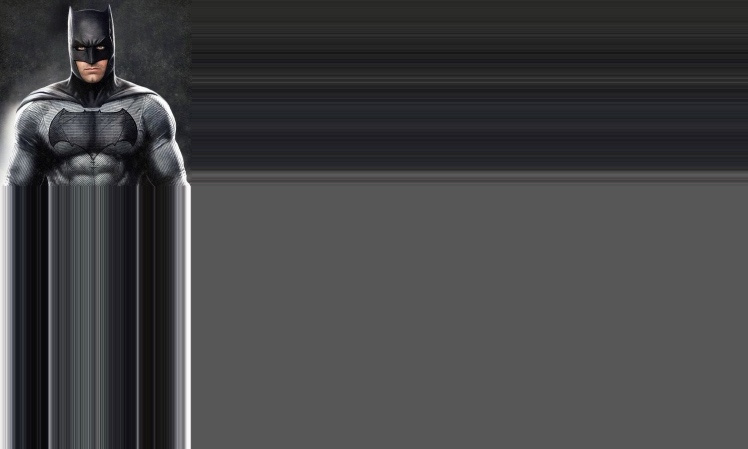

`MIRROR`:

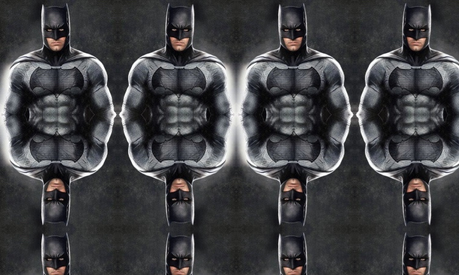

`REPEAT`:

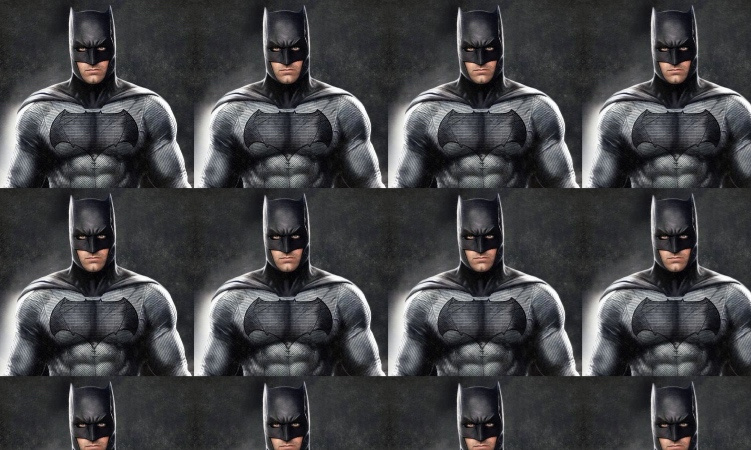

#### ComposeShader 混合着色器

就是把两个 `Shader` 一起使用。

```java
// 第一个 Shader：头像的 Bitmap
Bitmap bitmap1 = BitmapFactory.decodeResource(getResources(), R.drawable.batman);  
Shader shader1 = new BitmapShader(bitmap1, Shader.TileMode.CLAMP, Shader.TileMode.CLAMP);

// 第二个 Shader：从上到下的线性渐变（由透明到黑色）
Bitmap bitmap2 = BitmapFactory.decodeResource(getResources(), R.drawable.batman_logo);  
Shader shader2 = new BitmapShader(bitmap2, Shader.TileMode.CLAMP, Shader.TileMode.CLAMP);

// ComposeShader：结合两个 Shader
Shader shader = new ComposeShader(shader1, shader2, PorterDuff.Mode.SRC_OVER);  
paint.setShader(shader);

...

canvas.drawCircle(300, 300, 300, paint);  
```

> 注意：上面这段代码中使用了两个 `BitmapShader` 来作为 `ComposeShader()` 的参数，而 `ComposeShader()` 在硬件加速下是不支持两个相同类型的 `Shader` 的，所以这里也需要关闭硬件加速才能看到效果。


构造方法：`ComposeShader(Shader shaderA, Shader shaderB, PorterDuff.Mode mode)`

参数： 
`shaderA`, `shaderB`：两个相继使用的 `Shader` 
`mode`: 两个 `Shader` 的叠加模式，即 `shaderA` 和 `shaderB` 应该怎样共同绘制。它的类型是 `PorterDuff.Mode` 。

> PorterDuff.Mode
>
> `PorterDuff.Mode` 是用来指定两个图像共同绘制时的颜色策略的。
>
> 「颜色策略」的意思，就是说把源图像绘制到目标图像处时应该怎样确定二者结合后的颜色。
>
> `PorterDuff.Mode.DST_OUT`，挖空效果：
>
> 
>
> `PorterDuff.Mode.DST_IN`，蒙版抠图效果：
>
> 
>
>  `PorterDuff.Mode` 一共有 17 个，可以分为两类：
>
> 1. Alpha 合成 (Alpha Compositing)
> 2. 混合 (Blending)
>
> 第一类，Alpha 合成，其实就是 「PorterDuff」 这个词所指代的算法。 「PorterDuff」 并不是一个具有实际意义的词组，而是两个人的名字（准确讲是姓）。这两个人当年共同发表了一篇论文，描述了 12 种将两个图像共同绘制的操作（即算法）。而这篇论文所论述的操作，都是关于 Alpha 通道（也就是我们通俗理解的「透明度」）的计算的，后来人们就把这类计算称为**Alpha 合成** ( Alpha Compositing ) 。
>
> 源图像和目标图像：
>
> 
>
> Alpha 合成：
>
> 
>
> 第二类，混合，也就是 Photoshop 等制图软件里都有的那些混合模式（`multiply` `darken` `lighten`之类的）。
>
> 

除了使用 `setColor/ARGB()` 和 `setShader()` 来设置基本颜色， `Paint` 还可以来设置 `ColorFilter`，来对颜色进行第二层处理。

### setColorFilter(ColorFilter colorFilter)

为绘制的内容设置一个统一的过滤策略，然后 `Canvas.drawXXX()` 方法会对每个像素都进行过滤后再绘制出来。

举几个现实中比较常见的颜色过滤的例子：

- 有色玻璃透视：

  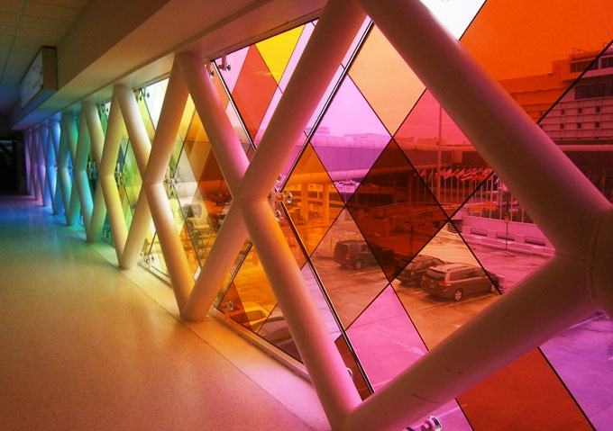

- 胶卷：

  

在 `Paint` 里设置 `ColorFilter` ，使用的是 `Paint.setColorFilter(ColorFilter filter)` 方法。 `ColorFilter` 并不直接使用，而是使用它的子类。它共有三个子类：`LightingColorFilter`，`PorterDuffColorFilter` 和 `ColorMatrixColorFilter`。

#### LightingColorFilter

这个 `LightingColorFilter` 是用来模拟简单的光照效果的。

`LightingColorFilter` 的构造方法是 `LightingColorFilter(int mul, int add)` ，参数里的 `mul` 和 `add` 都是和颜色值格式相同的 int 值，其中 `mul` 用来和目标像素相乘，`add` 用来和目标像素相加：

```
R' = R * mul.R / 0xff + add.R  
G' = G * mul.G / 0xff + add.G  
B' = B * mul.B / 0xff + add.B  
```

一个「保持原样」的「基本 `LightingColorFilter` 」，`mul` 为 `0xffffff`，`add` 为 `0x000000`（也就是0），那么对于一个像素，它的计算过程就是：

```java
// 第一个 Shader：头像的 Bitmap
Bitmap bitmap1 = BitmapFactory.decodeResource(getResources(), R.drawable.batman);  
Shader shader1 = new BitmapShader(bitmap1, Shader.TileMode.CLAMP, Shader.TileMode.CLAMP);

// 第二个 Shader：从上到下的线性渐变（由透明到黑色）
Bitmap bitmap2 = BitmapFactory.decodeResource(getResources(), R.drawable.batman_logo);  
Shader shader2 = new BitmapShader(bitmap2, Shader.TileMode.CLAMP, Shader.TileMode.CLAMP);

// ComposeShader：结合两个 Shader
Shader shader = new ComposeShader(shader1, shader2, PorterDuff.Mode.SRC_OVER);  
paint.setShader(shader);

...

canvas.drawCircle(300, 300, 300, paint);  
```

基于这个「基本 `LightingColorFilter` 」，你就可以修改一下做出其他的 filter。比如，如果你想去掉原像素中的红色，可以把它的 `mul` 改为 `0x00ffff` （红色部分为 0 ） ，那么它的计算过程就是：

```
R' = R * 0x0 / 0xff + 0x0 = 0 // 红色被移除  
G' = G * 0xff / 0xff + 0x0 = G  
B' = B * 0xff / 0xff + 0x0 = B  
```

具体效果是这样的：

```java
ColorFilter lightingColorFilter = new LightingColorFilter(0x00ffff, 0x000000);  
paint.setColorFilter(lightingColorFilter);  
```


或者，如果你想让它的绿色更亮一些，就可以把它的 `add` 改为 `0x003000` （绿色部分为 0x30 ），那么它的计算过程就是：

```
R' = R * 0xff / 0xff + 0x0 = R  
G' = G * 0xff / 0xff + 0x30 = G + 0x30 // 绿色被加强  
B' = B * 0xff / 0xff + 0x0 = B  
```

效果是这样：

```java
ColorFilter lightingColorFilter = new LightingColorFilter(0xffffff, 0x003000);  
paint.setColorFilter(lightingColorFilter);  
```


#### PorterDuffColorFilter

作用是使用一个指定的颜色和一种指定的 `PorterDuff.Mode` 来与绘制对象进行合成。

它的构造方法是 `PorterDuffColorFilter(int color, PorterDuff.Mode mode)` 其中的 `color` 参数是指定的颜色， `mode` 参数是指定的 `Mode`。同样也是 `PorterDuff.Mode` ，不过和 `ComposeShader` 不同的是，`PorterDuffColorFilter` 作为一个 `ColorFilter`，只能指定一种颜色作为源，而不是一个 `Bitmap`。

PorterDuff.Mode为前面的PorterDuff.Mode。

#### ColorMatrixColorFilter

`ColorMatrixColorFilter` 使用一个 `ColorMatrix` 来对颜色进行处理。 `ColorMatrix`这个类，内部是一个 4x5 的矩阵：

```
[ a, b, c, d, e,
  f, g, h, i, j,
  k, l, m, n, o,
  p, q, r, s, t ]
```

通过计算， `ColorMatrix` 可以把要绘制的像素进行转换。对于颜色 [R, G, B, A] ，转换算法是这样的：

```
R’ = a*R + b*G + c*B + d*A + e;  
G’ = f*R + g*G + h*B + i*A + j;  
B’ = k*R + l*G + m*B + n*A + o;  
A’ = p*R + q*G + r*B + s*A + t;  
```

`ColorMatrix` 有一些自带的方法可以做简单的转换，例如可以使用 `setSaturation(float sat)` 来设置饱和度；另外你也可以自己去设置它的每一个元素来对转换效果做精细调整。


### setXfermode(Xfermode xfermode)

> "Xfermode" 其实就是 "Transfer mode"，用 "X" 来代替 "Trans" 是一些美国人喜欢用的简写方式。

 `Xfermode` 指的是你要绘制的内容和 `Canvas` 的目标位置的内容应该怎样结合计算出最终的颜色。但通俗地说，其实就是要你以绘制的内容作为源图像，以 View 中已有的内容作为目标图像，选取一个 `PorterDuff.Mode` 作为绘制内容的颜色处理方案。就像这样：

```java
Xfermode xfermode = new PorterDuffXfermode(PorterDuff.Mode.DST_IN);

...

canvas.drawBitmap(rectBitmap, 0, 0, paint); // 画方  
paint.setXfermode(xfermode); // 设置 Xfermode  
canvas.drawBitmap(circleBitmap, 0, 0, paint); // 画圆  
paint.setXfermode(null); // 用完及时清除 Xfermode  
```


`PorterDuff.Mode` 在 `Paint` 一共有三处 API ，它们的工作原理都一样，只是用途不同：


另外，从上面的示例代码可以看出，创建 `Xfermode` 的时候其实是创建的它的子类 `PorterDuffXfermode`。而事实上，`Xfermode` 也只有这一个子类。所以在设置 `Xfermode` 的时候不用多想，直接用 `PorterDuffXfermode` 吧。

#### Xfermode 注意事项

`Xfermode` 使用很简单，不过有两点需要注意：

##### 1. 使用离屏缓冲（Off-screen Buffer）

实质上，上面这段例子代码，如果直接执行的话是不会绘制出图中效果的，程序的绘制也不会像上面的动画那样执行，而是会像这样：


按照逻辑我们会认为，在第二步画圆的时候，跟它共同计算的是第一步绘制的方形。但实际上，却是整个 `View` 的显示区域都在画圆的时候参与计算，并且 `View` 自身的底色并不是默认的透明色，而且是遵循一种迷之逻辑，导致不仅绘制的是整个圆的范围，而且在范围之外都变成了黑色。就像这样：


要想使用 `setXfermode()` 正常绘制，必须使用离屏缓存 (Off-screen Buffer) 把内容绘制在额外的层上，再把绘制好的内容贴回 View 中。也就是这样：


通过使用离屏缓冲，把要绘制的内容单独绘制在缓冲层， `Xfermode` 的使用就不会出现奇怪的结果了。使用离屏缓冲有两种方式：

- `Canvas.saveLayer()`

  `saveLayer()` 可以做短时的离屏缓冲。使用方法很简单，在绘制代码的前后各加一行代码，在绘制之前保存，绘制之后恢复：

  ```
  int saved = canvas.saveLayer(null, null, Canvas.ALL_SAVE_FLAG);
  
  
  canvas.drawBitmap(rectBitmap, 0, 0, paint); // 画方
  paint.setXfermode(xfermode); // 设置 Xfermode
  canvas.drawBitmap(circleBitmap, 0, 0, paint); // 画圆
  paint.setXfermode(null); // 用完及时清除 Xfermode
  
  
  canvas.restoreToCount(saved);
  ```

- `View.setLayerType()`

  `View.setLayerType()` 是直接把整个 `View` 都绘制在离屏缓冲中。 `setLayerType(LAYER_TYPE_HARDWARE)` 是使用 GPU 来缓冲， `setLayerType(LAYER_TYPE_SOFTWARE)` 是直接直接用一个 `Bitmap` 来缓冲。

如果没有特殊需求，可以选用第一种方法 `Canvas.saveLayer()` 来设置离屏缓冲，以此来获得更高的性能。

##### 2. 控制好透明区域

使用 Xfermode 来绘制的内容，除了注意使用离屏缓冲，还应该注意控制它的透明区域不要太小，要让它足够覆盖到要和它结合绘制的内容，否则得到的结果很可能不是你想要的。我用图片来具体说明一下：


由于透明区域过小而覆盖不到的地方，将不会受到 Xfermode 的影响。

## 效果

指的就是抗锯齿、填充/轮廓、线条宽度等等这些。

### setAntiAlias (boolean aa) 设置抗锯齿


抗锯齿默认是关闭的，如果需要抗锯齿，需要显式地打开。另外，除了 `setAntiAlias(aa)` 方法，打开抗锯齿还有一个更方便的方式：构造方法。创建 `Paint` 对象的时候，构造方法的参数里加一个 `ANTI_ALIAS_FLAG` 的 flag，就可以在初始化的时候就开启抗锯齿。

```java
Paint paint = new Paint(Paint.ANTI_ALIAS_FLAG);  
```

### setStyle(Paint.Style style)

`setStyle(style)` 也在上一节讲过了，用来设置图形是线条风格还是填充风格的（也可以二者并用）：

```
paint.setStyle(Paint.Style.FILL); // FILL 模式，填充  
canvas.drawCircle(300, 300, 200, paint);  
```


```
paint.setStyle(Paint.Style.STROKE); // STROKE 模式，画线  
canvas.drawCircle(300, 300, 200, paint);  
```


```
paint.setStyle(Paint.Style.FILL_AND_STROKE); // FILL_AND_STROKE 模式，填充 + 画线  
canvas.drawCircle(300, 300, 200, paint);  
```


`FILL` 模式是默认模式，所以如果之前没有设置过其他的 `Style`，可以不用 `setStyle(Paint.Style.FILL)` 这句。

#### 线条形状

设置线条形状的一共有 4 个方法：`setStrokeWidth(float width)`, `setStrokeCap(Paint.Cap cap)`, `setStrokeJoin(Paint.Join join)`, `setStrokeMiter(float miter)` 。

##### setStrokeWidth(float width)

设置线条宽度。单位为像素，默认值是 0。

```java
paint.setStyle(Paint.Style.STROKE);  
paint.setStrokeWidth(1);  
canvas.drawCircle(150, 125, 100, paint);  
paint.setStrokeWidth(5);  
canvas.drawCircle(400, 125, 100, paint);  
paint.setStrokeWidth(40);  
canvas.drawCircle(650, 125, 100, paint);  
```


> 线条宽度 0 和 1 的区别
>
> 默认情况下，线条宽度为 0，但你会发现，这个时候它依然能够画出线，线条的宽度为 1 像素。那么它和线条宽度为 1 有什么区别呢？
>
> 其实这个和后面要讲的一个「几何变换」有关：你可以为 `Canvas` 设置 `Matrix` 来实现几何变换（如放大、缩小、平移、旋转），在几何变换之后 `Canvas` 绘制的内容就会发生相应变化，包括线条也会加粗，例如 2 像素宽度的线条在 `Canvas` 放大 2 倍后会被以 4 像素宽度来绘制。而当线条宽度被设置为 0 时，它的宽度就被固定为 1 像素，就算 `Canvas` 通过几何变换被放大，它也依然会被以 1 像素宽度来绘制。Google 在文档中把线条宽度为 0 时称作「hairline mode（发际线模式）」。

##### setStrokeCap(Paint.Cap cap)

设置线头的形状。线头形状有三种：`BUTT` 平头、`ROUND` 圆头、`SQUARE` 方头。默认为 `BUTT`。

当线条的宽度是 1 像素时，这三种线头的表现是完全一致的，全是 1 个像素的点；而当线条变粗的时候，它们就会表现出不同的样子：


##### setStrokeJoin(Paint.Join join)

设置拐角的形状。

有三个值可以选择：`MITER` 尖角、 `BEVEL` 平角和 `ROUND` 圆角。默认为 `MITER`。


##### setStrokeMiter(float miter)

这个方法是对于 `setStrokeJoin()` 的一个补充，它用于设置 `MITER` 型拐角的延长线的最大值。所谓「延长线的最大值」，是这么一回事：

当线条拐角为 `MITER` 时，拐角处的外缘需要使用延长线来补偿：


而这种补偿方案会有一个问题：如果拐角的角度太小，就有可能由于出现连接点过长的情况。比如这样：


所以为了避免意料之外的过长的尖角出现， `MITER` 型连接点有一个额外的规则：当尖角过长时，自动改用 `BEVEL` 的方式来渲染连接点。例如上图的这个尖角，在默认情况下是不会出现的，而是会由于延长线过长而被转为 `BEVEL` 型连接点：


至于多尖的角属于过于尖，尖到需要转为使用 `BEVEL` 来绘制，则是由一个属性控制的，而这个属性就是 `setStrokeMiter(miter)` 方法中的 `miter` 参数。`miter` 参数是对于转角长度的限制，具体来讲，是指尖角的外缘端点和内部拐角的距离与线条宽度的比。也就是下面这两个长度的比：


用几何知识很容易得出这个比值的计算公式：如果拐角的大小为 θ ，那么这个比值就等于 1 / sin ( θ / 2 ) 。

这个 miter limit 的默认值是 4，对应的是一个大约 29° 的锐角：


默认情况下，大于这个角的尖角会被保留，而小于这个夹角的就会被「削成平头」

### 色彩优化

`Paint` 的色彩优化有两个方法： `setDither(boolean dither)` 和 `setFilterBitmap(boolean filter)`。它们的作用都是让画面颜色变得更加「顺眼」，但原理和使用场景是不同的。

#### setDither(boolean dither)

设置图像的抖动。

抖动的原理和这个类似。所谓抖动（注意，它就叫抖动，不是防抖动，也不是去抖动，有些人在翻译的时候自作主张地加了一个「防」字或者「去」字，这是不对的），是指把图像从较高色彩深度（即可用的颜色数）向较低色彩深度的区域绘制时，在图像中有意地插入噪点，通过有规律地扰乱图像来让图像对于肉眼更加真实的做法。

在实际的应用场景中，抖动更多的作用是在图像降低色彩深度绘制时，避免出现大片的色带与色块。


```java
paint.setDither(true);  
```

只要加这么一行代码，之后的绘制就是加抖动的了。

不过对于现在而言， `setDither(dither)` 已经没有当年那么实用了，因为现在的 Android 版本的绘制，默认的色彩深度已经是 32 位的 `ARGB_8888` ，效果已经足够清晰了。只有当你向自建的 `Bitmap` 中绘制，并且选择 16 位色的 `ARGB_4444` 或者 `RGB_565` 的时候，开启它才会有比较明显的效果。

####  setFilterBitmap(boolean filter)

设置是否使用双线性过滤来绘制 `Bitmap` 。

图像在放大绘制的时候，默认使用的是最近邻插值过滤，这种算法简单，但会出现马赛克现象；而如果开启了双线性过滤，就可以让结果图像显得更加平滑。


```java
paint.setFilterBitmap(true);  
```

加上这一行，在放大绘制 `Bitmap` 的时候就会使用双线性过滤了。

以上就是 `Paint` 的两个色彩优化的方法： `setDither(dither)` ，设置抖动来优化色彩深度降低时的绘制效果； `setFilterBitmap(filterBitmap)` ，设置双线性过滤来优化 `Bitmap` 放大绘制的效果。

### setPathEffect(PathEffect effect)

使用 `PathEffect` 来给图形的轮廓设置效果。对 `Canvas` 所有的图形绘制有效，也就是 `drawLine()`，`drawCircle()` `drawPath()` 这些方法。大概像这样：

```java
PathEffect pathEffect = new DashPathEffect(new float[]{10, 5}, 10);  
paint.setPathEffect(pathEffect);

...

canvas.drawCircle(300, 300, 200, paint);  
```


`PathEffect` 分为两类，单一效果的 `CornerPathEffect` `DiscretePathEffect` `DashPathEffect` `PathDashPathEffect` ，和组合效果的 `SumPathEffect` `ComposePathEffect`。

#### CornerPathEffect

把所有拐角变成圆角。

```java
PathEffect pathEffect = new CornerPathEffect(20);  
paint.setPathEffect(pathEffect);

...

canvas.drawPath(path, paint);  
```


它的构造方法 `CornerPathEffect(float radius)` 的参数 `radius` 是圆角的半径。

#### DiscretePathEffect

把线条进行随机的偏离，让轮廓变得乱七八糟。乱七八糟的方式和程度由参数决定。

```java
PathEffect pathEffect = new DiscretePathEffect(20, 5);  
paint.setPathEffect(pathEffect);

...

canvas.drawPath(path, paint);  
```


`DiscretePathEffect` 具体的做法是，把绘制改为使用定长的线段来拼接，并且在拼接的时候对路径进行随机偏离。它的构造方法 `DiscretePathEffect(float segmentLength, float deviation)` 的两个参数中， `segmentLength` 是用来拼接的每个线段的长度， `deviation` 是偏离量。这两个值设置得不一样，显示效果也会不一样。

#### DashPathEffect

使用虚线来绘制线条。

```java
PathEffect pathEffect = new DashPathEffect(new float[]{20, 10, 5, 10}, 0);  
paint.setPathEffect(pathEffect);

...

canvas.drawPath(path, paint);  
```


它的构造方法 `DashPathEffect(float[] intervals, float phase)` 中， 第一个参数 `intervals` 是一个数组，它指定了虚线的格式：数组中元素必须为偶数（最少是 2 个），按照「画线长度、空白长度、画线长度、空白长度」……的顺序排列，例如上面代码中的 `20, 5, 10, 5` 就表示虚线是按照「画 20 像素、空 5 像素、画 10 像素、空 5 像素」的模式来绘制；第二个参数 `phase` 是虚线的偏移量。

#### PathDashPathEffect

这个方法比 `DashPathEffect` 多一个前缀 `Path` ，所以顾名思义，它是使用一个 `Path` 来绘制「虚线」。具体看图吧：

```java
Path dashPath = ...; // 使用一个三角形来做 dash  
PathEffect pathEffect = new PathDashPathEffect(dashPath, 40, 0,  
        PathDashPathEffectStyle.TRANSLATE);
paint.setPathEffect(pathEffect);

...

canvas.drawPath(path, paint);  
```


它的构造方法 `PathDashPathEffect(Path shape, float advance, float phase, PathDashPathEffect.Style style)`中， `shape` 参数是用来绘制的 `Path` ； `advance` 是两个相邻的 `shape` 段之间的间隔，不过注意，这个间隔是两个 `shape` 段的起点的间隔，而不是前一个的终点和后一个的起点的距离； `phase` 和 `DashPathEffect` 中一样，是虚线的偏移；最后一个参数 `style`，是用来指定拐弯改变的时候 `shape` 的转换方式。`style` 的类型为 `PathDashPathEffect.Style` ，是一个 `enum` ，具体有三个值：

- `TRANSLATE`：位移
- `ROTATE`：旋转
- `MORPH`：变体


#### SumPathEffect

这是一个组合效果类的 `PathEffect` 。它的行为特别简单，就是分别按照两种 `PathEffect` 分别对目标进行绘制。

```java
PathEffect dashEffect = new DashPathEffect(new float[]{20, 10}, 0);  
PathEffect discreteEffect = new DiscretePathEffect(20, 5);  
pathEffect = new SumPathEffect(dashEffect, discreteEffect);

...

canvas.drawPath(path, paint);  
```


#### ComposePathEffect

这也是一个组合效果类的 `PathEffect` 。不过它是先对目标 `Path` 使用一个 `PathEffect`，然后再对这个改变后的 `Path` 使用另一个 `PathEffect`。

```java
PathEffect dashEffect = new DashPathEffect(new float[]{20, 10}, 0);  
PathEffect discreteEffect = new DiscretePathEffect(20, 5);  
pathEffect = new ComposePathEffect(dashEffect, discreteEffect);

...

canvas.drawPath(path, paint);  
```


它的构造方法 `ComposePathEffect(PathEffect outerpe, PathEffect innerpe)` 中的两个 `PathEffect` 参数， `innerpe` 是先应用的， `outerpe` 是后应用的。所以上面的代码就是「先偏离，再变虚线」。而如果把两个参数调换，就成了「先变虚线，再偏离」。

> 注意： `PathEffect` 在有些情况下不支持硬件加速，需要关闭硬件加速才能正常使用：
>
> 1. `Canvas.drawLine()` 和 `Canvas.drawLines()` 方法画直线时，`setPathEffect()` 是不支持硬件加速的；
> 2. `PathDashPathEffect` 对硬件加速的支持也有问题，所以当使用 `PathDashPathEffect` 的时候，最好也把硬件加速关了。

### setShadowLayer(float radius, float dx, float dy, int shadowColor)

在之后的绘制内容下面加一层阴影。

```java
paint.setShadowLayer(10, 0, 0, Color.RED);

...

canvas.drawText(text, 80, 300, paint);  
```


效果就是上面这样。方法的参数里， `radius` 是阴影的模糊范围； `dx` `dy` 是阴影的偏移量； `shadowColor` 是阴影的颜色。

如果要清除阴影层，使用 `clearShadowLayer()` 。

注意：

- 在硬件加速开启的情况下， `setShadowLayer()` 只支持文字的绘制，文字之外的绘制必须关闭硬件加速才能正常绘制阴影。
- 如果 `shadowColor` 是半透明的，阴影的透明度就使用 `shadowColor` 自己的透明度；而如果 `shadowColor` 是不透明的，阴影的透明度就使用 `paint` 的透明度。

### setMaskFilter(MaskFilter maskfilter)

为之后的绘制设置 `MaskFilter`。上一个方法 `setShadowLayer()` 是设置的在绘制层下方的附加效果；而这个 `MaskFilter` 和它相反，设置的是在绘制层上方的附加效果。

> 到现在已经有两个 `setXxxFilter(filter)` 了。前面有一个 `setColorFilter(filter)` ，是对每个像素的颜色进行过滤；而这里的 `setMaskFilter(filter)` 则是基于整个画面来进行过滤。

`MaskFilter` 有两种： `BlurMaskFilter` 和 `EmbossMaskFilter`。

#### BlurMaskFilter

模糊效果的 `MaskFilter`。

```java
paint.setMaskFilter(new BlurMaskFilter(50, BlurMaskFilter.Blur.NORMAL));

...

canvas.drawBitmap(bitmap, 100, 100, paint);  
```


它的构造方法 `BlurMaskFilter(float radius, BlurMaskFilter.Blur style)` 中， `radius` 参数是模糊的范围， `style` 是模糊的类型。一共有四种：

- `NORMAL`: 内外都模糊绘制
- `SOLID`: 内部正常绘制，外部模糊
- `INNER`: 内部模糊，外部不绘制
- `OUTER`: 内部不绘制，外部模糊


#### EmbossMaskFilter

浮雕效果的 `MaskFilter`。

```java
paint.setMaskFilter(new EmbossMaskFilter(new float[]{0, 1, 1}, 0.2f, 8, 10));

...

canvas.drawBitmap(bitmap, 100, 100, paint);  
```


它的构造方法 `EmbossMaskFilter(float[] direction, float ambient, float specular, float blurRadius)` 的参数里， `direction` 是一个 3 个元素的数组，指定了光源的方向； `ambient` 是环境光的强度，数值范围是 0 到 1； `specular` 是炫光的系数； `blurRadius` 是应用光线的范围。

### 获取绘制的 Path

这组方法做的事是，根据 `paint` 的设置，计算出绘制 `Path` 或文字时的**实际 Path**。

#### getFillPath(Path src, Path dst)

首先解答第一个问题：「实际 `Path`」。所谓实际 `Path` ，指的就是 `drawPath()` 的绘制内容的轮廓，要算上线条宽度和设置的 `PathEffect`。

默认情况下（线条宽度为 0、没有 `PathEffect`），原 `Path` 和实际 `Path` 是一样的；而在线条宽度不为 0 （并且模式为 `STROKE` 模式或 `FLL_AND_STROKE` ），或者设置了 `PathEffect` 的时候，实际 `Path` 就和原 `Path` 不一样了：


通过 `getFillPath(src, dst)` 方法就能获取这个实际 `Path`。方法的参数里，`src` 是原 `Path` ，而 `dst`就是实际 `Path` 的保存位置。 `getFillPath(src, dst)` 会计算出实际 `Path`，然后把结果保存在 `dst`里。

#### getTextPath(String text, int start, int end, float x, float y, Path path) / getTextPath(char[] text, int index, int count, float x, float y, Path path)

文字的绘制，虽然是使用 `Canvas.drawText()` 方法，但其实在下层，文字信息全是被转化成图形，对图形进行绘制的。 `getTextPath()` 方法，获取的就是目标文字所对应的 `Path` 。这个就是所谓「文字的 `Path`」。


这两个方法， `getFillPath()` 和 `getTextPath()` ，就是获取绘制的 `Path` 的方法。之所以把它们归类到「效果」类方法，是因为它们主要是用于图形和文字的装饰效果的位置计算。


## 初始化类

这一类方法很简单，它们是用来初始化 `Paint` 对象，或者是批量设置 `Paint` 的多个属性的方法。

### reset()

重置 `Paint` 的所有属性为默认值。相当于重新 `new` 一个，不过性能高一些。

### set(Paint src)

把 `src` 的所有属性全部复制过来。相当于调用 `src` 所有的 `get` 方法，然后调用这个 `Paint` 的对应的 `set` 方法来设置它们。

### setFlags(int flags)

批量设置 flags。相当于依次调用它们的 `set` 方法。例如： 

```java
paint.setMaskFilter(new BlurMaskFilter(50, BlurMaskFilter.Blur.NORMAL));

...

canvas.drawBitmap(bitmap, 100, 100, paint);  
```

这行代码，和下面这两行是等价的：

```java
paint.setAntiAlias(true);  
paint.setDither(true);  
```

`setFlags(flags)` 对应的 `get` 方法是 `int getFlags()`。

# Paint 对文字绘制的辅助

## 设置显示效果类

### setTextSize(float textSize)文字大小

设置文字大小。

```java
paint.setTextSize(18);  
canvas.drawText(text, 100, 25, paint);  
paint.setTextSize(36);  
canvas.drawText(text, 100, 70, paint);  
paint.setTextSize(60);  
canvas.drawText(text, 100, 145, paint);  
paint.setTextSize(84);  
canvas.drawText(text, 100, 240, paint);  
```


### setTypeface(Typeface typeface)字体

设置字体。

```java
paint.setTypeface(Typeface.DEFAULT);  
canvas.drawText(text, 100, 150, paint);  
paint.setTypeface(Typeface.SERIF);  
canvas.drawText(text, 100, 300, paint);  
paint.setTypeface(Typeface.createFromAsset(getContext().getAssets(), "Satisfy-Regular.ttf"));  
canvas.drawText(text, 100, 450, paint);  
```


### setFakeBoldText(boolean fakeBoldText)粗体

是否使用伪粗体。

```java
paint.setFakeBoldText(false);  
canvas.drawText(text, 100, 150, paint);  
paint.setFakeBoldText(true);  
canvas.drawText(text, 100, 230, paint);  
```


之所以叫伪粗体（ fake bold ），因为它并不是通过选用更高 weight 的字体让文字变粗，而是通过程序在运行时把文字给「描粗」了。

### setStrikeThruText(boolean strikeThruText)删除线

是否加删除线。

```java
paint.setTypeface(Typeface.DEFAULT);  
canvas.drawText(text, 100, 150, paint);  
paint.setTypeface(Typeface.SERIF);  
canvas.drawText(text, 100, 300, paint);  
paint.setTypeface(Typeface.createFromAsset(getContext().getAssets(), "Satisfy-Regular.ttf"));  
canvas.drawText(text, 100, 450, paint);  
```


### setUnderlineText(boolean underlineText)下划线

是否加下划线。

```java
paint.setUnderlineText(true);  
canvas.drawText(text, 100, 150, paint);  
```


### setTextSkewX(float skewX)文字倾斜度

设置文字横向错切角度。

```java
paint.setTextSkewX(-0.5f);  
canvas.drawText(text, 100, 150, paint);  
```


### setTextScaleX(float scaleX)横向缩放

设置文字横向放缩。

```java
paint.setTextScaleX(1);  
canvas.drawText(text, 100, 150, paint);  
paint.setTextScaleX(0.8f);  
canvas.drawText(text, 100, 230, paint);  
paint.setTextScaleX(1.2f);  
canvas.drawText(text, 100, 310, paint);  
```


### setLetterSpacing(float letterSpacing)字符间距

设置字符间距。默认值是 0。

```java
paint.setLetterSpacing(0.2f);  
canvas.drawText(text, 100, 150, paint);  
```


### setFontFeatureSettings(String settings)

用 CSS 的 `font-feature-settings` 的方式来设置文字。

```java
paint.setFontFeatureSettings("smcp"); // 设置 "small caps"  
canvas.drawText("Hello HenCoder", 100, 150, paint);  
```


CSS 全称是 Cascading Style Sheets ，是网页开发用来设置页面各种元素的样式的。

### setTextAlign(Paint.Align align)对齐方式

设置文字的对齐方式。一共有三个值：`LEFT` `CETNER` 和 `RIGHT`。默认值为 `LEFT`。

```java
paint.setTextAlign(Paint.Align.LEFT);  
canvas.drawText(text, 500, 150, paint);  
paint.setTextAlign(Paint.Align.CENTER);  
canvas.drawText(text, 500, 150 + textHeight, paint);  
paint.setTextAlign(Paint.Align.RIGHT);  
canvas.drawText(text, 500, 150 + textHeight * 2, paint);  
```


### setTextLocale(Locale locale) / setTextLocales(LocaleList locales)

设置绘制所使用的 `Locale`。

`Locale` 直译是「地域」，其实就是你在系统里设置的「语言」或「语言区域」（具体名称取决于你用的是什么手机），比如「简体中文（中国）」「English (US)」「English (UK)」。有些同源的语言，在文化发展过程中对一些相同的字衍生出了不同的写法（比如中国大陆和日本对于某些汉字的写法就有细微差别。注意，不是繁体和简体这种同音同义不同字，而真的是同样的一个字有两种写法）。系统语言不同，同样的一个字的显示就有可能不同。你可以试一下把自己手机的语言改成日文，然后打开微信看看聊天记录，你会明显发现文字的显示发生了很多细微的变化，这就是由于系统的 `Locale` 改变所导致的。

`Canvas` 绘制的时候，默认使用的是系统设置里的 `Locale`。而通过 `Paint.setTextLocale(Locale locale)` 就可以在不改变系统设置的情况下，直接修改绘制时的 `Locale`。

```java
paint.setTextLocale(Locale.CHINA); // 简体中文  
canvas.drawText(text, 150, 150, paint);  
paint.setTextLocale(Locale.TAIWAN); // 繁体中文  
canvas.drawText(text, 150, 150 + textHeight, paint);  
paint.setTextLocale(Locale.JAPAN); // 日语  
canvas.drawText(text, 150, 150 + textHeight * 2, paint);  
```


### setHinting(int mode)

设置是否启用字体的 hinting （字体微调）。

现在的 Android 设备大多数都是是用的矢量字体。矢量字体的原理是对每个字体给出一个字形的矢量描述，然后使用这一个矢量来对所有的尺寸的字体来生成对应的字形。由于不必为所有字号都设计它们的字体形状，所以在字号较大的时候，矢量字体也能够保持字体的圆润，这是矢量字体的优势。不过当文字的尺寸过小（比如高度小于 16 像素），有些文字会由于失去过多细节而变得不太好看。 hinting 技术就是为了解决这种问题的：通过向字体中加入 hinting 信息，让矢量字体在尺寸过小的时候得到针对性的修正，从而提高显示效果。


功能很强，效果很赞。不过在现在（ 2017 年），手机屏幕的像素密度已经非常高，几乎不会再出现字体尺寸小到需要靠 hinting 来修正的情况，所以这个方法可以忽略。

### setElegantTextHeight(boolean elegant)

对中文无用。

### setSubpixelText(boolean subpixelText)

是否开启次像素级的抗锯齿（ sub-pixel anti-aliasing ）。

次像素级抗锯齿这个功能解释起来很麻烦，简单说就是根据程序所运行的设备的屏幕类型，来进行针对性的次像素级的抗锯齿计算，从而达到更好的抗锯齿效果。

不过，和前面讲的字体 hinting 一样，由于现在手机屏幕像素密度已经很高，所以默认抗锯齿效果就已经足够好了，一般没必要开启次像素级抗锯齿，所以这个方法基本上没有必要使用。

### setLinearText(boolean linearText)

不知道是什么。

## 测量文字尺寸类

### float getFontSpacing()

获取推荐的行距。

即推荐的两行文字的 baseline 的距离。这个值是系统根据文字的字体和字号自动计算的。它的作用是当你要手动绘制多行文字（而不是使用 StaticLayout）的时候，可以在换行的时候给 `y` 坐标加上这个值来下移文字。

```java
canvas.drawText(texts[0], 100, 150, paint);  
canvas.drawText(texts[1], 100, 150 + paint.getFontSpacing, paint);  
canvas.drawText(texts[2], 100, 150 + paint.getFontSpacing * 2, paint);  
```


### FontMetircs getFontMetrics()

获取 `Paint` 的 `FontMetrics`。

`FontMetrics` 是个相对专业的工具类，它提供了几个文字排印方面的数值：`ascent`, `descent`, `top`, `bottom`, `leading`。


如图，图中有两行文字，每一行都有 5 条线：`top`, `ascent`, `baseline`, `descent`, `bottom`。（`leading`并没有画出来，因为画不出来）

- `baseline`: 上图中**黑色**的线。前面已经讲过了，它的作用是作为文字显示的基准线。
- `ascent` / `descent`: 上图中**绿色**和**橙色**的线，它们的作用是限制普通字符的顶部和底部范围。 
  普通的字符，上不会高过 `ascent` ，下不会低过 `descent` ，例如上图中大部分的字形都显示在 `ascent` 和 `descent` 两条线的范围内。具体到 Android 的绘制中， `ascent` 的值是图中绿线和 `baseline` 的相对位移，它的值为负（因为它在 `baseline` 的上方）； `descent` 的值是图中橙线和 `baseline` 相对位移，值为正（因为它在 `baseline` 的下方）。
- `top` / `bottom`: 上图中**蓝色**和**红色**的线，它们的作用是限制所有**字形**的顶部和底部范围。 
  除了普通字符，有些字形的显示范围是会超过 `ascent` 和 `descent` 的，而 `top` 和 `bottom` 则限制的是所有字形的显示范围，包括这些特殊字形。例如上图的第二行文字里，就有两个泰文的字形分别超过了 `ascent` 和 `descent` 的限制，但它们都在 `top` 和 `bottom` 两条线的范围内。具体到 Android 的绘制中， `top` 的值是图中蓝线和 `baseline` 的相对位移，它的值为负（因为它在 `baseline` 的上方）； `bottom` 的值是图中红线和 `baseline` 相对位移，值为正（因为它在 `baseline` 的下方）。
- `leading`: 这个词在上图中没有标记出来，因为它并不是指的某条线和 `baseline` 的相对位移。 `leading` 指的是行的额外间距，即对于上下相邻的两行，上行的 `bottom` 线和下行的 `top` 线的距离，也就是上图中**第一行的红线**和**第二行的蓝线**的距离（对，就是那个小细缝）。

> `leading` 这个词的本意其实并不是行的额外间距，而是行距，即两个相邻行的 `baseline` 之间的距离。不过对于很多非专业领域，`leading` 的意思被改变了，被大家当做行的额外间距来用；而 Android 里的 `leading` ，同样也是行的额外间距的意思。

`FontMetrics` 提供的就是 `Paint` 根据当前字体和字号，得出的这些值的推荐值。它把这些值以变量的形式存储，供开发者需要时使用。

- `FontMetrics.ascent`：float 类型。
- `FontMetrics.descent`：float 类型。
- `FontMetrics.top`：float 类型。
- `FontMetrics.bottom`：float 类型。
- `FontMetrics.leading`：float 类型。

另外，`ascent` 和 `descent` 这两个值还可以通过 `Paint.ascent()` 和 `Paint.descent()` 来快捷获取。

> **FontMetrics 和 getFontSpacing()：**
>
> 从定义可以看出，上图中两行文字的 font spacing (即相邻两行的 `baseline` 的距离) 可以通过 `bottom - top + leading` (`top` 的值为负，前面刚说过，记得吧？）来计算得出。
>
> 但你真的运行一下会发现， `bottom - top + leading` 的结果是要大于 `getFontSpacing()` 的返回值的。
>
> 两个方法计算得出的 font spacing 竟然不一样？
>
> 这并不是 bug，而是因为 `getFontSpacing()` 的结果并不是通过 `FontMetrics` 的标准值计算出来的，而是另外计算出来的一个值，它能够做到在两行文字不显得拥挤的前提下缩短行距，以此来得到更好的显示效果。所以如果你要对文字手动换行绘制，多数时候应该选取 `getFontSpacing()` 来得到行距，不但使用更简单，显示效果也会更好。

`getFontMetrics()` 的返回值是 `FontMetrics` 类型。它还有一个重载方法 `getFontMetrics(FontMetrics fontMetrics)` ，计算结果会直接填进传入的 `FontMetrics` 对象，而不是重新创建一个对象。这种用法在需要频繁获取 `FontMetrics` 的时候性能会好些。

另外，这两个方法还有一对同样结构的对应的方法 `getFontMetricsInt()` 和 `getFontMetricsInt(FontMetricsInt fontMetrics)` ，用于获取 `FontMetricsInt` 类型的结果。

### getTextBounds(String text, int start, int end, Rect bounds)

获取文字的显示范围。

参数里，`text` 是要测量的文字，`start` 和 `end` 分别是文字的起始和结束位置，`bounds` 是存储文字显示范围的对象，方法在测算完成之后会把结果写进 `bounds`。

```java
paint.setStyle(Paint.Style.FILL);  
canvas.drawText(text, offsetX, offsetY, paint);

paint.getTextBounds(text, 0, text.length(), bounds);  
bounds.left += offsetX;  
bounds.top += offsetY;  
bounds.right += offsetX;  
bounds.bottom += offsetY;  
paint.setStyle(Paint.Style.STROKE);  
canvas.drawRect(bounds, paint);  
```


它有一个重载方法 `getTextBounds(char[] text, int index, int count, Rect bounds)`，用法非常相似。

### float measureText(String text)

测量文字的宽度并返回。

```java
canvas.drawText(text, offsetX, offsetY, paint);  
float textWidth = paint.measureText(text);  
canvas.drawLine(offsetX, offsetY, offsetX + textWidth, offsetY, paint);  
```


咦，前面有了 `getTextBounds()`，这里怎么又有一个 `measureText()`？

如果你用代码分别使用 `getTextBounds()` 和 `measureText()` 来测量文字的宽度，你会发现 `measureText()` 测出来的宽度总是比 `getTextBounds()` 大一点点。这是因为这两个方法其实测量的是两个不一样的东西。

- `getTextBounds`: 它测量的是文字的显示范围（关键词：显示）。形象点来说，你这段文字外放置一个可变的矩形，然后把矩形尽可能地缩小，一直小到这个矩形恰好紧紧包裹住文字，那么这个矩形的范围，就是这段文字的 bounds。
- `measureText()`: 它测量的是文字绘制时所占用的宽度（关键词：占用）。前面已经讲过，一个文字在界面中，往往需要占用比他的实际显示宽度更多一点的宽度，以此来让文字和文字之间保留一些间距，不会显得过于拥挤。上面的这幅图，我并没有设置 `setLetterSpacing()` ，这里的 letter spacing 是默认值 0，但你可以看到，图中每两个字母之间都是有空隙的。另外，下方那条用于表示文字宽度的横线，在左边超出了第一个字母 `H` 一段距离的，在右边也超出了最后一个字母 `r`（虽然右边这里用肉眼不太容易分辨），而就是两边的这两个「超出」，导致了 `measureText()` 比 `getTextBounds()` 测量出的宽度要大一些。

在实际的开发中，测量宽度要用 `measureText()` 还是 `getTextBounds()` ，需要根据情况而定。

### getTextWidths(String text, float[] widths)

获取字符串中每个字符的宽度，并把结果填入参数 `widths`。

这相当于 `measureText()` 的一个快捷方法，它的计算等价于对字符串中的每个字符分别调用 `measureText()` ，并把它们的计算结果分别填入 `widths` 的不同元素。

### int breakText(String text, boolean measureForwards, float maxWidth, float[] measuredWidth)

这个方法也是用来测量文字宽度的。但和 `measureText()` 的区别是， `breakText()` 是在给出宽度上限的前提下测量文字的宽度。如果文字的宽度超出了上限，那么在临近超限的位置截断文字。

```java
int measuredCount;  
float[] measuredWidth = {0};

// 宽度上限 300 （不够用，截断）
measuredCount = paint.breakText(text, 0, text.length(), true, 300, measuredWidth);  
canvas.drawText(text, 0, measuredCount, 150, 150, paint);

// 宽度上限 400 （不够用，截断）
measuredCount = paint.breakText(text, 0, text.length(), true, 400, measuredWidth);  
canvas.drawText(text, 0, measuredCount, 150, 150 + fontSpacing, paint);

// 宽度上限 500 （够用）
measuredCount = paint.breakText(text, 0, text.length(), true, 500, measuredWidth);  
canvas.drawText(text, 0, measuredCount, 150, 150 + fontSpacing * 2, paint);

// 宽度上限 600 （够用）
measuredCount = paint.breakText(text, 0, text.length(), true, 600, measuredWidth);  
canvas.drawText(text, 0, measuredCount, 150, 150 + fontSpacing * 3, paint);  
```


`breakText()` 的返回值是截取的文字个数（如果宽度没有超限，则是文字的总个数）。参数中， `text` 是要测量的文字；`measureForwards` 表示文字的测量方向，`true` 表示由左往右测量；`maxWidth` 是给出的宽度上限；`measuredWidth` 是用于接受数据，而不是用于提供数据的：方法测量完成后会把截取的文字宽度（如果宽度没有超限，则为文字总宽度）赋值给 `measuredWidth[0]`。

这个方法可以用于多行文字的折行计算。

### 光标相关

对于 `EditText` 以及类似的场景，会需要绘制光标。

#### getRunAdvance(CharSequence text, int start, int end, int contextStart, int contextEnd, boolean isRtl, int offset)

对于一段文字，计算出某个字符处光标的 `x` 坐标。 `start` `end` 是文字的起始和结束坐标；`contextStart` `contextEnd` 是上下文的起始和结束坐标；`isRtl` 是文字的方向；`offset` 是字数的偏移，即计算第几个字符处的光标。

```java
int length = text.length();  
float advance = paint.getRunAdvance(text, 0, length, 0, length, false, length);  
canvas.drawText(text, offsetX, offsetY, paint);  
canvas.drawLine(offsetX + advance, offsetY - 50, offsetX + advance, offsetY + 10, paint);  
```


其实，说是测量光标位置的，本质上这也是一个测量文字宽度的方法。上面这个例子中，`start` 和 `contextStart` 都是 0， `end` `contextEnd` 和 `offset` 都等于 `text.length()`。在这种情况下，它是等价于 `measureText(text)` 的，即完整测量一段文字的宽度。而对于更复杂的需求，`getRunAdvance()` 能做的事就比 `measureText()` 多了。

```java
// 包含特殊符号的绘制（如 emoji 表情）
String text = "Hello HenCoder \uD83C\uDDE8\uD83C\uDDF3" // "Hello HenCoder 🇨🇳"

...

float advance1 = paint.getRunAdvance(text, 0, length, 0, length, false, length);  
float advance2 = paint.getRunAdvance(text, 0, length, 0, length, false, length - 1);  
float advance3 = paint.getRunAdvance(text, 0, length, 0, length, false, length - 2);  
float advance4 = paint.getRunAdvance(text, 0, length, 0, length, false, length - 3);  
float advance5 = paint.getRunAdvance(text, 0, length, 0, length, false, length - 4);  
float advance6 = paint.getRunAdvance(text, 0, length, 0, length, false, length - 5);

...
```


#### getOffsetForAdvance(CharSequence text, int start, int end, int contextStart, int contextEnd, boolean isRtl, float advance)

给出一个位置的像素值，计算出文字中最接近这个位置的字符偏移量（即第几个字符最接近这个坐标）。

方法的参数很简单： `text` 是要测量的文字；`start` `end` 是文字的起始和结束坐标；`contextStart``contextEnd` 是上下文的起始和结束坐标；`isRtl` 是文字方向；`advance` 是给出的位置的像素值。填入参数，对应的字符偏移量将作为返回值返回。

`getOffsetForAdvance()` 配合上 `getRunAdvance()` 一起使用，就可以实现「获取用户点击处的文字坐标」的需求。

### hasGlyph(String string)

检查指定的字符串中是否是一个单独的字形 (glyph）。最简单的情况是，`string` 只有一个字母（比如 `a`）。


# demo一个钟表盘

```
mPaint.setStyle(Paint.Style.STROKE);
mPaint.setStrokeWidth(5);
canvas.drawCircle(centerX, centerY, R, mPaint);

canvas.translate(centerX, centerY);//移动到中间
canvas.rotate(-90);//旋转到数学上的坐标系方向
mPaint.setStrokeWidth(3);
for (int i = 1; i <= 12; i++) {
    canvas.rotate(30);
    if (i == 3 || i == 6 || i == 9 || i == 12) {
        mPaint.setStrokeWidth(5);
        canvas.drawLine(0, R, 0, R - 80, mPaint);
    } else {
        mPaint.setStrokeWidth(3);
        canvas.drawLine(0, R, 0, R - 40, mPaint);
    }
}

```


# Android色彩特效处理

在Android中是使用一个颜色矩阵（ColorMatrix）来处理图像颜色。

矩阵A就是一个4*5的颜色矩阵，在Android中，它会以一维数组的形式来存储，而C是一个颜色矩阵分量。


计算过程：


**改变色光属性**

系统封装了一个类ColorMatrix，可以通过这个方便地处理颜色。

```
ColorMatrix imageMatrix = new ColorMatrix();
```

- 色调

  ```
  ColorMatrix hueMatrix = new ColorMatrix();
  hueMatrix.setRotate(0, hue);
  hueMatrix.setRotate(1, hue);
  hueMatrix.setRotate(2, hue);
  ```

  0代表红色，1代表绿色，2代表蓝色。

- 饱和度

  ```
  ColorMatrix saturationMatrix = new ColorMatrix();
  saturationMatrix.setSaturation(saturation);
  ```

  当饱和度变为0时，图像就变成灰度图像了。

- 亮度

  ```
  ColorMatrix lumMatrix = new ColorMatrix();
  lumMatrix.setScale(lum, lum, lum, 1);
  ```

  当亮度为0时，图像就全黑了。

通过postConcat方法将矩阵的作用混合，总而达到叠加的效果。

```
private Bitmap handleImage(Bitmap bitmap, float hue, float saturation, float lum) {
    Bitmap bmp = Bitmap.createBitmap(
            bitmap.getWidth(), bitmap.getHeight(), Bitmap.Config.ARGB_8888);
    Canvas canvas = new Canvas(bmp);
    Paint paint = new Paint();

    ColorMatrix hueMatrix = new ColorMatrix();
    hueMatrix.setRotate(0, hue);
    hueMatrix.setRotate(1, hue);
    hueMatrix.setRotate(2, hue);

    ColorMatrix saturationMatrix = new ColorMatrix();
    saturationMatrix.setSaturation(saturation);

    ColorMatrix lumMatrix = new ColorMatrix();
    lumMatrix.setScale(lum, lum, lum, 1);

    ColorMatrix imageMatrix = new ColorMatrix();
    imageMatrix.postConcat(hueMatrix);
    imageMatrix.postConcat(saturationMatrix);
    imageMatrix.postConcat(lumMatrix);

    paint.setColorFilter(new ColorMatrixColorFilter(imageMatrix));
    canvas.drawBitmap(bitmap, 0, 0, paint);
    return bmp;
}
```

> 在实践过程中，发现一点SeekBar图像就会消失，后来发现drawBitmap传的Bitmap应该为原图Bitmap，有点疑惑？

# 颜色矩阵ColorMatrix

```
public class Z18Activity extends AppCompatActivity {
    private ImageView mImageView;
    private GridLayout mGridLayout;
    private Bitmap mBitmap;
    private Button btnChange;
    private Button btnReset;
    private EditText[] mEditTexts;
    private int mWidth;
    private int mHeight;
    private float[] mColorMatrixs;

    @Override
    protected void onCreate(Bundle savedInstanceState) {
        super.onCreate(savedInstanceState);
        setContentView(R.layout.activity_z18);
        BitmapFactory.Options option = new BitmapFactory.Options();
        option.inSampleSize = 2;
        mBitmap = BitmapFactory.decodeResource(getResources(), R.drawable.hbqn, option);
        mEditTexts = new EditText[20];
        mColorMatrixs = new float[20];

        mImageView = findViewById(R.id.img);
        mGridLayout = findViewById(R.id.grid_layout);
        btnChange = findViewById(R.id.btn_change);
        btnReset = findViewById(R.id.btn_reset);

        mGridLayout.post(() -> {
            mWidth = mGridLayout.getWidth() / 5;
            mHeight = mGridLayout.getHeight() / 4;
            addEt();
            initMatrix();
        });

        mImageView.setImageBitmap(mBitmap);

        btnChange.setOnClickListener(v -> {
            getMatrix();
            setImageMatrix();
        });
        btnReset.setOnClickListener(v -> {
            initMatrix();
            getMatrix();
            setImageMatrix();
        });
    }

    private void setImageMatrix() {
        Bitmap bitmap = Bitmap.createBitmap(
                mBitmap.getWidth(), mBitmap.getHeight(), Bitmap.Config.ARGB_8888);
        ColorMatrix colorMatrix = new ColorMatrix();
        colorMatrix.set(mColorMatrixs);
        Canvas canvas = new Canvas(bitmap);
        Paint paint = new Paint();
        paint.setColorFilter(new ColorMatrixColorFilter(colorMatrix));
        canvas.drawBitmap(mBitmap, 0, 0, paint);
        mImageView.setImageBitmap(bitmap);
    }

    private void initMatrix() {
        for (int i = 0; i < mEditTexts.length; i++) {
            if (i % 6 == 0) {
                mEditTexts[i].setText(1 + "");
            } else {
                mEditTexts[i].setText(0 + "");
            }
        }
    }

    private void addEt() {
        for (int i = 0; i < 20; i++) {
            EditText editText = new EditText(this);
            editText.setInputType(InputType.TYPE_NUMBER_FLAG_DECIMAL);
            editText.setMaxLines(1);
            mEditTexts[i] = editText;
            mGridLayout.addView(editText, mWidth, mHeight);
        }
    }

    private void getMatrix() {
        for (int i = 0; i < 20; i++) {
            mColorMatrixs[i] = Float.valueOf(mEditTexts[i].getText().toString());
        }
    }

}
```

# 贝塞尔曲线

## 简介

贝塞尔曲线于1962年，由法国工程师皮埃尔·贝塞尔（Pierre Bézier）所广泛发表，他运用贝塞尔曲线来为汽车的主体进行设计。贝塞尔曲线最初由 Paul de Casteljau 于1959年运用de Casteljau 算法开发，以稳定数值的方法求出贝塞尔曲线。

- 用处：刷礼物；水滴动画；翻书效果；天气预报曲线图等；

## 二阶贝塞尔曲线

以屏幕为中心绘制左右两个定点，中心偏上绘制移动点；2.drawline()将3个点路径相连；3.onTouchEvent()方法中获取手势的点；4.path.moveTo(startX,startY)从起始点开始绘制，path.quadTo(eventX,eventY,endX,endY)以触碰点为控制点，右定点为结束点，绘制path。

```java
public class DrawQuadToView extends View {
    private int startX, startY;
    private int eventX, eventY;
    private int endX, endY;
    private Paint mPaint;
    private Path mPath;

    public DrawQuadToView(Context context) {
        super(context);
        init();
    }

    public DrawQuadToView(Context context, @Nullable AttributeSet attrs) {
        super(context, attrs);
        init();
    }

    private void init() {
        mPaint = new Paint();
        mPath = new Path();
    }

    @Override
    protected void onSizeChanged(int w, int h, int oldw, int oldh) {
        int centerX = w / 2;
        int centerY = h / 2;
        startX = centerX - 250;
        startY = centerY;
        eventX = centerX;
        eventY = centerY;
        endX = centerX + 250;
        endY = centerY;
    }

    @Override
    protected void onDraw(Canvas canvas) {
        mPath.reset();//清空之前的

        mPaint.setColor(Color.BLACK);
        canvas.drawCircle(startX, startY, 8, mPaint);
        canvas.drawCircle(endX, endY, 8, mPaint);
        mPaint.setColor(Color.RED);
        canvas.drawCircle(eventX, eventY, 8, mPaint);

        mPaint.setColor(Color.GREEN);
        mPaint.setStrokeWidth(3);
        canvas.drawLine(startX, startY, eventX, eventY, mPaint);
        canvas.drawLine(endX, endY, eventX, eventY, mPaint);

        mPaint.setColor(Color.BLACK);
        mPaint.setStyle(Paint.Style.STROKE);
        mPath.moveTo(startX, startY);
        mPath.quadTo(eventX, eventY, endX, endY);
        canvas.drawPath(mPath, mPaint);
    }

    @Override
    public boolean onTouchEvent(MotionEvent event) {
        switch (event.getAction()) {
            case MotionEvent.ACTION_DOWN:
            case MotionEvent.ACTION_MOVE:
                eventX = (int) event.getX();
                eventY = (int) event.getY();
                break;
        }
        invalidate();
        return true;
    }
}

```

三阶贝塞尔曲线与二阶相似，需要调整两个点。

**礼物特效**

```java
public class MyGiftView extends RelativeLayout {
    private int screenWidth;
    private int screenHeight;
    private LayoutParams layoutParams;
    private Drawable[] drawables = new Drawable[5];

    public MyGiftView(Context context) {
        super(context);
        init();
    }

    public MyGiftView(Context context, AttributeSet attrs) {
        super(context, attrs);
        init();
    }

    private void init() {
        drawables[0] = ContextCompat.getDrawable(getContext(),R.drawable.ic1);
        drawables[1] = ContextCompat.getDrawable(getContext(),R.drawable.ic2);
        drawables[2] = ContextCompat.getDrawable(getContext(),R.drawable.ic3);
        drawables[3] = ContextCompat.getDrawable(getContext(),R.drawable.ic4);
        drawables[4] = ContextCompat.getDrawable(getContext(),R.drawable.ic5);

        layoutParams = new LayoutParams(100,100);
        //代码设置布局方式，底部居中
        layoutParams.addRule(CENTER_HORIZONTAL,TRUE);
        layoutParams.addRule(ALIGN_PARENT_BOTTOM,TRUE);

    }

    public void addImageView(){
        ImageView imageView = new ImageView(getContext());
        imageView.setImageDrawable(drawables[(int) (Math.random()*drawables.length)]);
        imageView.setLayoutParams(layoutParams);

        addView(imageView);
        setAnim(imageView).start();
        getBezierValueAnimator(imageView).start();
    }

    private ValueAnimator getBezierValueAnimator(View target) {

        //初始化一个贝塞尔计算器- - 传入
        BezierEvaluator evaluator = new BezierEvaluator(getPointF(),getPointF());

        //这里最好画个图 理解一下 传入了起点 和 终点
        PointF randomEndPoint = new PointF((float) (Math.random()*screenWidth), (float) (Math.random()*50));
        ValueAnimator animator = ValueAnimator.ofObject(evaluator, new PointF(screenWidth / 2, screenHeight), randomEndPoint);
        animator.addUpdateListener(new BezierListener(target));
        animator.setTarget(target);
        animator.setDuration(3000);
        return animator;
    }

    /**
     * 产生随机控制点
     * @return
     */
    private PointF getPointF() {
        PointF pointF = new PointF();
        pointF.x = (float) (Math.random()*screenWidth);
        pointF.y = (float) (Math.random()*screenHeight/4);
        return pointF;
    }

    @Override
    protected void onMeasure(int widthMeasureSpec, int heightMeasureSpec) {
        super.onMeasure(widthMeasureSpec, heightMeasureSpec);

        screenWidth = getMeasuredWidth();
        screenHeight = getMeasuredHeight();
    }

    private AnimatorSet setAnim(View view){
        ObjectAnimator scaleX = ObjectAnimator.ofFloat(view, View.SCALE_X, 0.2f, 1f);
        ObjectAnimator scaleY = ObjectAnimator.ofFloat(view, View.SCALE_Y, 0.2f, 1f);

        AnimatorSet enter = new AnimatorSet();
        enter.setDuration(500);
        enter.setInterpolator(new LinearInterpolator());//线性变化
        enter.playTogether(scaleX,scaleY);
        enter.setTarget(view);

        return enter;
    }

    private class BezierListener implements ValueAnimator.AnimatorUpdateListener {

        private View target;

        public BezierListener(View target) {
            this.target = target;
        }

        @Override
        public void onAnimationUpdate(ValueAnimator animation) {
            //这里获取到贝塞尔曲线计算出来的的x y值 赋值给view 这样就能让爱心随着曲线走啦
            PointF pointF = (PointF) animation.getAnimatedValue();
            target.setX(pointF.x);
            target.setY(pointF.y);
            // 这里顺便做一个alpha动画
            target.setAlpha(1 - animation.getAnimatedFraction());
        }
    }

    public class BezierEvaluator implements TypeEvaluator<PointF> {


        private PointF pointF1;
        private PointF pointF2;
        public BezierEvaluator(PointF pointF1,PointF pointF2){
            this.pointF1 = pointF1;
            this.pointF2 = pointF2;
        }
        @Override
        public PointF evaluate(float time, PointF startValue,
                               PointF endValue) {

            float timeLeft = 1.0f - time;
            PointF point = new PointF();//结果

            point.x = timeLeft * timeLeft * timeLeft * (startValue.x)
                    + 3 * timeLeft * timeLeft * time * (pointF1.x)
                    + 3 * timeLeft * time * time * (pointF2.x)
                    + time * time * time * (endValue.x);

            point.y = timeLeft * timeLeft * timeLeft * (startValue.y)
                    + 3 * timeLeft * timeLeft * time * (pointF1.y)
                    + 3 * timeLeft * time * time * (pointF2.y)
                    + time * time * time * (endValue.y);
            return point;
        }
    }
}
```

```java
mGiftView = findViewById(R.id.gift);
Button button = findViewById(R.id.btn);
button.setOnClickListener(v -> mGiftView.addImageView());
```

# 绘制顺序

## super.onDraw() 

```java
public class AppView extends View {  
    protected void onDraw(Canvas canvas) {
        super.onDraw(canvas);
        ... // 自定义绘制代码
    }
}
```

这是自定义绘制最基本的形态：继承 `View` 类，在 `onDraw()` 中完全自定义它的绘制。

绘制代码写在 `super.onDraw()` 的上面还是下面都无所谓，甚至把 `super.onDraw()` 这行代码删掉都没关系，效果都是一样的——因为在 `View` 这个类里，`onDraw()` 是空实现

```java
public class View implements Drawable.Callback,  
    protected void onDraw(Canvas canvas) {
    }
}
```

然而，除了继承 `View` 类，自定义绘制更为常见的情况是，继承一个具有某种功能的控件，去重写它的 `onDraw()` ，在里面**添加**一些绘制代码，做出一个「进化版」的控件。

### 写在 super.onDraw() 的下面

把绘制代码写在 `super.onDraw()` 的下面，由于绘制代码会在原有内容绘制结束之后才执行，所以绘制内容就会盖住控件原来的内容。

这是最为常见的情况：**为控件增加点缀性内容**。比如，在 Debug 模式下绘制出 ImageView 的图像尺寸信息：

```java
public class AppImageView extends ImageView {  
    ...

    protected void onDraw(Canvas canvas) {
        super.onDraw(canvas);

        if (DEBUG) {
            // 在 debug 模式下绘制出 drawable 的尺寸信息
            ...
        }
    }
}
```


### 写在 super.onDraw() 的上面

如果把绘制代码写在 `super.onDraw()` 的上面，由于绘制代码会执行在原有内容的绘制之前，所以绘制的内容会被控件的原内容盖住。

相对来说，这种用法的场景就会少一些。不过只是少一些而不是没有，比如你可以通过在文字的下层绘制纯色矩形来作为「强调色」：

```java
public class AppTextView extends TextView {  
    ...

    protected void onDraw(Canvas canvas) {
        ... // 在 super.onDraw() 绘制文字之前，先绘制出被强调的文字的背景

        super.onDraw(canvas);
    }
}
```


## dispatchDraw()绘制子 View 

例如，你继承了一个 `LinearLayout`，重写了它的 `onDraw()` 方法，在 `super.onDraw()` 中插入了你自己的绘制代码，使它能够在内部绘制一些斑点作为点缀：

```java
public class SpottedLinearLayout extends LinearLayout {  
    protected void onDraw(Canvas canvas) {
       super.onDraw(canvas);
       ... // 绘制斑点
    }
}
```


但是当你添加了子 View 之后，你的斑点不见了：

```xml
<SpottedLinearLayout  
    android:orientation="vertical"
    ... >
    <ImageView ... />
    <TextView ... />
</SpottedLinearLayout>  
```


造成这种情况的原因是 Android 的绘制顺序：在绘制过程中，每一个 ViewGroup 会先调用自己的 `onDraw()` 来绘制完自己的主体之后再去绘制它的子 View。

对于上面这个例子来说，就是你的 `LinearLayout` 会在绘制完斑点后再去绘制它的子 View。那么在子 View 绘制完成之后，先前绘制的斑点就被子 View 盖住了。

具体来讲，这里说的「绘制子 View」是通过另一个绘制方法的调用来发生的，这个绘制方法叫做：`dispatchDraw()`。也就是说，在绘制过程中，每个 View 和 ViewGroup 都会先调用 `onDraw()` 方法来绘制主体，再调用 `dispatchDraw()` 方法来绘制子 View。

> 注：虽然 `View` 和 `ViewGroup` 都有 `dispatchDraw()` 方法，不过由于 View 是没有子 View 的，所以一般来说 `dispatchDraw()` 这个方法只对 `ViewGroup`（以及它的子类）有意义。

### 写在 super.dispatchDraw() 的下面

只要重写 `dispatchDraw()`，并在 `super.dispatchDraw()` 的下面写上你的绘制代码，这段绘制代码就会发生在子 View 的绘制之后，从而让绘制内容盖住子 View 了。

```java
public class SpottedLinearLayout extends LinearLayout {  
    // 把 onDraw() 换成了 dispatchDraw()
    protected void dispatchDraw(Canvas canvas) {
       super.dispatchDraw(canvas);
       ... // 绘制斑点
    }
}
```


### 写在 super.dispatchDraw() 的上面

同理，把绘制代码写在 `super.dispatchDraw()` 的上面，这段绘制就会在 `onDraw()` 之后、 `super.dispatchDraw()` 之前发生，也就是绘制内容会出现在主体内容和子 View 之间。

## 绘制过程简述

一个完整的绘制过程会依次绘制以下几个内容：

1. 背景
2. 主体（`onDraw()`）
3. 子 View（`dispatchDraw()`）
4. 滑动边缘渐变和滑动条
5. 前景

一般来说，一个 View（或 ViewGroup）的绘制不会这几项全都包含，但必然逃不出这几项，并且一定会严格遵守这个顺序。需要注意，前景的支持是在 Android 6.0（也就是 API 23）才加入的；之前其实也有，不过只支持 `FrameLayout`，而直到 6.0 才把这个支持放进了 `View` 类里。

第 1 步——背景，它的绘制发生在一个叫 `drawBackground()`的方法里，但这个方法是 `private` 的，不能重写，你如果要设置背景，只能用自带的 API 去设置（xml 布局文件的 `android:background` 属性以及 Java 代码的 `View.setBackgroundXxx()` 方法），而不能自定义绘制；

第 4、5 两步——滑动边缘渐变和滑动条以及前景，这两部分被合在一起放在了 `onDrawForeground()` 方法里，这个方法是可以重写的。


滑动边缘渐变和滑动条可以通过 xml 的 `android:scrollbarXXX` 系列属性或 Java 代码的 `View.setXXXScrollbarXXX()` 系列方法来设置；前景可以通过 xml 的 `android:foreground` 属性或 Java 代码的 `View.setForeground()` 方法来设置。而重写 `onDrawForeground()` 方法，并在它的 `super.onDrawForeground()` 方法的上面或下面插入绘制代码，则可以控制绘制内容和滑动边缘渐变、滑动条以及前景的遮盖关系。

## onDrawForeground()

> 这个方法是 API 23 才引入的，所以在重写这个方法的时候要确认你的 `minSdk` 达到了 23，不然低版本的手机装上你的软件会没有效果。

在 `onDrawForeground()` 中，会依次绘制滑动边缘渐变、滑动条和前景。

### 写在 super.onDrawForeground() 的下面

如果你把绘制代码写在了 `super.onDrawForeground()` 的下面，绘制代码会在滑动边缘渐变、滑动条和前景之后被执行，那么绘制内容将会盖住滑动边缘渐变、滑动条和前景。

```java
public class AppImageView extends ImageView {  
    ...

    public void onDrawForeground(Canvas canvas) {
       super.onDrawForeground(canvas);

       ... // 绘制「New」标签
    }
}
public class SpottedLinearLayout extends LinearLayout {  
    ...

    // 把 onDraw() 换成了 dispatchDraw()
    protected void dispatchDraw(Canvas canvas) {
       super.dispatchDraw(canvas);

       ... // 绘制斑点
    }
}
```


### 写在 super.onDrawForeground() 的上面

如果你把绘制代码写在了 `super.onDrawForeground()` 的上面，绘制内容就会在 `dispatchDraw()` 和 `super.onDrawForeground()` 之间执行，那么绘制内容会盖住子 View，但被滑动边缘渐变、滑动条以及前景盖住：

```java
public class AppImageView extends ImageView {  
    ...

    public void onDrawForeground(Canvas canvas) {
       ... // 绘制「New」标签

       super.onDrawForeground(canvas);
    }
}
```


这种写法，和重写 `dispatchDraw()` 并把绘制代码写在 `super.dispatchDraw()` 的下面的效果是一样的：绘制内容都会盖住子 View，但被滑动边缘渐变、滑动条以及前景盖住。

**如何在滑动边缘渐变、滑动条和前景之间插入绘制代码?**

不能做到。

虽然这三部分是依次绘制的，但它们被一起写进了 `onDrawForeground()` 方法里，所以你要么把绘制内容插在它们之前，要么把绘制内容插在它们之后。而想往它们之间插入绘制，是做不到的。

## draw() 总调度方法

除了 `onDraw()` `dispatchDraw()` 和 `onDrawForeground()` 之外，还有一个可以用来实现自定义绘制的方法： `draw()`。

draw() 是绘制过程的总调度方法。一个 View 的整个绘制过程都发生在 `draw()` 方法里。

```java
// View.java 的 draw() 方法的简化版大致结构：
public void draw(Canvas canvas) {  
    drawBackground(Canvas); // 绘制背景（不能重写）
    onDraw(Canvas); // 绘制主体
    dispatchDraw(Canvas); // 绘制子 View
    onDrawForeground(Canvas); // 绘制滑动相关和前景
}
```

从上面的代码可以看出，`onDraw()` `dispatchDraw()` `onDrawForeground()` 这三个方法在 `draw()` 中被依次调用，因此它们的遮盖关系也就像前面所说的——`dispatchDraw()` 绘制的内容盖住 `onDraw()` 绘制的内容；`onDrawForeground()` 绘制的内容盖住 `dispatchDraw()` 绘制的内容。而在它们的外部，则是由 `draw()` 这个方法作为总的调度。所以，你也可以重写 `draw()` 方法来做自定义的绘制。


### 写在 super.draw() 的下面

由于 `draw()` 是总调度方法，所以如果把绘制代码写在 `super.draw()` 的下面，那么这段代码会在其他所有绘制完成之后再执行，也就是说，它的绘制内容会盖住其他的所有绘制内容。

它的效果和重写 `onDrawForeground()`，并把绘制代码写在 `super.onDrawForeground()` 下面时的效果是一样的：都会盖住其他的所有内容。

### 写在 super.draw() 的上面

同理，由于 `draw()` 是总调度方法，所以如果把绘制代码写在 `super.draw()` 的上面，那么这段代码会在其他所有绘制之前被执行，所以这部分绘制内容会被其他所有的内容盖住，包括背景。

**可能的使用场景**

一个 `EditText`：


它下面的那条横线，是 `EditText` 的背景。所以如果想给这个 `EditText` 加一个绿色的底，我不能使用给它设置绿色背景色的方式，因为这就相当于是把它的背景替换掉，从而会导致下面的那条横线消失：

```xml
<EditText  
    ...
    android:background="#66BB6A" />
```


在这种时候，你就可以重写它的 `draw()` 方法，然后在 `super.draw()` 的上方插入代码，以此来在所有内容的底部涂上一片绿色：

```java
public AppEditText extends EditText {  
    ...

    public void draw(Canvas canvas) {
        canvas.drawColor(Color.parseColor("#66BB6A")); // 涂上绿色

        super.draw(canvas);
    }
}
```


## 注意

1. 出于效率的考虑，`ViewGroup` 默认会绕过 `draw()` 方法，换而直接执行 `dispatchDraw()`，以此来简化绘制流程。所以如果你自定义了某个 `ViewGroup` 的子类（比如 `LinearLayout`）并且需要在它的除 `dispatchDraw()` 以外的任何一个绘制方法内绘制内容，你**可能**会需要调用 `View.setWillNotDraw(false)` 这行代码来切换到完整的绘制流程（是「可能」而不是「必须」的原因是，有些 ViewGroup 是已经调用过 `setWillNotDraw(false)` 了的，例如 `ScrollView`）。
2. 有的时候，一段绘制代码写在不同的绘制方法中效果是一样的，这时你可以选一个自己喜欢或者习惯的绘制方法来重写。但有一个例外：如果绘制代码既可以写在 `onDraw()` 里，也可以写在其他绘制方法里，那么优先写在 `onDraw()` ，因为 Android 有相关的优化，可以在不需要重绘的时候自动跳过 `onDraw()` 的重复执行，以提升开发效率。享受这种优化的只有 `onDraw()` 一个方法。

# 自定义属性

参考：https://www.jianshu.com/p/21a9a1cd4afe

## 定义属性

在res的values目录下的attrs.xml文件中(没有就新建一个)，使用declare-styleable标签自定义属性。

```xml
<?xml version="1.0" encoding="utf-8"?>
<resources>
    <!--属性集合-->
    <declare-styleable name="SearchView" >
        <!--hint-->
        <attr name="hint" format="string"/>
        <!--搜索图标  可以通过typedArray.getResourceId获取资源id-->
        <attr name="search_ico" format="reference" />
        <!--清空图标-->
        <attr name="clear_ico" format="reference" />
        <!--语音图标-->
        <attr name="voice_ico" format="reference" />
        <!--输入类型-->
        <attr name="input_type">
            <!--value值只能是int类型的  所以获取时通过typeArray.getInt获取-->
            <enum name="text" value="0"/>
            <enum name="passwordText" value="1"/>
        </attr>

        <attr name="gravity">
            <!--区别于enum  enum只能选择一个  flag可以多选 如：left|top-->
            <flag name="left" value="0" />
            <flag name="top" value="1" />
            <flag name="center" value="2" />
            <flag name="right" value="3" />
            <flag name="bottom" value="4" />
        </attr>
    </declare-styleable>

</resources>
```

其中declare-styleable标签代表一个属性集合，name属性要与自定义的控件同名。
attr则是每条属性了，name是属性值，format是指定属性类型，目前可支持11种类型：

> - reference:引用资源
> - string:字符串
> - Color：颜色
> - boolean：布尔值
> - dimension：尺寸值
> - float：浮点型
> - integer：整型
> - fraction：百分数
> - enum：枚举类型
> - flag：位或运算

## 布局文件中使用

首先需要加上一个命名空间 xmlns:app="http://schemas.android.com/apk/res-auto" 
然后直接利用这个命名空间设置属性即可

```xml
<com.searchview.SearchView
      android:id="@+id/searchView"
      android:layout_width="match_parent"
      android:layout_height="50dp"
      android:layout_marginEnd="8dp"
      android:layout_marginStart="8dp"
      android:layout_marginTop="8dp"
      app:hint="aaa"
      app:search_ico="@drawable/ic_search"
      app:layout_constraintEnd_toEndOf="parent"
      app:layout_constraintStart_toStartOf="parent"
      app:layout_constraintTop_toTopOf="parent" />
```

### 自定义控件中使用

自定义的控件必须**至少重写一个带有Context和AttributeSet的构造方法**，我们就需要通过这两个属性来获取设置的自定义属性。核心方法是context.obtainStyledAttributes方法

```java
private void initParams(Context context, AttributeSet attrs) {
        TypedArray typedArray = context.obtainStyledAttributes(attrs, R.styleable.SearchView);
        if (typedArray != null) {
            String hint = typedArray.getString(R.styleable.SearchView_hint);
            if (hint != null) {
                et_input.setHint(hint);
            }

            Drawable clear_ico = typedArray.getDrawable(R.styleable.SearchView_clear_ico);
            if (clear_ico != null) {
                ib_cancle.setBackground(clear_ico);
            }

            Drawable voice_ico = typedArray.getDrawable(R.styleable.SearchView_voice_ico);
            if (clear_ico != null) {
                ib_voice.setBackground(voice_ico);
            }

            Drawable search_ico = typedArray.getDrawable(R.styleable.SearchView_search_ico);
            if (clear_ico != null) {
                this.search_ico.setImageDrawable(search_ico);
            }
            typedArray.recycle();
        }
    }
```

