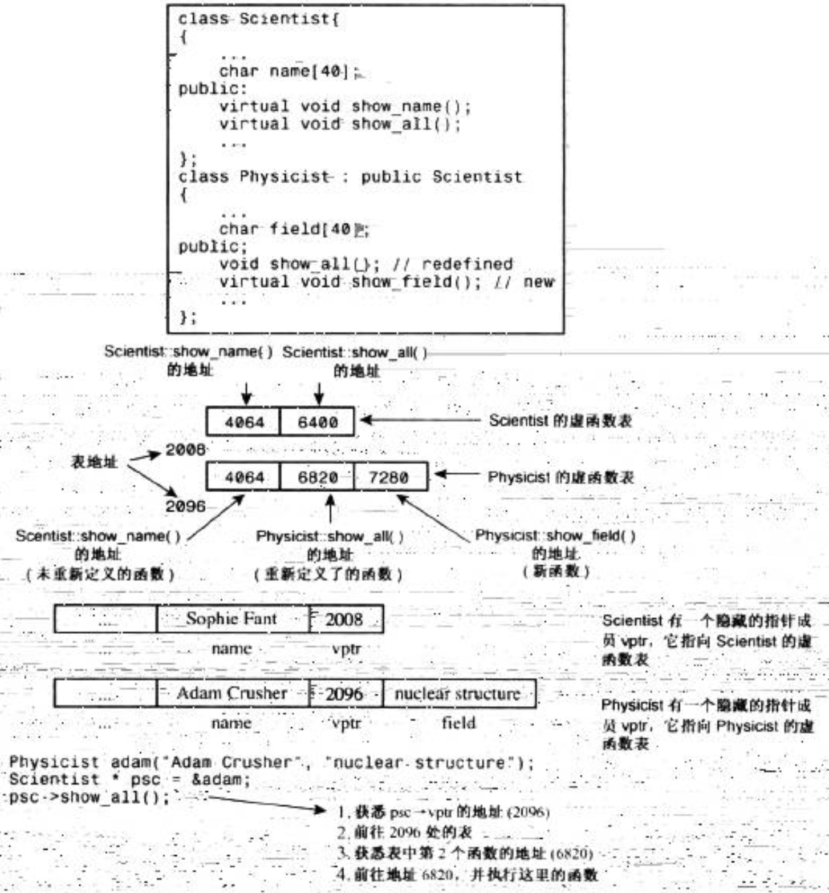

# 静态联编和动态联编

在编译过程中进行联编被称为静态联编。然而，使用哪一个函数是不能在编译时确定的，因为编译器不知道用户将选择哪种类型的对象。所以，编译器必须生成能够在程序运行时选择正确的虚方法的代码，这被称为动态联编( dynamic binding)，又称为晚期联编( late binding )。

编译器对非虚方法使用静态联编。编译器对虚方法使用动态联编。

由于静态联编的效率更高，因此被设置为C++的默认选择。

## 虚函数的工作原理

通常，编译器处理虚函数的方法是：给每个对象添加一个隐藏成员。隐藏成员中保存了一个指向函数地址数组的指针。这种数组称为虚函数表(virtual function table，vtbl)。虚函数表中存储了为类对象进行声明的虚函数的地址。例如，基类对象包含一个指针，该指针指向基类中所有虚函数的地址表。派生类对象将包含一个指向独立地址表的指针。如果派生类提供了虚函数的新定义，该虚函数表将保存新函数的地址：如果派生类没有重新定义虚函数，该vtbl将保存函数原始版本的地址。如果派生类定义了新的虚函数，则该函数的地址也将被添加到vtbl中。注意，无论类中包含的虚函数是1个还是10个，都只需要在对象中添加1个地址成员，只是表的大小不同而已。

