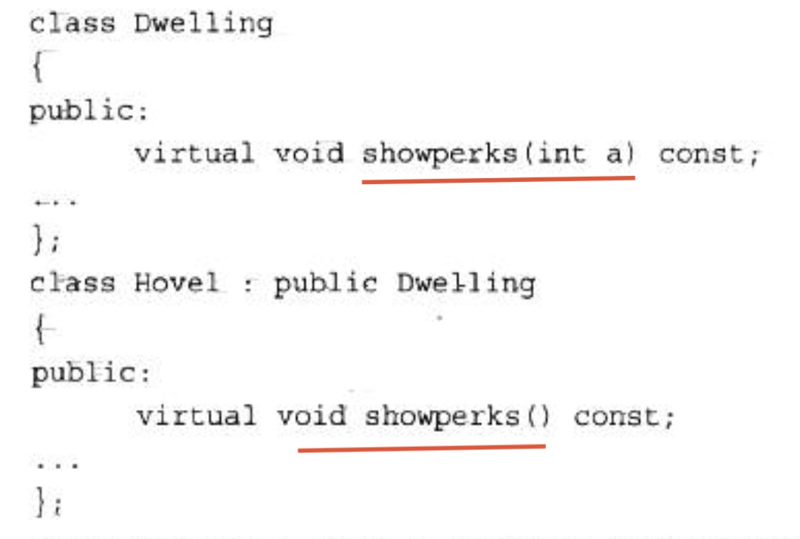
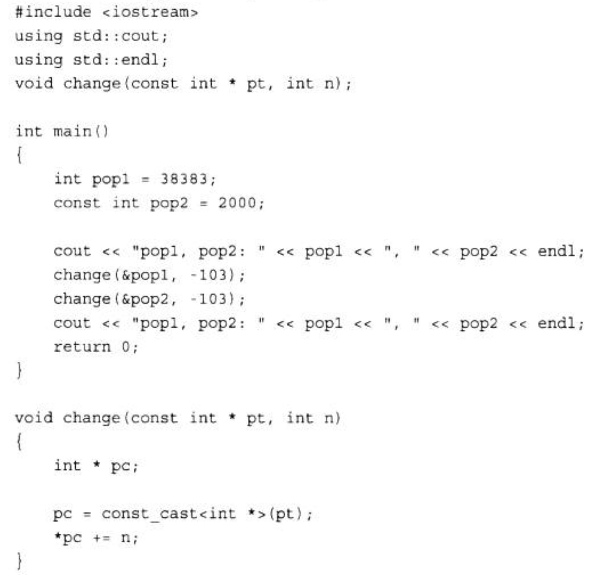

# explicit

```cpp
Chapter11 demo1 = 1.1;

string abc = "acb";
Chapter11 demo2 = abc;


Chapter11(double d);
Chapter11(const string &s);
```

C++可以隐式类型转换，如果要禁止这种行为，可以在构造函数前加explicit关键字。

```cpp
explicit Chapter11(double d);
```

# typedef

别名，如将unsigned long类型别名为Item：

```cpp
typedef unsigned long Item;
```

# static

static变量是在头文件中声明，在原文件中初始化。

`xxx.h`

```cpp
class xxx {
private:
    static int val;
};
```

`xxx.cpp`

```cpp
#include "xxx.h"
int xxx::val = 0;
```

初始化是在方法文件中，而不是在类声明文件中进行的，这是因为类声明位于头文件中，程序可能将头文件包括在其他几个文件中。如果在头文件中进行初始化，将出现多个初始化语句副本，从而引发错误。

**但如果静态成员是整型或枚举型const，则可以在类声明中初始化。**

# const

## 常量

创建常量的通用格式如下：

```
const type_name = value;
```

## const形参

为了防止参数被修改，可以添加const，cpp的const强度比Java的final更高，不光不能改地址，还不能修改里面的内容。

普通指针不能用于const形参。

## 指针和const

让指针指向一个常量对象，这样可以防止使用该指针来修改所指向的值。将指针本身声明为常量，这样可以防止改变指针指向的位置。

**指向常量的指针**

```cpp
int age = 39;
const int * pt = &age;
```

pt的声明并不意味着pt指向一个常量(age就不是常量)，而是对pt来说，是一个常量，不能通过pt来更改age值。

>   不能将const变量的地址赋给普通指针

**指针本身声明为常量**

```cpp
int sloth = 3;
const int *ps = &sloth;
int * const finger = &sloth;
```

在最后一个声明中，关键字const的位置与以前不同。这种声明格式使得finger只能指向sloth，但允许使用finger来修改sloth的值。中间的声明不允许使用ps来修改sloth的值，但允许将ps指向另一个位置。简而言之，finger和\*ps都是const，而\*finger和ps不是。

## 返回对象和const

### 返回指向const对象的引用

```cpp
const Vector & Max (const Vector & v1, const Vector & v2){
    if(v1.val() > v2.val())
    	return vl;
    else
    	return v2;
}
```

这样做的目的是提高效率。

由于返回的是const对象引用，而返回函数内的临时引用会引发问题，所以只能返回形参引用，这就要求形参也是const。

### 返回指向非const对象的引用

两种常见的返回非const对象情形是，重载赋值运算符以及重载与cout一起使用的<<运算符。

前者是为了连续赋值：

```cpp
s1 = s2 = s3;
```

后者是为了串接输出：

```cpp
cout << s1 << endl;
```

## 参数括号后的const

```cpp
const Stock & topval (const Stock & s) const; 
```

括号后的const表明，该函数不会修改被隐式(this)地访问的对象。

```cpp
top = stock1.topval(stock2);
top = stock2.topval(stock1);
```

第一种格式隐式地访问stock1，而显式地访问stock2；第二种格式显式地访问stock1，而隐式地访问
stock2。

# virtual

如果方法是通过引用或指针而不是对象调用的，它将确定使用哪一种方法。如果没有使用关键字virtual，程序将根据引用类型或指针类型选择方法；如果使用了virtual，程序将根据引用或指针指向的对象的类型来选择方法。

如果父类的方法没有设置virtual，子类设置了virtual，调用父类引用的此方法，执行的依然是父类方法。如果父类方法设置了virtual，子类没有设置，执行的结果是根据具体的对象类型。

## virtual原理

虚函数的原理见cpp原理总结。

## 注意事项

**重新定义将隐藏方法**

假设创建了如下所示的代码:



```
Hovel trump;
trump.showperks();// valid
trump.showperks(5);// invalid
```


新定义将showperks()定义为一个不接受任何参数的函数。重新定义不会生成函数的两个重载版本，而是隐藏了接受一个int参数的基类版本。总之，重新定义继承的方法并不是重载。如果在派生类中重新定义函数，将不是使用相同的函数特征标覆盖基类声明，而是隐藏同名的基类方法，不管参数特征标如何。

这引出了两条经验规则：

1.  如果重新定义继承的方法，应确保写原来的原型完全相同，但如果返回类型是基类引用或指针，则可以修改为指向派生类的引用或指针。这种特性被称为返回类型协变(covariance of return type)，因为允许返回类型随类类型的变化而变化。
2.  如果基类声明被重载了，则应在派生类中重新定义所有的基类版本。

## 虚基类

虚基类见类总结的多个实例。

# 类型转换运算符

## dynamic_cast

见RTTI总结的dynamic_cast

## const_cast

const_cast运算符用于执行只有一种用途的类型转换，即改变值为const或volatile，其语法与dynamic_cast运算符相同：

```cpp
const_cast<type-name>(expression)
```

如果类型的其他方面也被修改，则上述类型转换将出错。也就是说，除了const或volatile特征(有或无)可以不同外，type_name和expression的类型必须相同。

再次假设High和Low是两个类：

```cpp
High bar;
const High *pbar = &bar;
High * pb = const_cast<High *> (pbar) ;// valid
const Low * pl = const_cast<const Low *> (pbar);// invalid
```

第一个类型转换使得*pb成为一个可用于修改bar对象值的指针，它删除const标签。第二个类型转换是非法的，因为它同时尝试将类型从const High \*改为const Low\*。

```cpp
High bar;
const High * pbar = &bar;
High * pb = (High *) (pbar);//valid
Low * pl = (Low *)(pbar);// also valid
```

由于编程时可能无意间同时改变类型和常量特征，因此使用const_cast运算符更安全。

const_cast不是万能的。它可以修改指向一个值的指针，但修改const值的结果是不确定的。



由于pop2被声明为const，因此编译器可能禁止修改它，如下面的输出所示：

```
pop1, pop2: 38383，2000
pop1, pop2: 38280，2000
```


调用change()时，修改了pop1，但没有修改pop2。在change()中，指针被声明为const int *，因此不能用来修改指向的int。指针pc删除了const特征，因此可用来修改指向的值，但仅当指向的值不是const时才可行。因此，pc可用于修改pop1，但不能用于修改pop2。

## static_cast

## reinterpret_cast