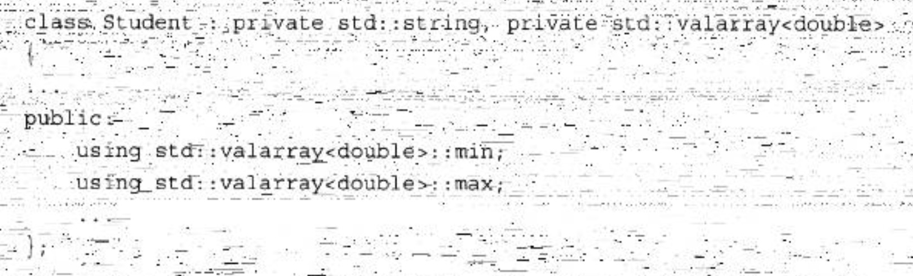

C++中复用代码的一个方式是组合，即类内部持有某一类的对象，另一个方式就是继承。

# 私有继承

用法：

```cpp
class Student : private std::string, private std::valarray<double> {}
```

需要初始化父类对象。

```cpp
Student(const char *str, const double *pd, int n)
        : std::string(str), ArrayDb(pd, n) {}
```

## 调用基类方法

使用私有继承时，只能在派生类的方法中使用基类的方法。

使用类名和作用域解析运算符来调用基类的方法：

```
Parent::fun();
```

## 使用基类对象

用强制转换来使用基类对象。

```
return (string&) *this;
```

## 访问基类友元函数

友元函数不属于类，所以不能直接调用，可以通过显式地转换为基类来调用正确的函数。

例如，对于下面的友元函数定义：

```cpp
ostream & operator<<(ostream & os, const Student & stu)
{
    os << "Scores for " << (const string &) stu  << ":\n";
    stu.arr_out(os);  // use private method for scores
    return os;
}
```

**引用stu不会自动转换为string引用。根本原因在于，在私有继承中，在不进行显式类型转换的情况下，不能将指向派生类的引用或指针赋给基类引用或指针。**

>   然而，即使这个例子使用的是公有继承，也必须使用显式类型转换。原因之一是， 如果不使用类型转换，下述代码将与友元函数原型匹配，从而导致递归调用：
>
>   os<< stu;
>
>   另一个原因是，由于这个类使用的是多重继承，编译器将无法确定应转换成哪个基类，如果两个基类都提供了函数operator<<()。

## 组合和私有继承的区别

组合：

-   首先，它易于理解。类声明中包含表示被包含类的显式命名对象，代码可以通过名称引用这些对象，而使用继承将使关系更抽象。
-   其次，继承会引起很多问题，尤其从多个基类继承时，可能必须处理很多问题，如包含同名方法的独立的基类或共享祖先的独立基类。
-   另外，包含能够包括多个同类的子对象。如果某个类需要3个string对象，可以使用包含声明3个独立的string成员。而继承则只能使用一个这样的对象(当对象都没有名称时，将难以区分)。

私有继承：

-   类包含保护成员(可以是数据成员，也可以是成员函数)，则这样的成员在派生类中是可用的，但在继承层次结构外是不可用的。如果使用组合将这样的类包含在另一个类中，则后者将不是派生类，而是位于继承层次结构之外，因此不能访问保护成员。但通过继承得到的将是派生类，因此它能够访问保护成员。
-   另一种需要使用私有继承的情况是需要重新定义虚函数。派生类可以重新定义虛函数，但包含类不能。使用私有继承，重新定义的函数将只能在类中使用，而不是公有的。

**一般情况下，应使用组合来建立has-a 关系；如果新类需要访问原有类的保护成员，或需要重新定义虚函数，则应使用私有继承。**

# 保护继承

使用保护继承时，基类的公有成员和保护成员都将成为派生类的保护成员。和私有私有继承一样，基类的接口在派生类中也是可用的，但在继承层次结构之外是不可用的。当从派生类派生出另一个类时，私有继承和保护继承之间的主要区别便呈现出来了。使用私有继承时，第三代类将不能使用基类的接口，这是因为基类的公有方法在派生类中将变成私有方法；使用保护继承时，基类的公有方法在第二代中将变成受保护的，因此第三代派生类可以使用它们。

## 在继承层次结构外使用基类的公有成员

一个是声明一个公有函数，然后内部调用基类的公有函数。

另一种方法是用using声明：



注意，using声明只使用成员名——没有圆括号、函数特征标和返回类型。这表示可以使用所有同名函数。

# 各种继承方式


成员修饰符：

-   public
    可在继承结构层次之外调用。
-   protect
    只能在继承结构层次之内调用。
-   private
    无法被外部访问

继承修饰符：

C++的继承方式更改的是成员的可见性，见上表。

# 多重继承

多重继承会带来很多问题，主要的问题为：

-   从两个不同的基类继承同名方法
-   从两个或更多相关基类那里继承同一个类的多个实例。

## 多个方法


## 多个实例

**问题描述**

基类：Worker

子类：Singer，Waiter

第三代子类：SingerWaiter

```cpp
SingerWaiter ed;
Worker * pw = &ed;
```

公有继承的基类指针可以指向子类对象的基类对象的地址。但ed中包含两个Worker对象，有两个地址可供选择，出现二义性，所以应使用类型转换来指定对象：

```cpp
SingerWaiter ed;
Worker * pw1 = (Waiter *)&ed;
Worker * pw2 = (Singer *)&ed;
```

这种解决方式是临时的，虚基类可以很好的解决这个问题。虚基类使得从多个类（它们的基类相同）派生出的对象只继承一个基类对象。

>   为什么不抛弃将基类声明为虚的这种方式，而使虚行为成为MI的准则呢？
>
>   -   在一些情况下，可能需要基类的多个拷贝
>   -   将基类作为虚的要求程序完成额外的计算，为不需要的工具付出代价是不应当的

非虚基类会自动传递构造函数，设为虚基类后自动传递不起作用，需要显式地调用基类构造函数，否则会调用基类的默认构造函数。


