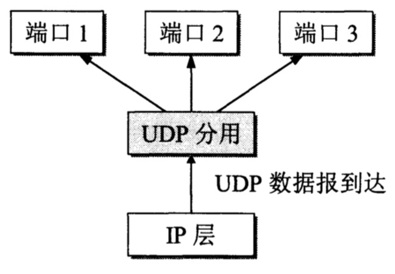
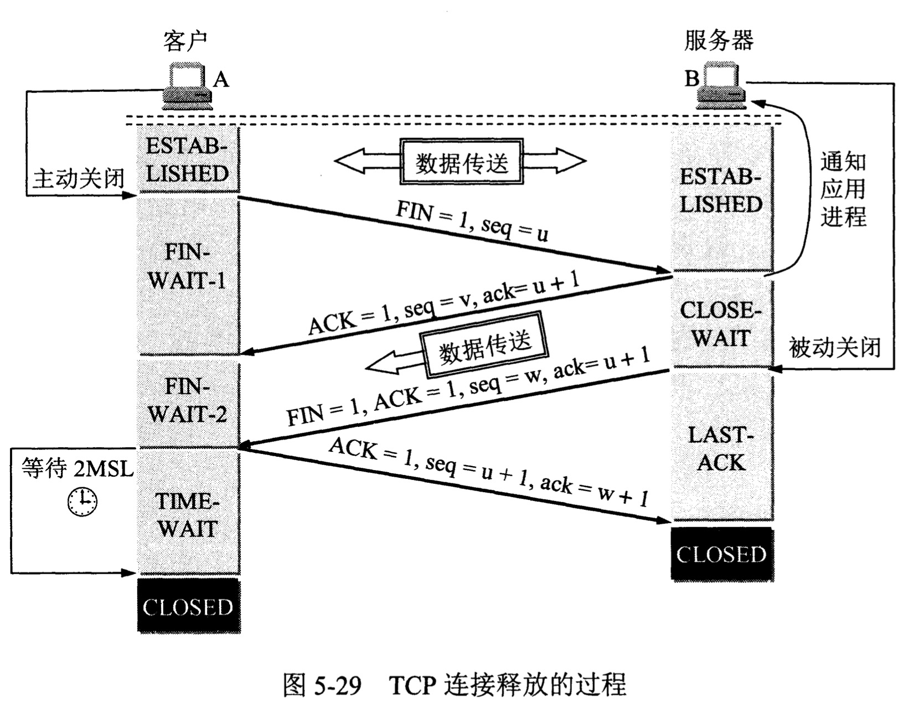

# TCP/IP协议体系结构 

## 整体层次


## 链路层


## 网络层

根据IP定义网络地址，区分网段。子网内根据地址解析协议(ARP)进行MAC寻址，子网外进行路由转发数据包，这个数据包即IP数据包。


> 地址解析协议ARP：根据IP地址找出其Mac地址。
>
> 逆地址解析协议RARP：根据Mac地址找出IP地址。（包含在DHCP协议里）
>
> 网际控制报文协议ICMP：评估网络健康状态，比如：ping
>
> 网际组管理协议IGMP：跟多播有关。

## 传输层


## 应用层

略

## 总结

总结一下，程序在发送消息时，应用层按既定的协议打包数据，随后由传输层加上双方的端口号，由网络层加上双方的IP地址，由链路层加上双方的MAC地址，井将数据拆分成数据帧，经过多个路由器和网关后，创达目标机器。简而言之，就是按“端口IP地址一MAC地址”这样的路径进行数据的封装和发送，解包的时候反过来操作即可。

## 个人总结

**体系结构**

TCP/IP协议体系结构有四层：应用层、传输层、网络层、网络接口层。应用层对应OSI体系结构的应用层、表示层、会话层，网络接口层对应OSI的数据链路层和物理层。

物理层主要处理物理上的东西，比如电缆；

数据链路层主要解决三个问题：封装成帧、透明传输、差错控制。

网络层主要有IP协议，配合使用的还有地址解析协议ARP、网际控制报文协议ICMP、网际组管理协议IGMP。ARP负责缓存一个从物理地址到IP地址的映射。

传输层有两个协议：TCP和UDP

# 基本知识

-   **互联网地址（ip地址）**
    网络上每一个节点都必须有一个独立的Internet地址（也叫做IP地址）。现在，通常使用的IP地址是一个32bit的数字，也就是我们常说的IPv4标准，这32bit的数字分成四组，也就是常见的255.255.255.255的样式。IPv4标准上，地址被分为五类，我们常用的是B类地址。具体的分类请参考其他文档。需要注意的是IP地址是网络号+主机号的组合，这非常重要。

- **域名系统**
    域名系统是一个分布的数据库，它提供将主机名（网址）转换成IP地址的服务。

- **RFC**
    RFC是什么？RFC就是TCP/IP协议的标准文档，在这里我们可以看到RFC那长长的定义列表，现在它一共有4000多个协议的定义，当然，我们所要学习的，也就是那么十几个协议而已。

- **端口号(port)**
    注意，这个号码是用在TCP，UDP上的一个逻辑号码，并不是一个硬件端口，我们平时说把某某端口封掉了，也只是在IP层次把带有这个号码的IP包给过滤掉了而已。

- **应用编程接口**
    现在常用的编程接口有socket和TLI。而前面的有时候也叫做“Berkeley socket”，可见Berkeley对于网络的发展有多大的贡献。

# 物理层

## 关于信道的几个概念

信道一般都是用来表示向某一个方向传送信息的媒体。因此，一条通信电路往往包含一条发送信道和一条接收信道。

从通信的双方信息交互的方式来看，可以有以下三种基本方式：

1.  单向通信
    又称为单工通信，即只能有一个方向的通信而没有反方向的交互。无线电广播或有线电广播以及电视广播就属于这种类型。
2.  双向交替通信
    又称为半双工通信，即通信的双方都可以发送信息，但不能双方同时发送(当然也就不能同时接收)。这种通信方式是一方发送另一方接收，过一段时间后可以再反过来。
3.  双向同时通信
    又称为全双工通信，即通信的双方可以同时发送和接收信息。

# 数据链路层

略

# 网络层

网络层向上只提供简单灵活的、**无连接的**、**尽最大努力交付**的数据报服务。

网络层主要使用IP协议，与IP协议配套的有：

- 地址解析协议ARP (Address Resolution Protocol)
- 网际控制报文协议ICMP (Internet Control Message Protocol)
- 网际组管理协议IGMP (Internet Group Management Protocol)


从一般的概念来讲，将网络互相连接起来要使用一些中间设备。根据中间设备所在的层次，可以有以下四种不同的中间设备：

1. 物理层使用的中间设备叫做转发器(repeater)。
2. 数据链路层使用的中间设备叫做网桥或桥接器(bridge)。
3. **网络层使用的中间设备叫做路由器(router)。**
4. 在网络层以上使用的中间设备叫做网关(gateway)。用网关连接两个不兼容的系统需
   要在高层进行协议的转换。

当中间设备是转发器或网桥时，这仅仅是把一个网络扩大了，而从网络层的角度看，这仍然是一个网络，一般并不称之为网络互连。网关由于比较复杂，目前使用得较少。因此讨论网络互连时，都是**指用路由器进行网络互连和路由选择**。路由器其实就是一台专用计算机，用来在互联网中进行路由选择。

## IP地址

IP地址就是给互联网上的每一台主机(或路由器)的每一个接口分配一个在全世界范围内是唯一的**32位**的标识符。

两级IP地址：


这里A类、B类和C类地址都是单播地址(一对一通信)， 是最常用的。

**由于近年来已经广泛使用无分类IP地址进行路由选择，A类、B类和C类地址的区分已成为历史。**

全0的主机号字段表示该IP地址是“本主机”所连接到的单个网络地址(例如，一主机的IP地址为5.6.7.8，则该主机所在的网络地址就是5.0.0.0)，
全1表示“所有的”，因此全1的主机号字段表示该网络上的所有主机”。

A类地址的网络号字段占1个字节，只有7位可供使用(该字段的第一位已固定为0)，但可指派的网络号是126个(即27- 2)。减2的原因是：
第一，IP 地址中的全0表示“这个(this)”。网络号字段为全0的IP地址是个保留地址，意思是“本网络”
第二，网络号为127 (即01111111)保留作为本地软件环回测试本主机的进程之间的通信之用。

B类中的128.0.0.0是不指派的，C类中的192.0.0.0也是不指派的。


## 地址解析协议ARP

已经知道了一个机器(主机或路由器)的IP地址，需要找出其相应的硬件地址。地址解析协议ARP就是用来解决这样的问题的。

地址解析协议ARP在主机ARP高速缓存中存放一个从IP地址到硬件地址的映射表，并且这个映射表还经常动态更新(新增或超时删除)。

## IP数据报格式


## 子网和超网

为什么要划分子网？

1. IP地址空间的利用率有时很低。
2. 给每一个物理网络分配一个网络号会使路由表变得太大因而使网络性能变坏。
3. 两级IP地址不够灵活。

为解决上述问题，在IP地址中又增加了一个“子网号字段”，使两级IP地址变成为三级IP地址，它能够较好地解决上述问题，并且使用起来也很灵活。这种做法叫做**划分子网**。

格式：


### 子网掩码

现在剩下的问题就是：假定有一个数据报(其目的地址是145.13.3.10)已经到达了路由器R1。那么这个路由器如何把它转发到子网145.13.3.0 呢？

从IP数据报的首部无法看出源主机或目的主机所连接的网络是否进行了子网的划分。这是因为32位的IP地址本身以及数据报的首部都没有包含任何有关子网划分的信息。因此必须另外想办法，这就是使用**子网掩码**

**一个例题**

有三个子网，两个路由器，以及路由器R1中的部分路由表。现在源主机H1向目的主机H2发送分组。试讨论R1收到H向H2发送的分组后查找路由表的过程。


源主机H1向目的主机H2发送的分组的目的地址是H2的IP地址128.30.33.138。

源主机H1首先要进行的操作是要判断：发送的这个分组，是在本子网上进行直接交付还是要通过本子网上的路由器进行间接交付？

源主机H1把本子网的“子网掩码255.255.255.128” 与目的主机H2的“IP地址128.30.33.138”逐位相“与”(即逐位进行AND操作)，得出128.30.33.128，它不等于H1的网络地址( 128.30.33.0)。这说明H2与H不在同一个子网上。因此H1不能把分组直接交付H2，而必须交给子网上的默认路由器R1，由R1来转发。

路由器R1在收到一个分组后，就在其路由表中逐行寻找有无匹配的网络地址。

先看R1路由表中的第一行。用这一行的“子网掩码255.255.255.128”和收到的分组的“目的地址128.30.33.138”逐位相“与”(即逐位进行AND操作)，得出128.30.33.128。 然后和这一行给出的目的网络地址128.30.33.0进行比较。但比较的结果不一致(即不匹配)。
用同样方法继续往下找第二行。用第二行的“子网掩码255.255.255.128” 和该分组的目的地址128.30.33.138”逐位相“与”(即逐位进行AND操作)，结果也是128.30.33.128。这个结果和第二行的目的网络地址128.30.33.128相匹配，说明这个网络(子网2)就是收到的分组所要寻找的目的网络。于是不需要再继续查找下去。R1把分组从接口1直接交付主机H2 (它们都在一个子网上)。

### 无分类编址CIDR

#### 网络前缀

划分子网在一定程度上缓解了互联网在发展中遇到的困难。然而在1992 年互联网仍然面临三个必须尽早解决的问题，这就是：

1. B类地址在1992年已分配了近一半，眼看很快就将全部分配完毕
2. 互联网主干网上的路由表中的项目数急剧增长(从几千个增长到几万个)。
3. 整个IPv4的地址空间最终将全部耗尽。在2011年2月3日，IANA宣布IPv4地址已经耗尽了。

解决方法是无分类域间路由选择CIDR (Classless Inter-Domain Routing，CIDR 的读音是“sider”)。

CIDR最主要的特点有两个：

1. **CIDR消除了传统的A类、B类和C类地址以及划分子网的概念**，因而能更加有效地分配IPv4 的地址空间，并且在新的IPv6 使用之前容许互联网的规模继续增长。CIDR把32位的IP 地址划分为前后两个部分。前面部分是“网络前缀”(network-prefix) ( 或简称为“前缀”)，用来指明网络，后面部分则用来指明主机。因此CIDR使IP地址从三级编址(使用子网掩码)又回到了两级编址，但这已是无分类的两级编址。其记法是：
   `IP地址::= {<网络前缀>, <主机号>}`
   CIDR还使用“斜线记法”(slash notation)，或称为CIDR记法，即在IP地址后面加上斜线， 然后写上网络前缀所占的位数。
2. CIDR把网络前缀都相同的连续的IP地址组成一个“CIDR地址块”。我们只要知道CIDR地址块中的任何一个地址，就可以知道这个地址块的起始地址(即最小地址)和最大地址，以及地址块中的地址数。例如，已知IP地址128.14.35.7/20 是某CIDR地址块中的一个地址，现在把它写成二进制表示，其中的前20位是网络前缀(用粗体和下划线表示出)，而前缀后面的12位是主机号：
   128.14.35.7/20 = 10000000 00001110 00100011 00000111
   这个地址所在的地址块中的最小地址和最大地址可以很方便地得出：


全0和全1一般不使用。

## 网际控制报文协议ICMP

为了更有效地转发IP数据报和提高交付成功的机会，在网际层使用了网际控制报文协
议ICMP (Internet Control Message Protocol)。

### ICMP的应用举例

ICMP的一个重要应用就是分组网间探测PING (Packet InterNet Groper)。

## 路由选择协议

使用分层次的路由选择方法，可将互联网的路由选择协议划分为：

-   内部网关协议IGP：具体的协议有多种，如RIP和OSPF等。
-   外部网关协议EGP：目前使用的协议就是BGP。

### 路由器的构成

#### 路由器的结构

路由器是一种具有多个输入端口和多个输出端口的专用计算机，其任务是转发分组。从路由器某个输入端口收到的分组，按照分组要去的目的地(即目的网络)，把该分组从路由器的某个合适的输出端口转发给下一跳路由器。下一跳路由器也按照这种方法处理分组，直到该分组到达终点为止。
路由器的转发分组正是网络层的主要工作。


整个的路由器结构可划分为两大部分：**路由选择部分**和**分组转发部分**。

路由选择部分也叫做控制部分，其核心构件是路由选择处理机。路由选择处理机的任务是根据所选定的路由选择协议构造出路由表，同时经常或定期地和相邻路由器交换路由信息而不断地更新和维护路由表。

分组转发部分它由三部分组成：交换结构、一组输入端口和一组输出端口(请注意：这里的端口就是硬件接口)。
交换结构(switching fabric)又称为交换组织，它的作用就是根据转发表(forwarding table)
对分组进行处理，将某个输入端口进入的分组从一个合适的输出端口转发出去。

## IPv6

IP是互联网的核心协议。IPv4是在20世纪70年代末期设计的。互联网经过几十年的飞速发展，到2011年2月，IPv4 的地址已经耗尽，ISP 已经不能再申请到新的IP地址块了。我国在2014年至2015年也逐步停止了向新用户和应用分配IPv4地址，同时全面开始商用部署IPv6。

### IPv6的基本首部

IPv6仍支持无连接的传送，但将协议数据单元PDU称为分组，而不是IPv4的数据报。为方便起见，这里仍采用数据报这一名词。

IPv6所引进的主要变化如下：

1.  更大的地址空间
    IPv6把地址从IPv4的32位增大到4倍，即增大到128位，使地址空间增大了296 倍。这样大的地址空间在可预见的将来是不会用完的。
2.  扩展的地址层次结构
    IPv6 由于地址空间很大，因此可以划分为更多的层次。
3.  灵活的首部格式
    IPv6 数据报的首部和IPv4 的并不兼容。IPv6定义了许多可选的扩展首部，不仅可提供比IPv4更多的功能，而且还可提高路由器的处理效率，这是因为路由器对扩展首部不进行处理(除逐跳扩展首部外)。
4.  改进的选项
    IPv6允许数据报包含有选项的控制信息，因而可以包含一些新的选项。但IPv6的首部长度是固定的，其选项放在有效载荷中。IPv4 所规定的选项是固定不变的，其选项放在首部的可变部分。
5.  允许协议继续扩充
    这一点很重要，因为技术总是在不断地发展(如网络硬件的更新)而新的应用也还会出现。而IPv4 的功能是固定不变的。
6.  支持即插即用(即自动配置)
    因此IPv6不需要使用DHCP。
7.  支持资源的预分配
    IPv6支持实时视像等要求保证一定的带宽和时延的应用。
8.  IPv6 首部改为8字节对齐(即首部长度必须是8字节的整数倍)。原来的IPv4首部
    是4字节对齐。

### IPv4到IPv6的过渡

介绍两种向IPv6过渡的策略：

1.  **双协议栈**
    双协议栈(dual stack)是指在完全过渡到IPv6 之前，使一部分主机(或路由器)装有双协议栈：一个IPv4和一个IPv6。 因此双协议栈主机(或路由器)既能够和IPv6 的系统通信，又能够和IPv4的系统通信。双协议栈的主机(或路由器)记为IPv6/IPv4，表明它同时具有两种IP地址：一个IPv6地址和一个IPv4地址。
    双协议栈主机在和IPv6主机通信时采用IPv6 地址，而和IPv4主机通信时则采用IPv4地址。但双协议栈主机怎样知道目的主机是采用哪一种地址呢？它是使用域名系统DNS来
    查询的。若DNS返回的是IPv4地址，双协议栈的源主机就使用IPv4地址。但当DNS返回
    的是IPv6地址，源主机就使用IPv6地址。

2.  **隧道技术**
    这种方法的要点就是在IPv6数据报要进入IPv4网络时，把IPv6数据报封装成为IPv4数据报。当IPv4数据报离开IPv4网络中的隧道时，再把数据部分(即原来的IPv6数据报)交给主机的IPv6协议栈。

## 虚拟专用网VPN和网络地址转换NAT

### 虚拟专用网VPN

由于IP地址的紧缺，一个机构能够申请到的IP地址数往往远小于本机构所拥有的主机数。考虑到互联网并不很安全，一个机构内也并不需要把所有的主机接入到外部的互联网。实际上，在许多情况下，很多主机主要还是和本机构内的其他主机进行通信。假定在一个机构内部的计算机通信也是采用TCP/IP协议，那么从原则上讲，对于这些仅在机构内部使用的计算机就可以由本机构自行分配其IP地址。这就是说，让这些计算机使用仅在本机构有效的IP地址(这种地址称为本地地址)，而不需要向互联网的管理机构申请全球唯一的IP地址( 这种地址称为全球地址)。这样就可以大大节约宝贵的全球IP地址资源。

但是，如果任意选择一些IP地址作为本机构内部使用的本地地址，那么在某种情况下可能会引起一些麻烦。例如，有时机构内部的某台主机需要和互联网连接，那么这种仅在内部使用的本地地址就有可能和互联网中某个IP地址重合，这样就会出现地址的二义性问题。

为了解决这一问题，RFC指明了一些专用地址。 这些地址只能用于一个机构的内部通信，而不能用于和互联网上的主机通信。换言之，专用地址只能用做本地地址而不能用作全球地址。在互联网中的所有路由器，对目的地址是专用地址的数据报一律不进行转发。

采用这样的专用IP 地址的互连网络称为**专用互联网或本地互联网**，或更简单些，就叫
做专用网。

**虚拟专用网VPN (Virtual Private Network)是利用公用的互联网作为本机构各专用网之间的通信载体。**

### 网络地址转换NAT

在专用网内部的一些主机本来已经分配到了本地IP地址(即仅在本专用网内使用的专用地址)，但现在又想和互联网上的主机通信(并不需要加密)，那么应当采取什么措施呢？

最简单的办法就是设法再申请一些全球IP地址。但这在很多情况下是不容易做到的，因为全球IPv4的地址已所剩不多了。目前使用得最多的方法是采用**网络地址转换**。

网络地址转换NAT (Network Address Translation)需要在专用网连接到互联网的路由器上安装NAT软件。装有NAT软件的路由器叫做NAT路由器，它至少有一个有效的外部全球IP地址。这样，所有使用本地地址的主机在和外界通信时，都要在NAT路由器上将其本地地址转换成全球IP地址，才能和互联网连接。

### 总结

虚拟专用网VPN利用公用的互联网作为本机构各专用网之间的通信载体。VPN内部使用互联网的专用地址。一个VPN至少要有一个路由器具有合法的全球IP地址，这样才能和本系统的另一个VPN通过互联网进行通信。所有通过互联网传送的数据都必须加密。

使用网络地址转换NAT技术，可以在专用网络内部使用专用IP 地址，而仅在连接到互联网的路由器使用全球IP地址。这样大大节约了宝贵的IP地址。

# 传输层

IP 协议提供了主机和主机间的通信。TCP 协议在 IP 协议提供的主机间通信功能的基础上，完成这两个主机上**进程对进程**的通信。

**有了 IP，不同主机就能够交换数据。**但是，计算机收到数据后，并不知道这个数据属于哪个进程（简单讲，进程就是一个正在运行的应用程序）。TCP 的作用就在于，让我们能够知道这个数据属于哪个进程，从而完成进程间的通信。

为了标识数据属于哪个进程，我们给需要进行 TCP 通信的进程分配一个唯一的数字来标识它。这个数字，就是我们常说的**端口号**。

TCP 的全称是 Transmission Control Protocol（**传输控制协议**），大家对它说得最多的，大概就是**面向连接**的特性了。之所以说它是有连接的，是说在进行通信前，通信双方需要先经过一个三次握手的过程。三次握手完成后，连接便建立了。这时候我们才可以开始发送/接收数据。（与之相对的是 UDP，不需要经过握手，就可以直接发送数据）。

## 端口

在单个计算机中的进程是用进程标识符来标志的。但是在互联网环境下，使用的计算机的操作系统种类很多，而不同的操作系统又使用不同格式的进程标识符。为了使运行不同操作系统的计算机的应用进程能够互相通信，就必须用统一的方法对TCP/IP体系的应用进程进行标志。

解决这个问题的方法就是在运输层使用**协议端口号**，或通常简称为**端口**(port)。虽然通信的终点是应用进程，但只要把所传送的报文交到目的主机的某个目的端口，剩下的工作(即最后交付目的进程)就由TCP或UDP来完成。

运输层用一个16 位端口号来标志一个端口。端口号只具有本地意义，它只是为了标志本计算机应用层中的各个进程在和运输层交互时的层间接口。

由此可见，两个计算机中的进程要互相通信，不仅必须知道对方的IP地址(为了找到对方的计算机)，而且要知道对方的端口号(为了找到对方计算机中的应用进程)。

UDP和TCP的端口可以重复，因为是不同的协议

## UDP

用户数据报协议UDP只在IP的数据报服务之上增加了很少一点的功能，这就是复用和分用的功能以及差错检测的功能。UDP的主要特点是：

1. **UDP是无连接的**，即发送数据之前不需要建立连接(当然，发送数据结束时也没有连接可释放)，因此减少了开销和发送数据之前的时延。
2. **UDP不保证可靠交付**，因此主机不需要维持复杂的连接状态表。
3. **UDP是面向报文的**。发送方的UDP对应用程序交下来的报文，在添加首部后就向下交付IP层。应用层交给UDP多长的报文，UDP就照样发送，即一次发送一个报文，如图所示。
   在接收方的UDP，对IP层交上来的UDP用户数据报，在去除首部后就原封不动地交付上层的应用进程。也就是说，UDP一次交付一个完整的报文。因此，应用程序必须选择合适大小的报文。若报文太长，UDP把它交给IP层后，IP层在传送时可能要进行分片，这会降低IP层的效率。反之，若报文太短，UDP把它交给IP层后，会使IP数据报的首部的相对长度太大，这也降低了IP 层的效率。
   
4. **UDP没有拥塞控制**，因此网络出现的拥塞不会使源主机的发送速率降低。这对某些实时应用是很重要的。很多的实时应用(如IP电话、实时视频会议等)要求源主机以恒定
   的速率发送数据，并且允许在网络发生拥塞时丢失一些数据，但却不允许数据有太大的时延。UDP正好适合这种要求。
5. **UDP支持一对一、一对多、多对一和多对多的交互通信**。
6. **UDP的首部开销小**，只有8个字节，比TCP的20个字节的首部要短。

虽然某些实时应用需要使用没有拥塞控制的UDP，但当很多的源主机同时都向网络发送高速率的实时视频流时，网络就有可能发生拥塞，结果大家都无法正常接收。因此，不使用拥塞控制功能的UDP有可能会引起网络产生严重的拥塞问题。

还有一些使用UDP的实时应用，需要对UDP的不可靠的传输进行适当的改进，以减少数据的丢失。在这种情况下，应用进程本身可以在不影响应用的实时性的前提下，增加一些提高可靠性的措施，如采用前向纠错或重传已丢失的报文。

### UDP怎么实现可靠传输

UDP传输层无法保证数据的可靠传输，只能通过应用层来实现。实现的方式可以参照TCP可靠性传输的方式，只是实现不在传输层，实现转移到了应用层：

```
确认机制、重传机制、窗口确认机制
```

当运输层从IP层收到UDP数据报时，就根据首部中的目的端口，把UDP数据报通过相应的端口，上交最后的终点一应用进程。 



## TCP概述

### 特点

1. **TCP是面向连接的运输层协议。**这就是说，应用程序在使用TCP协议之前，必须先建立TCP连接。在传送数据完毕后，必须释放已经建立的TCP连接。
2. **每一条TCP连接只能有两个端点，每一条TCP连接只能是点对点的(一对一)。**
3. **TCP提供可靠交付的服务。**通过TCP连接传送的数据，无差错、不丢失、不重复，并且按序到达。
4. **TCP提供全双工通信。**TCP允许通信双方的应用进程在任何时候都能发送数据。TCP连接的两端都设有发送缓存和接收缓存，用来临时存放双向通信的数据。在发送时，应用程序在把数据传送给TCP的缓存后，就可以做自己的事，而TCP在合适的时候把数据发送出去。在接收时，TCP把收到的数据放入缓存，上层的应用进程在合适的时候读取缓存中的数据。
5. **面向字节流。**TCP中的流指的是流入到进程或从进程流出的字节序列。“面向字节流”的含义是：虽然应用程序和TCP的交互是一次一个数据块(大小不等)，但TCP把应用程序交下来的数据仅仅看成是一连串的无结构的字节流。TCP并不知道所传送的字节流的含义。
   TCP不保证接收方应用程序所收到的数据块和发送方应用程序所发出的数据块具有对应大小的关系(**例如，发送方应用程序交给发送方的TCP共10个数据块，但接收方的TCP可能只用了4个数据块就把收到的字节流交付上层的应用程序**)。**但接收方应用程序收到的字节流必须和发送方应用程序发出的字节流完全一样。**当然，接收方的应用程序必须有能力识别收到的字节流，把它还原成有意义的应用层数据。
   TCP和UDP在发送报文时所采用的方式完全不同。TCP并不关心应用进程一次把多长的报文发送到TCP的缓存中，而是根据对方给出的窗口值和当前网络拥塞的程度来决定一个报文段应包含多少个字节(UDP发送的报文长度是应用进程给出的)。如果应用进程传送到TCP缓存的数据块太长，TCP就可以把它划分短一些再传送。如果应用进程一次只发来一个字节，TCP也可以等待积累有足够多的字节后再构成报文段发送出去。

### TCP的连接

TCP是一对一的，每一条TCP连接有两个端点。TCP连接的端点叫做套接字(socket)（注意不是端口port）。

**套接字socket=（IP地址：端口号）**

每一条TCP连接唯一地被通信两端的两个端点(即两个套接字)所确定。即：
**TCP连接= {socket1, socket2} = {(IP1: port1), (IP2: port2)}**

这里可以针对TCP的一对一通信提出一个问题：一亿个人访问https://www.baidu.com，端口号默认是80，为什么不会卡顿？
因为一对一指的是TCP连接的一对一，而TCP的连接是由两个套接字所确定，客户端的IP不同，那么就是一个不同的TCP连接。

### TCP报文段的首部格式

TCP虽然是面向字节流的，但是传送的数据却是报文段。（此处理解见TCP特点）


## 可靠传输原理

TCP发送的报文段是交给IP层传送的。但IP层只能提供尽最大努力服务，也就是说，TCP下面的网络所提供的是不可靠的传输。因此，TCP必须采用适当的措施才能使得两个运输层之间的通信变得可靠。

总结一下就是确认机制、超时重传机制和滑动窗口。

### 停止等待协议

注意，在运输层并不使用这种协议，这里只是为了引出可靠传输的问题才从最简单的概念讲起。

停止等待就是每发送完一个分组就停止发送，等待对方的确认，在收到确认后再发送下一个分组。


**出现差错**

A只要超过了一段时间仍然没有收到确认，就认为刚刚发送的分组丢失了，因而重传前面发送过的分组。这就叫做**超时重传**。要实现超时重传，就要在每发送完一个分组时设置一个超时计时器。如果在超时计时器到期之前收到了对方的确认，就撤销已设置的超时计时器。

这里应注意以下三点。
第一，A在发送完一个分组后，必须暂时保留已发送的分组的副本(在发生超时重传时使用)。只有在收到相应的确认后才能清除暂时保留的分组副本。
第二，分组和确认分组都必须进行编号这样才能明确是哪一个发送出去的分组收到了确认，而哪一个分组还没有收到确认。
第三， 超时计时器设置的重传时间应当比数据在分组传输的平均往返时间更长一些。

**确认丢失和确认迟到**

B所发送的对M1的确认丢失了。A在设定的超时重传时间内没有收到确认，并无法知道是自己发送的分组出错、丢失，或者是B发送的确认丢失了。因此A在超时计时器到期后就要重传M1。现在应注意B的动作。假定B又收到了重传的分组M1。这时应采取两个行动。

第一，丢弃这个重复的分组M1，不向上层交付。

第二，向A发送确认。不能认为已经发送过确认就不再发送，因为A之所以重传M1就表示A没有收到对M1的确认。

(b)也是一种可能出现的情况。传输过程中没有出现差错，但B对分组M1的确认迟到了。A会收到重复的确认。对重复的确认的处理很简单：收下后就丢弃。B仍然会收到重复的M1，并且同样要丢弃重复的M1，并重传确认分组。

通常A最终总是可以收到对所有发出的分组的确认。如果A不断重传分组但总是收不到确认，就说明通信线路太差，不能进行通信。


使用上述的确认和重传机制，就可以在不可靠的传输网络上实现可靠的通信。

像上述的这种可靠传输协议常称为**自动重传请求ARQ**

停止等待协议信道利用率低，为了提高传输效率，可以采用**流水线传输**，这种方式需要下面介绍的**连续ARQ协议**和**滑动窗口协议**。

### 连续ARQ协议


位于发送窗口内的5个分组都可连续发送出去，而不需要等待对方的确认。这样，信道利用率就提高了。
接收方一般采用**累计确认**的方式。接收方不必对收到的分组逐个发送确认，而是在收到几个分组后，**对按序到达的最后一个分组发送确认**。
优点：容易实现。
缺点：不能向发送方反映出接收方已经正确收到的所有分组的信息。

可见，当通信线路质量不好的时候，连续ARQ协议会带来负面的影响。

见滑动窗口部分。

## TCP可靠传输实现

### 以字节为单位的滑动窗口

先假定A收到了B发来的确认报文段，其中窗口是20字节，而确认号是31（这表明B期望收到的下一个序列号是31，而序号30为止的数据已经收到了）


发送窗口表示：在没有收到B的确认的情况下，A可以连续把窗口内的数据都发送出去。凡是已经发送过的数据，在未收到确认之前都必须暂时保留，以便在超时重传时使用。

发送窗口里面的序号表示允许发送的序号。显然，窗口越大，发送方就可以在收到对方确认之前连续发送更多的数据，因而可能获得更高的传输效率。接收方会把自己的接收窗口数值放在窗口字段中发送给对方。**因此，A的发送窗口一定不能超过B的接收窗口数值**。发送方的发送窗口大小还要受到当时网络拥塞程度的制约，但暂不考虑网络拥塞的影响。

发送窗口后沿的后面部分表示已发送且已收到了确认。这些数据显然不需要再保留了。而发送窗口前沿的前面部分表示不允许发送的，因为接收方都没有为这部分数据保留临时存放的缓存空间。

发送窗口的位置由窗口前沿和后沿的位置共同确定。发送窗口后沿的变化情况有两种可能，即不动(没有收到新的确认)和前移(收到了新的确认)。发送窗口后沿不可能向后移动，因为不能撤销已收到的确认。

**1**

现在假定A发送了序号为31~ 41的数据。这时，发送窗口位置并未改变，但发送窗口内靠后面有11个字节(灰色小方框表示)表示已发送但未收到确认。而发送窗口内靠前面的9个字节(42 ~ 50)是允许发送但尚未发送的。


从以上所述可以看出，要描述一个发送窗口的状态需要三个指针：P1, P2和P3。指针都指向字节的序号。这三个指针指向的几个部分的意义如下:

小于P1的是已发送并已收到确认的部分，而大于P3的是不允许发送的部分。

P3-P1=A的发送窗口

P2-P1=已发送但尚未收到确认的字节数

P3- P2=允许发送但当前尚未发送的字节数(又称为可用窗口或有效窗口)

再看一下B的接收窗口。B的接收窗口大小是20。在接收窗口外面，到30号为止的数据是已经发送过确认，并且已经交付主机了。因此在B可以不再保留这些数据。接收窗口内的序号(31 ~ 50)是允许接收的。在图中， B收到了序号为32和33的数据。这些数据没有按序到达，因为序号为31的数据没有收到(也许丢失了，也许滞留在网络中的某处)。请注意，B只能对按序收到的数据中的最高序号给出确认，因此B发送的确认报文段中的确认号仍然是31 (即期望收到的序号)，而不能是32或33。

**2**


现在假定B收到了序号为31的数据，并把序号为31 ~ 33的数据交付主机，然后B删除这些数据。接着把接收窗口向前移动3个序号，同时给A发送确认，其中窗口值仍为20，但确认号是34。这表明B已经收到了到序号33为止的数据。我们注意到，B还收到了序号为37，38和40的数据，但这些都没有按序到达，只能先暂存在接收窗口中。A收到B的确认后，就可以把发送窗口向前滑动3个序号，但指针P2不动。可以看出，现在A的可用窗口增大了，可发送的序号范围是42 ~53。

还要注意三点：

- 虽然A的发送窗口是根据B的接收窗口设置的，但在同一时刻，A的发送窗口并不总是和B的接收窗口一样大。这是因为通过网络传送窗口值需要经历一定的时间滞后。这里相关见TCP流量控制。
- TCP对不按序到达的数据是先临时存放在接收窗口中，等到字节流中所缺少的字节收到后，再按序交付上层的应用进程。
- TCP要求接收方必须有累积确认的功能，这样可以减少传输开销。

#### 小结

这里定义A为发送方，B为接受方。

A窗口的大小不能大于B窗口的大小。

A发送了[3,4,5,6,7]，B收到了4和5，那么B回复的确认号是3（即期望接收的数据）。

对于B没按序接收到的序号，那么暂时存放在接收窗口里。这里为了让发送方避免重复发送，可以利用选择确认SACK的方式。

### 超时重传时间的选择

TCP的发送方在规定的时间内没有收到确认就要重传已发送的报文段。这种重传的概念是很简单的，但重传时间的选择却是TCP最复杂的问题之一。

TCP采用了一种**自适应算法**，它记录一个报文段发出的时间，以及收到响应的确认的时间。这两个时间之差就是**报文段的往返时间RTT**。

超时重传时间的设置与RTT有关，具体公式见书籍。

### 选择确认SACK

若收到的报文段无差错，只是未按序号，中间还缺少一些序号，能否设法只传送缺少的数据。

答案是可以的，选择确认就是一种可行的方法。

具体见书籍。

## TCP流量控制

### 利用滑动窗口实现流量控制

如果发送方把数据发送得过快，接收方就可能来不及接收，这就会造成数据的丢失。所谓流量控制就是让发送方的发送速率不要太快，要让接收方来得及接收。

利用滑动窗口机制可以很方便地在TCP连接上实现对发送方的流量控制。


设A向B发送数据。在连接建立时，B告诉了A：“我的接收窗口rwnd = 400”(这里rwnd表示receiver window)。 因此，发送方的发送窗口不能超过接收方给出的接收窗口的数值。请注意，TCP的窗口单位是字节，不是报文段。

再设每一个报文段为100 字节长，而数据报文段序号的初始值设为1(见图中第一个箭头上面的序号seq = 1)。请注意，图中箭头上面大写ACK表示首部中的确认位ACK，小写ack表示确认字段的值。

接收方的主机B进行了三次流量控制。第一次把窗口减小到 rwnd = 300，第二次又减到rwnd= 100，最后减到rwnd= 0，即不允许发送方再发送数据了。这种使发送方暂停发送的状态将持续到主机B重新发出一个新的窗口值为止。

B向A发送的三个报文段都设置了ACK=1，只有在ACK=1时确认号字段才有意义。

B向A发送了零窗口的报文段后不久，B的接收缓存又有了一些存储空间。于是B向A发送了rwnd = 400的报文段。然而这个报文段在传送过程中丢失了。A一直等待收到B发送的非零窗口的通知，而B也一直等待A发送的数据。如果没有其他措施，这种互相等待的死锁局面将一直延续下去。
为了解决这个问题，TCP为每一个连接设有一个**持续计时器**(persistence timer)。 只要
TCP连接的一方收到对方的零窗口通知，就启动持续计时器。若持续计时器设置的时间到
期，就发送一个零窗口探测报文段(仅携带1字节的数据)，而对方就在确认这个探测报
文段时给出了现在的窗口值。如果窗口仍然是零，那么收到这个报文段的一方就重新设置持续计时器。如果窗口不是零，那么死锁的僵局就可以打破了。

## TCP的拥塞控制

### 拥塞概念

若对网络中某一资源的需求超过了该资源所能提供的可用部分，网络的性能就要变坏，这种情况就叫**拥塞**。

### 控制的方法

进行控制的算法有四种：**慢开始**、**拥塞避免**、**快重传**、**快恢复**。

#### 慢开始

慢开始算法原理：当主机开始发送数据时，如果立即将大量数据字节注入到网络，那么就有可能因为不清楚当前网络的负荷情况而引起网络阻塞。所以，最好的方法是先探测一下，即由小到大逐渐增大发送窗口，也就是说，由小到大逐渐增大拥塞窗口数值。

#### 拥塞避免

拥塞避免算法如下：

1. TCP连接初始化，将拥塞窗口设置为1。
2. 执行慢开始算法，cwnd按指数规律增长，知道cwind=ssthress时，开始执行拥塞避免算法，cwnd按线性规律增长。
3. 当网络发送拥塞，把ssthresh值更新为拥塞前ssthresh的一半，cwnd重新设置为1，然后再执行（2）。

**发送方如何知道网络出现了拥塞？**
现在的通信线路的传输质量一般都很好，因此判断网络拥塞的依据就是出现了超时。

为了防止拥塞窗口cwnd增长过大引起网络拥塞，还需要设置一个**慢开始门限ssthresh**，用法：
cwnd<ssthresh，使用上述的慢开始算法。
cwnd>ssthresh，改用拥塞避免算法。
cwnd=ssthresh，两者都可以使用。

拥塞避免是说把拥塞窗口控制为按线性规律增长，使网络比较不容易出现拥塞。

#### 快重传

有时，个别报文段会在网络中丢失，但实际上网络并未发生拥塞。如果发送方迟迟收不到确认，就会产生超时，就会误认为网络发生了拥塞。这就导致发送方错误地启动慢开始，把拥塞窗口cwnd又设置为1，因而降低了传输效率。

快重传算法要求首先接收方收到一个失序的报文段后立刻发出重复确认，而不要等待自己发送数据时才进行捎带确认，如下图


快重传算法规定，发送方只要一连收到3个重复确认，就知道接收方确实没有收到报文段M3，因而应当立即进行重传(即“快重传”)，这样就不会出现超时，发送方也不就会误认为出现了网络拥塞。

#### 快恢复

发送方知道现在只是丢失了个别的报文段，于是不启动慢开始，而是执行快恢复算法。这时，发送方调整门限值ssthresh= cwnd/ 2= 8，同时设置拥塞窗口cwnd = ssthresh=8（为了预防网络发生阻塞），并开始执行拥塞避免算法。

有的快恢复实现是把快恢复开始时的拥塞窗口cwnd值再增大一些(增大3个报文段的长度)，即等于新的ssthresh+ 3 x MSS。这样做的理由是：既然发送方收到3个重复的确认，就表明有3个分组已经离开了网络。这3个分组不再消耗网络的资源而是停留在接收方的缓存中(接收方发送出3个重复的确认就证明了这个事实)。可见现在网络中并不是堆积了分组而是减少了3个分组。**因此可以适当把拥塞窗口扩大些。**

## TCP的运输连接管理

运输连接有三个阶段，即：**连接建立、数据传送、连接释放**

TCP连接建立要解决以下三个问题：

1. 要使每一方能够确知对方的存在
2. 要允许双方协商一些参数
3. 能够对运输实体资源进行分配
   TCP连接的建立采用客户服务器的方式。主动连接的叫**客户**，被动等待连接建立的叫**服务器**

### 三次握手

称客户为A，服务器为B。B被动打开，进入LISTEN状态，等待A连接。

- A机器发出一个数据包并将SYN置1，表示希望建立连接。这个包中的序列号假设是x。A进入SYN-SENT（同步可发送状态）
- B机器收到A机器发过来的数据包后，通过SYN得知这是一个建立连接的请求，于是发送一个响应包并将SYN和ACK标记都置1。假设这个包中的序列号是y，而确认序列号必须是x+1，表示收到了A发过来的SYN。在TCP中，SYN被当作数据部分的一个字节。B进入SYN-RCVD（同步收到）。
- A收到B的响应包后需进行确认，确认包中将ACK置1,并将确认序列号设置为y+1,表示收到了来自B的SYN。A进入**ESTABLISHED（已建立连接）**。当B收到A的确认后，也进入**ESTABLISHED**。


三次握手的原因：信息对等和防止失效连接。

如果A发送了一个请求连接报文，这个报文滞留，A没有收到确认就再发一遍，此时正常连接，正常释放，然后之前滞留的请求报文传到B中，如果不采用三次握手，那么B会建立连接，同时发生一个确认报文，而A不需要建立连接，不会理睬B的确认，也不会向B发送数据。而B认为连接已经建立，一直等待A发送数据，那么B的资源就会浪费。

### 四次挥手

- A的应用进程先向其TCP发出连接释放报文段，并停止再发送数据，主动关闭TCP连接，A进入**FIN-WAIT-1（终止等待1）**。
- B收到连接释放报文段后即发出确认。然后B就进入**CLOSE-WAIT（关闭等待）**。
- A收到B的确认后，就进入**FIN-WAIT-2（终止等待2）**。
- 若B已经没有要向A发送的数据，其应用进程就通知TCP释放连接。这时B就进入**LAST-ACK（最后确认）**，等待A的确认。
- A在收到B的连接释放报文段后，必须对此发出确认，然后进入**TIME-WAIT（时间等待）**状态。请注意，现在TCP连接还没有释放掉。必须经过**时间等待计时器**设置的时间2MSL，A才进入到CLOSED状态。时间MSL叫做**最长报文段寿命**。



等两个最长报文段寿命的原因：

1. 确认被动关闭方能够顺利进入CLOSED状态。假如最后一个ACK由于网络原因导致无法到达B机器，处于LAST ACK的B机器通常“自信”地以为对方没有收到自己的FIN+ACK报文，所以会重发。A机器收到第二次的FIN+ACK报文，会重发一次ACK，并且重新计时。如果A机器收到B机器的FIN+ACK报文后，发送一个ACK给B机器，就“自私”地立马进入CLOSED状态，可能会导致B机器无法确保收到最后的ACK指令，也无法进入CLOSED状态。
2. 防止失效请求。因为经过时间2MSL，就可以是本连接持续时间内所产生的报文段全部消失，这样就可以使下一个新的连接中不会出现旧的连接请求报文。

除时间等待计时器外，TCP还设有一个保活计时器。 
设想有这样的情况：客户已主动与服务器建立了TCP连接。但后来客户端的主机突然出故障。显然，服务器以后就不能再收到客户发来的数据。因此，应当有措施使服务器不要再白白等待下去。这就是使用保活计时器。
服务器每收到一次客户的数据，就重新设置保活计时器，时间的设置通常是两小时。若两小时没有收到客户的数据，服务器就发送一个探测报文段，以后则每隔75秒钟发送一次。若一连发送10个探测报文段后仍无客户的响应，服务器就认为客户端出了故障，接着就关闭这个连接。

## TCP和UDP的区别

按照OSI的术语，两个对等运输实体在通信时传送的数据单位叫做**运输协议数据单元**TPDU (Transport Protocol Data Unit)。 但在TCP/IP体系中，则根据所使用的协议是TCP或
UDP，分别称之为**TCP报文段**(segment)或**UDP用户数据报**。


#### **TCP为什么是可靠的？**

TCP依靠自动重传协议ARQ（连续ARQ配合滑动窗口协议），在建立连接的时候三次握手，释放连接的时候四次挥手，这样能保证连接建立、传输和释放的可靠。

#### **UDP为什么是不可靠的？**

从数据报字段就能看出来，TCP的数据报的字段非常多，有序号、确认号，而UDP的数据端只有长度和校验和。
另外UDP不保证消息交付，它不确认，不重传，所以传输不可靠。

#### **怎么实现可靠的UDP？**

见UDP部分。

#### **TCP和UDP的使用场景**

一般强调数据准确性的场景需要使用TCP。


#### **怎么理解TCP的全双工性**

全双工意味着，TCP的收发是可以同时进行的。亦即接收的时候可以发送，发送的时候也可以接收，两者互不冲突，可同时进行。

#### **TCP的数据格式是报文，怎么理解面向字节流？**

见TCP概述中的特点部分。

#### **怎么理解UDP的无连接**

UDP在传送数据之前不需要先建立连接。远地主机的运输层在收到UDP报文后，不需要给出任何确认。

TCP则提供面向连接的服务。在传送数据之前必须先建立连接，数据传送结束后要释放连接。TCP不提供广播或多播服务。

#### **怎么理解IP层的无连接？**

# 应用层

## 域名系统DNS

DNS是互联网使用的命名系统，用来把便于人们使用的机器名字转换为IP地址。

DNS被设计成为一个联机分布式数据库系统，并采用客户服务器方式。DNS使大多数名字都在本地进行**解析**。因此DNS的效率很高。

域名到IP地址的解析是由分布在互联网上的许多域名服务器程序共同完成的，域名服务器程序在专设的结点上运行，而人们也常把运行域名服务器程序的机器成为**域名服务器**。

**解析过程：**当某一个应用进程需要把主机名解析为IP地址时，该应用进程就调用解析程序，并成为DNS的一个客户，把待解析的域名放在DNS请求报文中，以UDP用户数据报方式发送给本地域名服务器（使用UDP是为了减少开销）。本地域名服务器在查找域名后，把对应的IP地址放在回答报文中返回。应用进程获得目的主机的IP地址后即可进行通信。

若本地域名服务器不能回答该请求，则此域名服务器就暂时成为DNS中的另一个客户，并向其他域名服务器发出查询请求。

### 互联网的域名结构

互联网采用层次树状结构的命名方法。采用这种命名方法，任何一个连接在互联网上的主机或路由器，都有一个唯一的层次结构的名字，即**域名**。例如：

**mail.cctv.com（三级域名.二级域名.顶级域名）**

DNS规定，域名中的标号都由英文字母和数字组成，每一个标号**不超过63个字符**，也**不区分大小写**，除了-不能使用其他标点符号，多个标号组成的域名**不能超过255个字符**。

## HTTP协议

### HTTP简介

HTTP协议是超文本传输协议的缩写，是用于从万维网（WWW）服务器传输超文本到本地浏览器的传送协议。

HTTP是一个基于TCP/IP通信协议来传递数据（HTML 文件，图片文件，查询结果等）。

HTTP是一个属于应用层的面向对象的协议。

HTTP协议工作于客户端-服务端架构为上。浏览器作为HTTP客户端通过URL向HTTP服务端即WEB服务器发送所有请求。Web服务器根据接收到的请求后，向客户端发送响应信息。


### 主要特点

1. 简单快速
   客户向服务器请求服务时，只需传送请求方法和路径。请求方法常用的有GET、HEAD、POST。每种方法规定了客户与服务器联系的类型不同。由于HTTP协议简单，使得HTTP服务器的程序规模小，因而通信速度很快。
2. 灵活
   HTTP允许传输任意类型的数据对象。正在传输的类型由Content-Type加以标记。
3. 无连接
   无连接的含义是限制每次连接只处理一个请求。服务器处理完客户的请求，并收到客户的应答后，即断开连接。采用这种方式可以节省传输时间。
4. 无状态
   HTTP协议是无状态协议。无状态是指协议对于事务处理没有记忆能力。缺少状态意味着如果后续处理需要前面的信息，则它必须重传，这样可能导致每次连接传送的数据量增大。另一方面，在服务器不需要先前信息时它的应答就较快。
5. 支持B/S及C/S模式

### Http缓存

发起一个http请求后，服务器返回所请求的资源，这时可以将该资源的副本存储在本地，这样当再次对该url资源发起请求时，能快速的从本地存储设备中获取到该url资源，这就是所谓的缓存。缓存既可以节约不必要的网络带宽，又能迅速对http请求做出响应。

> 先摆出几个概念：
>
> 1. 新鲜度检测
> 2. 再验证
> 3. 再验证命中

有些url所对应的资源并不是一成不变的，服务器中该url的资源可能在一定时间之后会被修改。这时本地缓存中的资源将与服务器一侧的资源有差异。

既然在一定时间之后可能资源会改变，那么在某个时间之前可以认为这个资源没有改变，从而放心大胆的使用缓存资源，当请求时间超过来该时间，那么认为这个缓存资源可能不再与服务器端一致了。所以当发起一个请求时，需要先对缓存的资源进行判断，看看究竟是否可以直接使用该缓存资源，这个就叫做**新鲜度检测**。

如果发现该缓存资源已经超过了一定的时间，再次发起请求时不会直接将缓存资源返回，而是先去服务器查看该资源是否已经改变，这个就叫做**再验证**。如果服务器发现对应的url资源并没有发生变化，则会返回**304 Not Modified**，并且不再返回对应的实体。这称之为**再验证命中**。相反如果再验证未命中，则返回**200 OK**，并将改变后的url资源返回，此时缓存可以更新以待之后请求。

具体的实现方式：

1. 新鲜度检测 
   我们需要通过检测资源是否超过一定的时间，来判断缓存资源是否新鲜可用。那么这个一定的时间怎么决定呢？其实是由服务器通过在响应报文中增加`Cache-Control:max-age`，或是`Expire`这两个首部来实现的。值得注意的是Cache-Control是http1.1的协议规范，通常是接相对的时间，即多少秒以后，需要结合`last-modified`这个首部计算出绝对时间。而Expire是http1.0的规范，后面接一个绝对时间。
2. 再验证 
   如果通过新鲜度检测发现需要请求服务器进行再验证，那么我们至少需要告诉服务器，我们已经缓存了一个什么样的资源了，然后服务器来判断这个缓存资源到底是不是与当前的资源一致。逻辑是这样没错。那怎么告诉服务器我当前已经有一个备用的缓存资源了呢？我们可以采用一种称之为`条件请求`的方式实现再验证。
3. Http定义了5个首部用于条件请求: 
   If-Modified-Since 
   If-None-Match 
   If-Unmodified-Since 
   If-Range 
   If-Match

If-Modified-Since 可以结合`Last-Modified`这个服务器返回的响应首部使用，当我们发起条件请求时，将Last-Modified首部的值作为If-Modified-Since首部的值传递到服务器，意思是查询服务器的资源自从我们上一次缓存之后是否有修改。

If-None-Match 需要结合另一个`Etag`的服务器返回的响应首部使用。Etag首部实际上可以认为是服务器对文档资源定义的一个版本号。有时候一个文档被修改了，可能所做的修改极为微小，并不需要所有的缓存都重新下载数据。或者说某一个文档的修改周期极为频繁，以至于以秒为时间粒度的判断已经无法满足需求。这个时候可能就需要Etag这个首部来表明这个文档的版号了。发起条件请求时可将缓存时保存下来的Etag的值作为If-None-Match首部的值发送至服务器，如果服务器的资源的Etag与当前条件请求的Etag一致，表明这次再验证命中。  

### URL概念

HTTP使用**统一资源标识符（URI）**来传输数据和建立连接。**URL是一种特殊类型的URI**，包含了用于查找某个资源的足够的信息。

**URL，全称是UniformResourceLocator，中文叫统一资源定位符**，是互联网上用来标识某一处资源的地址。以下面这个URL为例，介绍下普通URL的各部分组成：

`http://www.aspxfans.com:8080/news/index.asp?boardID=5&ID=24618&page=1#name`

从上面的URL可以看出，一个完整的URL包括以下几部分：

1. 协议部分：该URL的协议部分为“http：”，这代表网页使用的是HTTP协议。在Internet中可以使用多种协议，如HTTP，FTP等等本例中使用的是HTTP协议。在"HTTP"后面的“//”为分隔符

2. 域名部分：该URL的域名部分为`www.aspxfans.com`。一个URL中，也可以使用IP地址作为域名使用

3. 端口部分：跟在域名后面的是端口，域名和端口之间使用“:”作为分隔符。端口不是一个URL必须的部分，如果省略端口部分，将采用默认端口

4. 虚拟目录部分：从域名后的第一个“/”开始到最后一个“/”为止，是虚拟目录部分。虚拟目录也不是一个URL必须的部分。本例中的虚拟目录是“/news/”

5. 文件名部分：从域名后的最后一个“/”开始到“？”为止，是文件名部分，如果没有“?”,则是从域名后的最后一个“/”开始到“#”为止，是文件部分，如果没有“？”和“#”，那么从域名后的最后一个“/”开始到结束，都是文件名部分。本例中的文件名是“index.asp”。文件名部分也不是一个URL必须的部分，如果省略该部分，则使用默认的文件名

6. 锚部分：从“#”开始到最后，都是锚部分。本例中的锚部分是“name”。锚部分也不是一个URL必须的部分

7. 参数部分：从“？”开始到“#”为止之间的部分为参数部分，又称搜索部分、查询部分。本例中的参数部分为“boardID=5&ID=24618&page=1”。参数可以允许有多个参数，参数与参数之间用“&”作为分隔符。

#### URI和URL的区别

URI，是uniform resource identifier，统一资源标识符。URI是一个抽象的概念。

URL，是uniform resource locator，统一资源定位器，它是一种具体的URI，用来定位这个资源。

URI中还有一个URN（uniform resource name，统一资源命名），通过命名来标识资源。

URL只是URI中的子集。

### HTTP请求消息Request


HTTP 的请求报文分为三个部分 **请求行**、**请求头**和**请求体**

请求行（Request Line）分为三个部分：**请求方法**、**请求地址** 和 **协议及版本**

HTTP/1.1 定义的请求方法有8种：**GET、POST、PUT、DELETE、PATCH、HEAD、OPTIONS、TRACE**，最常的两种GET和POST

#### 常用的请求体

- Accept-Charset：浏览器可接受的字符集。如果在请求消息中没有设置这个域，缺省表示任何字符集都可以接受。
- User-Agent：告诉HTTP服务器，客户端使用的操作系统和浏览器的名称和版本。
- Content-Type：例如：Content-Type: application/x-www-form-urlencoded。
- Host：（发送请求时，该头域是必需的）主要用于指定被请求资源的Internet主机和端口号，它通常从HTTP URL中提取出来的。HTTP/1.1请求必须包含主机头域，否则系统会以400状态码返回。
- Content-Length：表示请求消息正文的长度。例如：Content-Length: 38。
- Connection：
  例如：Connection: keep-alive 当一个网页打开完成后，客户端和服务器之间用于传输HTTP数据的TCP连接不会关闭，如果客户端再次访问这个服务器上的网页，会继续使用这一条已经建立的连接。

#### get和post区别

- get参数通过url传递，post放在request body中。
- get请求在url中传递的参数是有长度限制的，而post没有。
  首先说明一点，HTTP 协议没有 Body 和 URL 的长度限制，对 URL 限制的大多是浏览器和服务器的原因。
- get的数据类型只能ASCII 字符，而post没有限制。

#### Get请求例子

```
GET /562f25980001b1b106000338.jpg HTTP/1.1
Host    img.mukewang.com
User-Agent    Mozilla/5.0 (Windows NT 10.0; WOW64) AppleWebKit/537.36 (KHTML, like Gecko) Chrome/51.0.2704.106 Safari/537.36
Accept    image/webp,image/*,*/*;q=0.8
Referer    http://www.imooc.com/
Accept-Encoding    gzip, deflate, sdch
Accept-Language    zh-CN,zh;q=0.8
```

**第一部分：请求行，用来说明请求类型,要访问的资源以及所使用的HTTP版本。**

GET说明请求类型为GET，[/562f25980001b1b106000338.jpg]为要访问的资源，该行的最后一部分说明使用的是HTTP1.1版本。

**第二部分：请求头部，紧接着请求行（即第一行）之后的部分，用来说明服务器要使用的附加信息**

从第二行起为请求头部，HOST将指出请求的目的地.User-Agent,服务器端和客户端脚本都能访问它，它是浏览器类型检测逻辑的重要基础.该信息由你的浏览器来定义,并且在每个请求中自动发送等等

**第三部分：空行，请求头部后面的空行是必须的**

即使第四部分的请求数据为空，也必须有空行。

**第四部分：请求数据也叫主体，可以添加任意的其他数据。**

这个例子的请求数据为空。

#### POST请求例子

```
POST / HTTP1.1
Host:www.wrox.com
User-Agent:Mozilla/4.0 (compatible; MSIE 6.0; Windows NT 5.1; SV1; .NET CLR 2.0.50727; .NET CLR 3.0.04506.648; .NET CLR 3.5.21022)
Content-Type:application/x-www-form-urlencoded
Content-Length:40
Connection: Keep-Alive

name=Professional%20Ajax&publisher=Wiley
```

第一部分：请求行，第一行明了是post请求，以及http1.1版本。
第二部分：请求头部，第二行至第六行。
第三部分：空行，第七行的空行。
第四部分：请求数据，第八行。

#### HTTP请求方法

根据HTTP标准，HTTP请求可以使用多种请求方法。
HTTP1.0定义了三种请求方法： GET，POST 和 HEAD方法。
HTTP1.1新增了五种请求方法：OPTIONS，PUT，DELETE，TRACE 和 CONNECT 方法。

```
GET     请求指定的页面信息，并返回实体主体。
HEAD     类似于get请求，只不过返回的响应中没有具体的内容，用于获取报头
POST     向指定资源提交数据进行处理请求（例如提交表单或者上传文件）。数据被包含在请求体中。POST请求可能会导致新的资源的建立和/或已有资源的修改。
PUT     从客户端向服务器传送的数据取代指定的文档的内容。
DELETE      请求服务器删除指定的页面。
CONNECT     HTTP/1.1协议中预留给能够将连接改为管道方式的代理服务器。
OPTIONS     允许客户端查看服务器的性能。
TRACE     回显服务器收到的请求，主要用于测试或诊断。
```

### HTTP之响应消息Response

HTTP响应的格式上除状态行(第一行)与请求的请求行不一样以外，其它就格式而言是一样的，但排除状态行和请求行的区别，从Header上还是能区分出HTTP请求和HTTP响应的，怎么区分就要看前面的常见Header。


**协议版本**、**响应码**、**响应信息**

**例子**

```
HTTP/1.1 200 OK
Date: Fri, 22 May 2009 06:07:21 GMT
Content-Type: text/html; charset=UTF-8

<html>
      <head></head>
      <body>
            <!--body goes here-->
      </body>
</html>
```

**第一部分**：状态行，由HTTP协议版本号， 状态码， 状态消息 三部分组成。

第一行为状态行，（HTTP/1.1）表明HTTP版本为1.1版本，状态码为200，状态消息为（ok）

**第二部分**：消息报头，用来说明客户端要使用的一些附加信息

第二行和第三行为消息报头，
Date:生成响应的日期和时间；Content-Type:指定了MIME类型的HTML(text/html),编码类型是UTF-8

**第三部分**：空行，消息报头后面的空行是必须的

**第四部分**：响应正文，服务器返回给客户端的文本信息。

空行后面的html部分为响应正文。

#### 常见的响应头

- Content-Type：WEB服务器告诉浏览器自己响应的对象的类型和字符集。Servlet默认为text/plain，但通常需要显式地指定为text/html。
- Content-Range：用于指定整个实体中的一部分的插入位置，他也指示了整个实体的长度。在服务器向客户返回一个部分响应，它必须描述响应覆盖的范围和整个实体长度。一般格式：Content-Range:bytes-unitSPfirst-byte-pos-last-byte-pos/entity-length。
  例如，传送头500个字节次字段的形式：Content-Range:bytes0-499/1234如果一个http消息包含此节（例如，对范围请求的响 应或对一系列范围的重叠请求），Content-Range表示传送的范围。
- Content-Length：指明实体正文的长度，以字节方式存储的十进制数字来表示。
- Server：指明HTTP服务器用来处理请求的软件信息。例如：Server: Microsoft-IIS/7.5、Server：Apache-Coyote/1.1。此域能包含多个产品标识和注释，产品标识一般按照重要性排序。

### HTTP之状态码

状态代码有三位数字组成，第一个数字定义了响应的类别，共分五种类别:

1xx：指示信息--表示请求已接收，继续处理

2xx：成功--表示请求已被成功接收、理解、接受

3xx：重定向--要完成请求必须进行更进一步的操作

4xx：客户端错误--请求有语法错误或请求无法实现

5xx：服务器端错误--服务器未能实现合法的请求

常见状态码：

```
200 OK                        //客户端请求成功
304														//服务端已经执行了GET，但文件未变化。可以使用缓存，见Http缓存部分。
400 Bad Request               //客户端请求有语法错误，不能被服务器所理解
401 Unauthorized              //请求未经授权，这个状态代码必须和WWW-Authenticate报头域一起使用 
403 Forbidden                 //服务器收到请求，但是拒绝提供服务
404 Not Found                 //请求资源不存在，eg：输入了错误的URL
500 Internal Server Error     //服务器发生不可预期的错误
503 Server Unavailable        //服务器当前不能处理客户端的请求，一段时间后可能恢复正常
```

### HTTP工作原理

HTTP协议定义Web客户端如何从Web服务器请求Web页面，以及服务器如何把Web页面传送给客户端。HTTP协议采用了请求/响应模型。客户端向服务器发送一个请求报文，请求报文包含请求的方法、URL、协议版本、请求头部和请求数据。服务器以一个状态行作为响应，响应的内容包括协议的版本、成功或者错误代码、服务器信息、响应头部和响应数据。

以下是 HTTP 请求/响应的步骤：

1. 客户端连接到Web服务器，建立TCP连接
   一个HTTP客户端，通常是浏览器，与Web服务器的HTTP端口（默认为80）建立一个TCP套接字连接。例如，`http://www.oakcms.cn。`
2. 发送HTTP请求
   通过TCP套接字，客户端向Web服务器发送一个文本的请求报文，一个请求报文由请求行、请求头部、空行和请求数据4部分组成。
3. 服务器接受请求并返回HTTP响应
   Web服务器解析请求，定位请求资源。服务器将资源复本写到TCP套接字，由客户端读取。一个响应由状态行、响应头部、空行和响应数据4部分组成。
4. 释放连接TCP连接
   若connection 模式为close，则服务器主动关闭TCP连接，客户端被动关闭连接，释放TCP连接；若connection 模式为keepalive，则该连接会保持一段时间，在该时间内可以继续接收请求;
5. 客户端浏览器解析HTML内容
   客户端浏览器首先解析状态行，查看表明请求是否成功的状态代码。然后解析每一个响应头，响应头告知以下为若干字节的HTML文档和文档的字符集。客户端浏览器读取响应数据HTML，根据HTML的语法对其进行格式化，并在浏览器窗口中显示。

例如：在浏览器地址栏键入URL，按下回车之后会经历以下流程：

1. 浏览器向 DNS 服务器请求解析该 URL 中的域名所对应的 IP 地址
2. 解析出 IP 地址后，根据该 IP 地址和默认端口 80，和服务器建立TCP连接
3. 浏览器发出读取文件(URL 中域名后面部分对应的文件)的HTTP 请求，该请求报文作为TCP三次握手的第三个报文的数据发送给服务器
4. 服务器对浏览器请求作出响应，并把对应的 html 文本发送给浏览器
5. 释放TCP连接
6. 浏览器将该html文本并显示内容

### HTTP实现长连接

添加keep-alive


### 断点续传原理

HTTP 1.1默认支持断点续传。

关联header如下：

Range：用于客户端到服务端的请求，可以通过改字段指定下载文件的某一段大小及其单位，字节偏移从0开始。典型格式：

- Ranges:    (unit=first byte pos)-[last byte pos]

- Ranges:    bytes=4000- 下载从第4000字节开始到文件结束部分
- Ranges:    bytes=0~N 下载第0-N字节范围的内容
- Ranges:    bytes=M-N 下载第M－N字节范围的内容
- Ranges:    bytes=-N 下载最后N字节内容

If-Range：用于客户端到服务端的请求，用于判断实体是否发生改变，必须与Range配合使用。若实体未被修改，则响应所缺少的那部分；否则，响应整个新的实体。

Accept-Ranges：用于服务端到客户端的应答，客户端通过该自段判断服务端是否支持断点续传。

- Accept-Ranges:bytes：表示支持以bytes为单位进行传输。

- Accept-Ranges:none：表示不支持断点续传

Content-Ranges：用于sever到client的应答，与Accept-Ranges在同一个报文内，通过该字段指定了返回的文件资源的字节范围。格式如下：

- Content-Ranges:bytes M-N/size 
  大小为size的文件的第M－N字节范围的内容

**关于ETag**

ETag用于标识/保证文件的唯一性、完整性，每次文件有更新该值就会变化。

关于HTTP 206：断点续传，如果返回文件的一部分，则使用HTTP 206状态码；如果返回整个文件，则使用HTTP 200响应码。

HTTP/1.1 200 OK（不使用断点续传）

HTTP/1.1 206 Partial Content（使用断点续传）

## HTTPS协议

HTTPS（Hypertext Transfer Protocol Secure）是一种通过计算机网络进行安全通信的传输协议。HTTPS经由HTTP进行通信，但利用TLS来加密数据包。HTTPS开发的主要目的，是提供对网站服务器的身份认证，保护交换数据的隐私与完整性。

原来HTTPS就是在HTTP协议的基础上加入了TLS协议。目的是保证我们的数据在网络上传输的安全性。

> TLS是传输层加密协议，前身是SSL协议。由网景公司于1995年发布。后改名为TLS。常用的 TLS 协议版本有：TLS1.2, TLS1.1, TLS1.0 和 SSL3.0。其中 SSL3.0 由于 POODLE 攻击已经被证明不安全。TLS1.0 也存在部分安全漏洞，比如 RC4 和 BEAST 攻击。

由于HTTP协议采用明文传输，可以通过抓包很轻松的获取到HTTP所传输的数据。因此，采用HTTP协议是不安全的。这才催生了HTTPS的诞生。HTTPS相对HTTP提供了更安全的数据传输保障。主要体现在三个方面：

1. 内容加密。客户端到服务器的内容都是以加密形式传输，中间者无法直接查看明文内容。 
2. 身份认证。通过校验保证客户端访问的是自己的服务器。 
3. 数据完整性。防止内容被第三方冒充或者篡改。 

和Http一样，先建立TCP连接，然后进行HTTPS的连接过程

### 大致过程

1. 浏览器向服务器发送请求，请求中包括浏览器支持的加密协议。
2. 服务器收到请求后，选择合适的加密协议，然后把数字证书签名公钥、身份信息发送给浏览器。
3. 浏览器收到后，验证证书的真实性。
4. 验证通过后，生成一个对称密钥，用服务器的公钥加密然后发送给服务器。
5. 服务器用私钥解密，获取对称密钥，然后使用对称密钥加密数据。
6. 后续所有的信息发送都是以对称加密方式进行的。

### 公钥密码体制

公钥密码体制分为三个部分，公钥、私钥、加密解密算法，它的加密解密过程如下：

- 加密：通过加密算法和公钥对内容进行加密，得到密文。加密过程需要用到公钥。 
- 解密：通过解密算法和私钥对密文进行解密，得到明文。解密过程需要用到解密算法和私钥。注意，由公钥加密的内容，只能由私钥进行解密，也就是说，由公钥加密的内容，如果不知道私钥，是无法解密的。

公钥密码体制的公钥和算法都是公开的，私钥是保密的。大家都以使用公钥进行加密，但是只有私钥的持有者才能解密。在实际的使用中，有需要的人会生成一对公钥和私钥，把公钥发布出去给别人使用，自己保留私钥。

### 对称加密算法（AES、DES）

在对称加密算法中，加密使用的密钥和解密使用的密钥是相同的。也就是说，加密和解密都是使用的同一个密钥。因此对称加密算法要保证安全性的话，密钥要做好保密，只能让使用的人知道，不能对外公开。这个和上面的公钥密码体制有所不同，公钥密码体制中加密是用公钥，解密使用私钥，而对称加密算法中，加密和解密都是使用同一个密钥，不区分公钥和私钥。

> 密钥，一般就是一个字符串或数字，在加密或者解密时传递给加密/解密算法。前面在公钥密码体制中说到的公钥、私钥就是密钥，公钥是加密使用的密钥，私钥是解密使用的密钥。

### 非对称加密算法（RSA）

在非对称加密算法中，加密使用的密钥和解密使用的密钥是不相同的。前面所说的公钥密码体制就是一种非对称加密算法，他的公钥和是私钥是不能相同的，也就是说加密使用的密钥和解密使用的密钥不同，因此它是一个非对称加密算法。

#### RSA简介

RSA是一种公钥密码体制，现在使用得很广泛。

RSA密码体制是一种公钥密码体制，公钥公开，私钥保密，它的加密解密算法是公开的。 由公钥加密的内容可以并且只能由私钥进行解密，并且由私钥加密的内容可以并且只能由公钥进行解密。也就是说，RSA的这一对公钥、私钥都可以用来加密和解密，并且一方加密的内容可以由并且只能由对方进行解密。

非对称加密的安全性是基于大质数分解的困难性，在非对称的加密中公钥和私钥是一对大质数函数。计算两个大质数的乘积是简单的，但是这个过程的逆运算（即将这个乘积分解为两个质数）是非常困难的。而在RSA的算法中，从一个公钥和密文中解密出明文的难度等同于分解两个大质数的难度。因此在实际传输中，可以把公钥发给对方。一方发送信息时，使用另一方的公钥进行加密生成密文。收到密文的一方再用私钥进行解密，这样一来，传输就相对安全了。

### 签名和加密

加密，是指对某个内容加密，加密后的内容还可以通过解密进行还原。 比如把一封邮件进行加密，加密后的内容在网络上进行传输，接收者在收到后，通过解密可以还原邮件的真实内容。

签名，签名就是在信息的后面再加上一段内容，可以证明信息没有被修改过，怎么样可以达到这个效果呢？一般是对信息做一个hash计算得到一个hash值，注意，这个过程是不可逆的，也就是说无法通过hash值得出原来的信息内容。在把信息发送出去时，把这个hash值加密后做为一个签名和信息一起发出去。 接收方在收到信息后，会重新计算信息的hash值，并和信息所附带的hash值(解密后)进行对比，如果一致，就说明信息的内容没有被修改过，因为这里hash计算可以保证不同的内容一定会得到不同的hash值，所以只要内容一被修改，根据信息内容计算的hash值就会变化。当然，不怀好意的人也可以修改信息内容的同时也修改hash值，从而让它们可以相匹配，为了防止这种情况，hash值一般都会加密后(也就是签名)再和信息一起发送，以保证这个hash值不被修改。至于如何让别人可以解密这个签名，这个过程涉及到数字证书等概念，我们后面在说到数字证书时再详细说明，这里您先只需先理解签名的这个概念。

### 其它问题

【问题1】

在双方的通信过程中，“黑客”可以截获发送的加密了的内容，虽然他无法解密这个内容，但是他可以捣乱，例如把信息原封不动的发送多次，扰乱通信过程。

〖解决方法〗

可以给通信的内容加上一个序号或者一个随机的值，如果“客户”或者“服务器”接收到的信息中有之前出现过的序号或者随机值，那么说明有人在通信过程中重发信息内容进行捣乱，双方会立刻停止通信。有人可能会问，如果有人一直这么捣乱怎么办？那不是无法通信了？ 答案是的确是这样的，例如有人控制了你连接互联网的路由器，他的确可以针对你。但是一些重要的应用，例如军队或者政府的内部网络，它们都不使用我们平时使用的公网，因此一般人不会破坏到他们的通信。 

【问题3】

在双方的通信过程中，“黑客”除了简单的重复发送截获的消息之外，还可以修改截获后的密文修改后再发送，因为修改的是密文，虽然不能完全控制消息解密后的内容，但是仍然会破坏解密后的密文。因此发送过程如果黑客对密文进行了修改，“客户”和“服务器”是无法判断密文是否被修改的。虽然不一定能达到目的，但是“黑客”可以一直这样碰碰运气。

〖解决方法〗

在每次发送信息时，先对信息的内容进行一个hash计算得出一个hash值，将信息的内容和这个hash值一起加密后发送。接收方在收到后进行解密得到明文的内容和hash值，然后接收方再自己对收到信息内容做一次hash计算，与收到的hash值进行对比看是否匹配，如果匹配就说明信息在传输过程中没有被修改过。如果不匹配说明中途有人故意对加密数据进行了修改，立刻中断通话过程后做其它处理。


